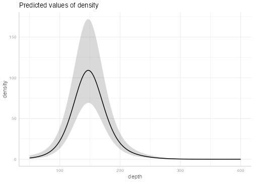
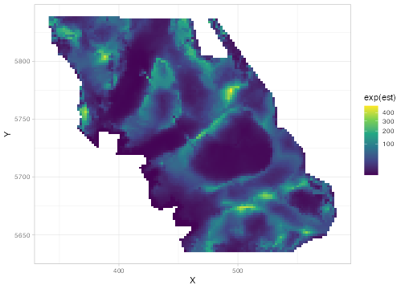
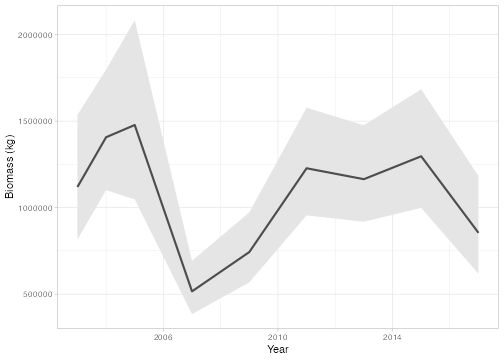
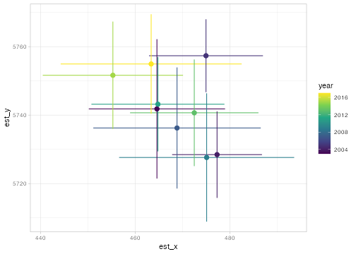
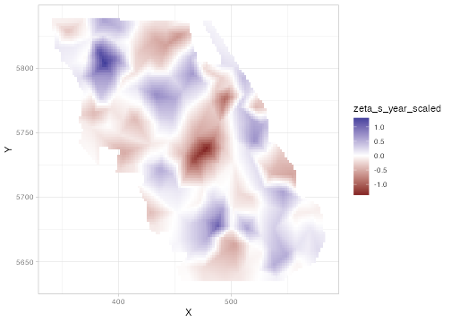
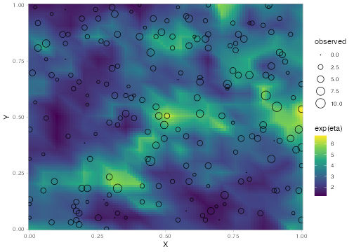
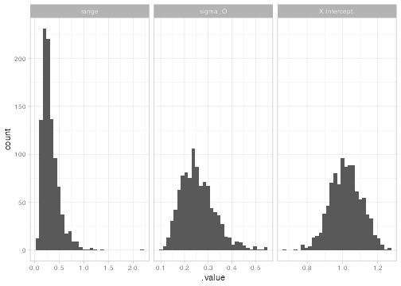
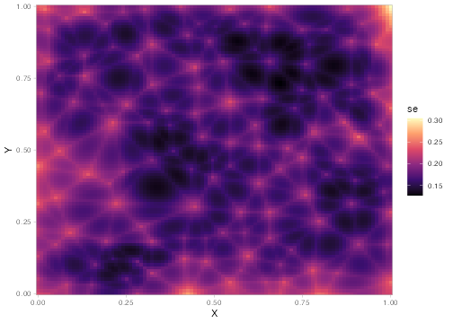
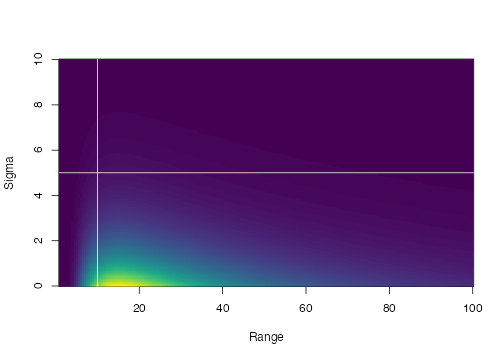
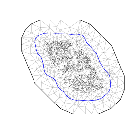

<!-- README.md is generated from README.Rmd. Please edit that file -->

# sdmTMB <a href="https://sdmTMB.github.io/sdmTMB/"></a>

> Spatial and spatiotemporal GLMMs with TMB

<!-- badges: start -->
[](https://cran.r-project.org/package=sdmTMB)
[](https://sdmTMB.github.io/sdmTMB/)
[](https://github.com/sdmTMB/sdmTMB/actions)
[](https://app.codecov.io/gh/sdmTMB/sdmTMB?branch=main)
[](https://cranlogs.r-pkg.org/)
<!-- badges: end -->

sdmTMB is an R package that fits spatial and spatiotemporal GLMMs (generalized linear mixed effects models) using Template Model Builder ([TMB](https://github.com/kaskr/adcomp) via [RTMB](https://github.com/kaskr/RTMB)), [fmesher](https://github.com/inlabru-org/fmesher), and Gaussian Markov random fields. It's designed to feel familiar to users of glm(), lme4, mgcv, or glmmTMB. One common application is for species distribution models (SDMs), but it works for any data with spatial coordinates. See the [documentation site](https://sdmTMB.github.io/sdmTMB/) and the [published paper](https://doi.org/10.18637/jss.v115.i02).

## Table of contents

- [Installation](#installation)
  - [Speeding up large models
    (optional)](#speeding-up-large-models-optional)
- [Overview](#overview)
  - [What can sdmTMB do?](#what-can-sdmtmb-do)
- [Getting help](#getting-help)
- [Citation](#citation)
- [Basic use](#basic-use)
  - [Make a mesh](#make-a-mesh)
  - [Fit a model](#fit-a-model)
  - [Check the model](#check-the-model)
  - [Plot covariate effects](#plot-covariate-effects)
  - [Predict](#predict)
  - [Other families](#other-families)
  - [Spatiotemporal models](#spatiotemporal-models)
  - [Derived quantities: totals and center of
    gravity](#derived-quantities-totals-and-center-of-gravity)
- [More model types](#more-model-types)
  - [Random intercepts and slopes](#random-intercepts-and-slopes)
  - [Time-varying coefficients](#time-varying-coefficients)
  - [Spatially varying coefficients
    (SVC)](#spatially-varying-coefficients-svc)
  - [Breakpoint and threshold
    effects](#breakpoint-and-threshold-effects)
  - [Covariates on dispersion](#covariates-on-dispersion)
  - [Areal models](#areal-models)
  - [Non-local covariates](#non-local-covariates)
  - [Multi-family models
    (experimental)](#multi-family-models-experimental)
- [Uncertainty, forecasting, and
  simulation](#uncertainty-forecasting-and-simulation)
  - [Simulating data from scratch](#simulating-data-from-scratch)
  - [Simulating from a fitted model](#simulating-from-a-fitted-model)
  - [Sampling parameter uncertainty](#sampling-parameter-uncertainty)
  - [Uncertainty on spatial
    predictions](#uncertainty-on-spatial-predictions)
  - [Forecasting](#forecasting)
- [Model comparison and
  cross-validation](#model-comparison-and-cross-validation)
  - [Cross-validation](#cross-validation)
  - [Other model comparison tools](#other-model-comparison-tools)
- [Priors and Bayesian estimation](#priors-and-bayesian-estimation)
  - [Priors](#priors)
  - [Bayesian MCMC sampling with
    Stan](#bayesian-mcmc-sampling-with-stan)
- [Meshes](#meshes)
  - [Using a custom fmesher mesh](#using-a-custom-fmesher-mesh)
  - [Barrier meshes](#barrier-meshes)
- [Related software](#related-software)

## Installation

sdmTMB can be installed from CRAN:

``` r
install.packages("sdmTMB", dependencies = TRUE)
```

We recommend the development version, which has the latest features and
bug fixes. Prebuilt binaries (tracking `main`) are available from
r-universe and do not require a C++ compiler:

``` r
install.packages(
  "sdmTMB",
  dependencies = TRUE,
  repos = c("https://sdmtmb.r-universe.dev", "https://cloud.r-project.org")
)
```

Alternatively, if you have a [C++
compiler](https://support.posit.co/hc/en-us/articles/200486498-Package-Development-Prerequisites)
installed, you can build the development version from source:

``` r
# install.packages("pak")
pak::pak("sdmTMB/sdmTMB", dependencies = TRUE)
```

There are some extra utilities in the
[sdmTMBextra](https://github.com/sdmTMB/sdmTMBextra) package.

### Speeding up large models (optional)

For large models, an optimized BLAS library (the linear algebra library
R uses) can make sdmTMB models much faster, often around 8 times faster.
Suggested installation instructions for [Mac
users](https://www.mail-archive.com/r-sig-mac@r-project.org/msg06199.html)
or [with OpenBLAS on a
Mac](https://gist.github.com/seananderson/3c6cbf640ba566ce936c79442b9a6068),
[Linux users](https://prdm0.github.io/ropenblas/), [Windows
users](https://github.com/david-cortes/R-openblas-in-windows), and
[Windows users without admin
privileges](https://gist.github.com/seananderson/08a51e296a854f227a908ddd365fb9c1).
To check that it worked, start a new R session and run:

``` r
m <- 1e4; n <- 1e3; k <- 3e2
X <- matrix(rnorm(m*k), nrow=m); Y <- matrix(rnorm(n*k), ncol=n)
system.time(X %*% Y)
```

The ‘elapsed’ time should be a fraction of a second (e.g., 0.03 s), not
more than 1 second.

## Overview

Many datasets are collected at known locations, such as survey samples,
plots, transects, or monitoring stations. Observations close together in
space (or time) tend to be more similar than observations far apart.
Ignoring this can give overconfident estimates and poor predictions.
sdmTMB fits generalized linear mixed effects models (GLMMs) that account
for this by adding *random fields*: smooth, estimated surfaces that
capture spatial (and spatiotemporal) patterns not explained by your
covariates.

If you’ve used `glm()`, lme4, mgcv, or glmmTMB, the syntax will feel
familiar. A common application is species distribution models (SDMs),
hence the package name, but the models apply to any data with
coordinates.

Under the hood, sdmTMB uses
[fmesher](https://CRAN.R-project.org/package=fmesher) to build a
triangular mesh and the [SPDE
approach](https://doi.org/10.1111/j.1467-9868.2011.00777.x) to represent
random fields efficiently. Models are written with
[RTMB](https://cran.r-project.org/package=RTMB) and fit with Template
Model Builder ([TMB](https://cran.r-project.org/package=TMB)).
Parameters are estimated by maximum marginal likelihood (via
`stats::nlminb()`), with random effects integrated out using the Laplace
approximation. Models can also be passed to Stan via
[tmbstan](https://cran.r-project.org/package=tmbstan) for Bayesian
estimation.

### What can sdmTMB do?

**Model structure**

- Spatial random fields, and spatiotemporal random fields that are
  independent each time step or that follow a random walk or
  autoregressive (AR1) process
- Areal models (CAR/SAR) for polygon or gridded data, as an alternative
  to the mesh-based approach
- Random intercepts and slopes with lme4-style syntax, e.g.,
  `(1 + x | group)`
- Smooth (non-linear) covariate effects with mgcv-style `s()` terms
- Breakpoint (“hockey-stick”) and logistic threshold covariate effects
- Time-varying coefficients that change over time as a random walk or
  AR1 process
- Spatially varying coefficients, where a covariate’s effect differs
  across space
- Non-local covariate effects, where a covariate affects the response at
  nearby locations (spatial diffusion) or later times (time lags)
- Anisotropy (spatial correlation that is stronger in some directions)
  and barriers to correlation (e.g., land in a marine model)
- Interpolation over missing time steps and forecasting into the future

**Response distributions (families)**

- Common families: `gaussian()`, `binomial()`, `poisson()`, `Gamma()`,
  `Beta()`, `lognormal()`, `student()`
- Families for overdispersed or zero-heavy data: `nbinom1()`,
  `nbinom2()`, `tweedie()`, `betabinomial()`, `gengamma()`, mixture
  families for extreme events (e.g., `gamma_mix()`), and truncated and
  censored families (e.g., `censored_poisson()` for [hook competition in
  longline
  surveys](https://sdmTMB.github.io/sdmTMB/articles/hook-competition.html))
- `ordbeta()` for proportions that include exact 0s and 1s
- Delta (hurdle) models that separately model presence and positive
  values, e.g., `delta_gamma()` and `delta_lognormal()`, including
  Poisson-link delta models (`type = "poisson-link"`)
- Covariates on the dispersion parameter (`dispformula`)
- Experimental multi-family models that combine different data types
  (e.g., presence-absence and counts) in one model

**After fitting**

- Prediction on new data, with uncertainty
- Derived quantities such as area-weighted totals (e.g., abundance
  indices), center of gravity, area occupied, range edges, and weighted
  averages
- Residual checks and simulation from fitted models
- Cross-validation (including leave-future-out) and model comparison
- Priors (including custom priors) and Bayesian estimation with Stan

See [`?sdmTMB`](https://sdmTMB.github.io/sdmTMB/reference/sdmTMB.html)
and
[`?predict.sdmTMB`](https://sdmTMB.github.io/sdmTMB/reference/predict.sdmTMB.html)
for the most complete examples. Also see the articles on the
[documentation
site](https://sdmTMB.github.io/sdmTMB/articles/index.html) and the
[published paper](https://doi.org/10.18637/jss.v115.i02).

## Getting help

For questions about how to use sdmTMB or interpret the models, please
post on the [discussion
board](https://github.com/sdmTMB/sdmTMB/discussions). If you
[email](https://github.com/sdmTMB/sdmTMB/blob/main/DESCRIPTION) a
question, we are likely to respond on the [discussion
board](https://github.com/sdmTMB/sdmTMB/discussions) with an anonymized
version of your question (and without data) if we think it could be
helpful to others. Please let us know if you don’t want us to do that.

For bugs or feature requests, please post in the [issue
tracker](https://github.com/sdmTMB/sdmTMB/issues).

There have been several [past sdmTMB
workshops](https://github.com/sdmTMB/sdmTMB-teaching). Slides and
exercises from the latest workshop are
[here](https://sdmtmb.github.io/sdmTMB-DSAF-2026/).
[Recordings](https://www.youtube.com/channel/UCYoFG51RjJVx7m9mZGaj-Ng/videos)
from an older workshop are also available.

## Citation

To cite sdmTMB in publications, please use:

``` r
citation("sdmTMB")
```

Anderson, S.C., E.J. Ward, P.A. English, L.A.K. Barnett, J.T. Thorson.
2025. sdmTMB: an R package for fast, flexible, and user-friendly
generalized linear mixed effects models with spatial and spatiotemporal
random fields. Journal of Statistical Software. 115(2):1–46.
<https://doi.org/10.18637/jss.v115.i02>.

A list of known publications that use sdmTMB can be found
[here](https://github.com/sdmTMB/sdmTMB/tree/main/scratch/citations).
Please use the above citation so we can track publications.

## Basic use

An sdmTMB model needs a data frame with a column for the response,
columns for any predictors, and columns for spatial coordinates. The
coordinates should be in a projected coordinate system where distances
are the same everywhere, such as UTMs in km, rather than latitude and
longitude. You can convert coordinates with `sf::st_transform()` or
`add_utm_columns()`.

Here, we fit a model to Pacific cod (*Gadus macrocephalus*) survey data
from Queen Charlotte Sound, British Columbia, Canada. The data frame
`pcod` is built into the package. It has a column `year` for the survey
year, `density` for fish density at each sampling location, `present`
for whether `density > 0`, `depth` for depth in meters, and coordinates
`X` and `Y` (UTMs in km).

``` r
library(dplyr)
library(ggplot2)
library(sdmTMB)
head(pcod)
```

    #> # A tibble: 3 × 6
    #>    year density present depth     X     Y
    #>   <int>   <dbl>   <dbl> <dbl> <dbl> <dbl>
    #> 1  2003   113.        1   201  446. 5793.
    #> 2  2003    41.7       1   212  446. 5800.
    #> 3  2003     0         0   220  449. 5802.

### Make a mesh

First, we make a mesh: a network of triangles used to approximate the
spatial random field.

``` r
mesh <- make_mesh(pcod, xy_cols = c("X", "Y"), cutoff = 10)
```

`cutoff` is the minimum distance allowed between mesh vertices, in the
units of `X` and `Y` (here, km). Smaller values make a finer mesh, which
can capture finer spatial patterns but takes longer to fit. You can view
the mesh with `plot(mesh)`.

### Fit a model

Our first model includes a smooth effect of depth, a spatial random
field, and a Tweedie distribution, which handles continuous data with
exact zeros (common for density or biomass data):

``` r
fit <- sdmTMB(
  density ~ s(depth),
  data = pcod,
  mesh = mesh,
  family = tweedie(link = "log"),
  spatial = "on"
)
```

Print the model fit:

``` r
fit
#> Spatial model fit by ML ['sdmTMB']
#> Formula: density ~ s(depth)
#> Mesh: mesh (isotropic covariance)
#> Data: pcod
#> Family: tweedie(link = 'log')
#>  
#> Conditional model:
#>             coef.est coef.se
#> (Intercept)     2.37    0.21
#> sdepth          0.62    2.53
#> 
#> Smooth terms:
#>              Std. Dev.
#> sd__s(depth)     13.93
#> 
#> Dispersion parameter: 12.69
#> Tweedie p: 1.58
#> Matérn range: 16.39
#> Spatial SD: 1.86
#> ML criterion at convergence: 6402.136
#> 
#> See ?tidy.sdmTMB to extract these values as a data frame.
```

How to read this output:

- `sdepth` and `sd__s(depth)` describe the depth smoother: its linear
  component and how wiggly it is.
- The dispersion parameter (`phi`) and `Tweedie p` describe how variable
  the observations are around the mean.
- `Matérn range` is the distance (here, km) at which spatial correlation
  drops to about 0.13. Points farther apart than this are nearly
  independent.
- `Spatial SD` (`sigma_O`) is how much the spatial random field varies,
  i.e., how much spatial variation the covariates don’t explain.
- `ML criterion at convergence` is the negative log likelihood that was
  minimized.

We can extract parameters as a data frame:

``` r
tidy(fit)
#> # A tibble: 2 × 5
#>   term        estimate std.error conf.low conf.high
#>   <chr>          <dbl>     <dbl>    <dbl>     <dbl>
#> 1 (Intercept)     2.37     0.215     1.95      2.79
#> 2 sdepth          0.62     2.53     -4.34      5.58
tidy(fit, effects = "ran_pars")
#> # A tibble: 5 × 5
#>   term         estimate std.error conf.low conf.high
#>   <chr>           <dbl>     <dbl>    <dbl>     <dbl>
#> 1 range           16.4    4.47        9.60     28.0 
#> 2 phi             12.7    0.406      11.9      13.5 
#> 3 sigma_O          1.86   0.218       1.48      2.34
#> 4 tweedie_p        1.58   0.00998     1.56      1.60
#> 5 sd__s(depth)    13.9   NA           7.54     25.7
```

### Check the model

Run some basic checks for convergence and estimation problems:

``` r
sanity(fit)
#> ✔ Non-linear minimizer suggests successful convergence
#> ✔ Hessian matrix is positive definite
#> ✔ No extreme or very small eigenvalues detected
#> ✔ No gradients with respect to fixed effects are >= 0.001
#> ✔ No fixed-effect standard errors are NA
#> ✔ No standard errors look unreasonably large
#> ✔ No sigma parameters are < 0.01
#> ✔ No sigma parameters are > 100
#> ✔ Range parameter doesn't look unreasonably large
```

Check the residuals. If the model is consistent with the data, these
should look approximately normally distributed:

``` r
set.seed(1)
r <- residuals(fit, type = "mle-mvn")
qqnorm(r)
abline(0, 1)
```

See the article on [residual
checking](https://sdmTMB.github.io/sdmTMB/articles/residual-checking.html)
for more options, including simulation-based residuals with DHARMa.

### Plot covariate effects

Use the [ggeffects](https://github.com/strengejacke/ggeffects) package
to plot the depth effect:

``` r
ggeffects::ggpredict(fit, "depth [50:400, by=2]") |> plot()
```



For models without smoothers, `ggeffects::ggeffect()` is a faster
alternative. See the [ggeffects
article](https://sdmTMB.github.io/sdmTMB/articles/ggeffects.html) for
more examples.

### Predict

Next, we predict on a grid covering the survey area. The data frame
`qcs_grid` (included in the package) has the coordinates and covariates
at each grid cell:

``` r
p <- predict(fit, newdata = qcs_grid)
```

``` r
head(p)
```

    #> # A tibble: 3 × 7
    #>       X     Y depth   est est_non_rf est_rf omega_s
    #>   <dbl> <dbl> <dbl> <dbl>      <dbl>  <dbl>   <dbl>
    #> 1   456  5636  347. -3.06      -3.08 0.0172  0.0172
    #> 2   458  5636  223.  2.03       1.99 0.0460  0.0460
    #> 3   460  5636  204.  2.89       2.82 0.0747  0.0747

`est` is the full prediction in link space (here, log). It’s the sum of
two parts: `est_non_rf`, everything in the model except the random
fields (the intercept and covariate effects, plus any random intercepts
or other terms), and `est_rf`, the contribution of the random fields
(here equal to `omega_s`, the spatial random field). We use `exp()` to
convert predictions from the log scale to the density scale:

``` r
ggplot(p, aes(X, Y, fill = exp(est))) + geom_raster() +
  scale_fill_viridis_c(trans = "sqrt")
```



### Other families

For presence-absence data, we change the response and family:

``` r
fit <- sdmTMB(
  present ~ s(depth),
  data = pcod,
  mesh = mesh,
  family = binomial(link = "logit")
)
```

A delta (hurdle) model fits two parts: one for whether the species is
present and one for density where it is present.

``` r
fit <- sdmTMB(
  density ~ s(depth),
  data = pcod,
  mesh = mesh,
  family = delta_gamma(link1 = "logit", link2 = "log")
)
```

See the articles on [delta
models](https://sdmTMB.github.io/sdmTMB/articles/delta-models.html) and
[Poisson-link delta
models](https://sdmTMB.github.io/sdmTMB/articles/poisson-link.html).

### Spatiotemporal models

To let the spatial pattern change over time, we specify the `time`
column and a spatiotemporal structure. Here, `"ar1"` means each year’s
spatial pattern is correlated with the previous year’s. The survey
wasn’t conducted every year, so we use `extra_time` to include the
unsampled years and keep the time steps evenly spaced:

``` r
fit_spatiotemporal <- sdmTMB(
  density ~ s(depth, k = 5),
  data = pcod,
  mesh = mesh,
  time = "year",
  extra_time = 2003:2017,
  family = tweedie(link = "log"),
  spatial = "off",
  spatiotemporal = "ar1"
)
```

### Derived quantities: totals and center of gravity

A common goal is a time series of total abundance (or biomass) that
accounts for where and when samples were taken (an “index”). We do this
by predicting on a grid covering the whole area for each year and
summing over the grid. Each grid cell is 2 x 2 km, so its area is 4 km²:

``` r
grid_yrs <- replicate_df(qcs_grid, "year", unique(pcod$year))
index <- get_index(fit_spatiotemporal, newdata = grid_yrs,
  area = rep(4, nrow(grid_yrs)))
ggplot(index, aes(year, est)) +
  geom_ribbon(aes(ymin = lwr, ymax = upr), fill = "grey90") +
  geom_line(lwd = 1, colour = "grey30") +
  labs(x = "Year", y = "Biomass (kg)")
```



Or the center of gravity, the average location of the population, which
is useful for detecting shifts in distribution:

``` r
cog <- get_cog(fit_spatiotemporal, newdata = grid_yrs, format = "wide")
ggplot(cog, aes(est_x, est_y, colour = year)) +
  geom_pointrange(aes(xmin = lwr_x, xmax = upr_x)) +
  geom_pointrange(aes(ymin = lwr_y, ymax = upr_y)) +
  scale_colour_viridis_c()
```



Other derived quantities include area occupied (`get_eao()`), range
edges (`get_range_edge()`), and weighted averages of covariates such as
depth or temperature (`get_weighted_average()`).

For more on these basic features, see the articles [Intro to modeling
with sdmTMB](https://sdmTMB.github.io/sdmTMB/articles/basic-intro.html)
and [Index standardization with
sdmTMB](https://sdmTMB.github.io/sdmTMB/articles/index-standardization.html).

## More model types

### Random intercepts and slopes

Use the same syntax as lme4 or glmmTMB (`(1 | group)`,
`(1 + x | group)`, or `(1 + x || group)` for uncorrelated intercepts and
slopes):

``` r
pcod$year_factor <- as.factor(pcod$year)
fit <- sdmTMB(
  density ~ s(depth, k = 5) + (1 | year_factor),
  data = pcod, mesh = mesh,
  family = tweedie(link = "log")
)
```

### Time-varying coefficients

Time-varying coefficients let effects change gradually over time, for
example if a relationship shifts with environmental change. Here we use
`time_varying_type = "rw0"`, a random walk that starts at zero. The
coefficients in the main formula give the starting values and the random
walk describes how they change from there. Alternatively, `"ar1"` lets
coefficients fluctuate around their main formula values. See `?sdmTMB`
for details, including the default `"rw"`.

A time-varying intercept (with `extra_time` filling in unsampled years
so the time steps are evenly spaced):

``` r
fit <- sdmTMB(
  density ~ s(depth, k = 5),
  time_varying = ~ 1,
  time_varying_type = "rw0",
  extra_time = 2003:2017,
  data = pcod, mesh = mesh,
  time = "year",
  family = tweedie(link = "log"),
  silent = FALSE # see progress
)
```

Covariate effects can vary over time too, e.g.,
`time_varying = ~ 1 + depth_scaled`. See the article [Intro to modeling
with sdmTMB](https://sdmTMB.github.io/sdmTMB/articles/basic-intro.html)
for a time-varying depth effect with `"ar1"`.

### Spatially varying coefficients (SVC)

Spatially varying coefficients let a covariate’s effect differ across
space. For example, a population might be increasing in some areas and
decreasing in others.

Spatially varying effect of time:

``` r
pcod$year_scaled <- as.numeric(scale(pcod$year))
fit <- sdmTMB(
  density ~ s(depth, k = 5) + year_scaled,
  spatial_varying = ~ year_scaled,
  data = pcod, mesh = mesh,
  time = "year",
  family = tweedie(link = "log"),
  spatiotemporal = "off"
)
```

The SVC covariate should be centered (mean of about 0) and also included
in the main formula. Then the spatially varying field (`zeta_s`)
represents local deviations from the average effect:

``` r
grid_yrs <- replicate_df(qcs_grid, "year", unique(pcod$year))
grid_yrs$year_scaled <- (grid_yrs$year - mean(pcod$year)) / sd(pcod$year)
p <- predict(fit, newdata = grid_yrs) |>
  subset(year == 2011) # any year
ggplot(p, aes(X, Y, fill = zeta_s_year_scaled)) + geom_raster() +
  scale_fill_gradient2()
```



See the articles on [spatial trend
models](https://sdmTMB.github.io/sdmTMB/articles/spatial-trend-models.html)
and [SVC factor
models](https://sdmTMB.github.io/sdmTMB/articles/svc-factor-models.html)
for more details.

### Breakpoint and threshold effects

Breakpoint effects increase linearly up to a threshold and then level
off. Logistic effects follow an S-shaped curve:

``` r
fit <- sdmTMB(
  present ~ 1 + breakpt(depth_scaled),
  data = pcod, mesh = mesh,
  family = binomial(link = "logit")
)
```

``` r
fit <- sdmTMB(
  present ~ 1 + logistic(depth_scaled),
  data = pcod, mesh = mesh,
  family = binomial(link = "logit")
)
```

See the article on [threshold
modeling](https://sdmTMB.github.io/sdmTMB/articles/threshold-models.html)
for more details.

### Covariates on dispersion

By default, the dispersion (how variable the observations are around the
mean) is constant. `dispformula` lets it depend on covariates:

``` r
fit <- sdmTMB(
  density ~ s(depth, k = 5),
  dispformula = ~ depth_scaled,
  data = pcod, mesh = mesh,
  family = tweedie(link = "log")
)
```

### Areal models

For data summarized by polygons or grid cells, areal models with
`spatial_model = "car"` or `"sar"` and a domain from
`make_areal_domain()` use neighbouring units instead of a mesh. See the
articles on [polygon areal
models](https://sdmTMB.github.io/sdmTMB/articles/areal-sar-car-spde.html)
and [grid areal
models](https://sdmTMB.github.io/sdmTMB/articles/areal-grid-sar-car-spde.html).

### Non-local covariates

Sometimes a covariate affects the response not just where it is measured
but also nearby or later in time.
`nonlocal_formula = ~ diffusion(x) + time_lag(x)` estimates the spatial
and temporal scale of these effects. See the [non-local covariates
article](https://sdmTMB.github.io/sdmTMB/articles/nonlocal-covariates.html).

### Multi-family models (experimental)

Different rows of the data can use different families. For example,
presence-absence data from one survey and biomass data from another can
share spatial fields in a single model. Supply a named list to `family`
and name the column that assigns rows to families with
`distribution_column`. See the [multi-family
article](https://sdmTMB.github.io/sdmTMB/articles/multi-family.html).

## Uncertainty, forecasting, and simulation

### Simulating data from scratch

`simulate_new()` simulates data from a model you specify. This is useful
for learning how the models work and for testing whether a model can
recover known values:

``` r
predictor_dat <- expand.grid(
  X = seq(0, 1, length.out = 100), Y = seq(0, 1, length.out = 100)
)
mesh <- make_mesh(predictor_dat, xy_cols = c("X", "Y"), cutoff = 0.05)
sim_dat <- simulate_new(
  formula = ~ 1,
  data = predictor_dat,
  mesh = mesh,
  family = poisson(link = "log"),
  range = 0.3,
  sigma_O = 0.4,
  seed = 1,
  B = 1 # B0 = intercept
)
head(sim_dat)
#> # A tibble: 6 × 7
#>        X     Y omega_s    mu   eta observed `(Intercept)`
#>    <dbl> <dbl>   <dbl> <dbl> <dbl>    <int>         <dbl>
#> 1 0          0   0.517  4.56  1.52        2             1
#> 2 0.0101     0   0.501  4.49  1.50        1             1
#> 3 0.0202     0   0.486  4.42  1.49        4             1
#> 4 0.0303     0   0.470  4.35  1.47        5             1
#> 5 0.0404     0   0.455  4.28  1.45        6             1
#> 6 0.0505     0   0.439  4.22  1.44        5             1

# sample 200 points for fitting:
set.seed(1)
sim_dat_obs <- sim_dat[sample(seq_len(nrow(sim_dat)), 200), ]
```

``` r
ggplot(sim_dat, aes(X, Y)) +
  geom_raster(aes(fill = exp(eta))) + # mean without observation error
  geom_point(aes(size = observed), data = sim_dat_obs, pch = 21) +
  scale_fill_viridis_c() +
  scale_size_area() +
  coord_cartesian(expand = FALSE)
```



Fit to the simulated data:

``` r
mesh <- make_mesh(sim_dat_obs, xy_cols = c("X", "Y"), cutoff = 0.05)
fit <- sdmTMB(
  observed ~ 1,
  data = sim_dat_obs,
  mesh = mesh,
  family = poisson()
)
```

See
[`?simulate_new`](https://sdmtmb.github.io/sdmTMB/reference/simulate_new.html)
for more details.

### Simulating from a fitted model

`simulate()` generates new response data from a fitted model. Each
column is one simulated dataset:

``` r
set.seed(1)
s <- simulate(fit, nsim = 500)
dim(s)
#> [1] 200 500
s[1:3, 1:4]
#>      [,1] [,2] [,3] [,4]
#> [1,]    0    6    1    4
#> [2,]    0    3    1    1
#> [3,]    0    2    3    4
```

Simulations are the basis for many model checks. See the article on
[residual
checking](https://sdmTMB.github.io/sdmTMB/articles/residual-checking.html),
[`?simulate.sdmTMB`](https://sdmTMB.github.io/sdmTMB/reference/simulate.sdmTMB.html),
and
[`?dharma_residuals`](https://sdmTMB.github.io/sdmTMB/reference/dharma_residuals.html)
for more details.

### Sampling parameter uncertainty

We can draw samples of the parameters from their approximate joint
distribution (a multivariate normal):

``` r
set.seed(1)
samps <- gather_sims(fit, nsim = 1000)
ggplot(samps, aes(.value)) + geom_histogram() +
  facet_wrap(~.variable, scales = "free_x")
#> `stat_bin()` using `bins = 30`. Pick better value `binwidth`.
```



See
[`?gather_sims`](https://sdmTMB.github.io/sdmTMB/reference/gather_sims.html)
and
[`?get_index_sims`](https://sdmTMB.github.io/sdmTMB/reference/get_index_sims.html)
for more details.

### Uncertainty on spatial predictions

The fastest way to get uncertainty for each predicted location is to use
the `nsim` argument in `predict()`, which returns one column per draw:

``` r
set.seed(1)
p <- predict(fit, newdata = predictor_dat, nsim = 500)
predictor_dat$se <- apply(p, 1, sd)
ggplot(predictor_dat, aes(X, Y, fill = se)) +
  geom_raster() +
  scale_fill_viridis_c(option = "A") +
  coord_cartesian(expand = FALSE)
```



Set `sample_fe = FALSE` to hold the fixed effects at their estimates and
only include uncertainty from the random effects.

### Forecasting

To forecast, you can include future time steps with `extra_time` when
fitting and predict on them. For longer forecasts, it’s faster to fit
the model to the observed years only and use `project()` to simulate
future random fields. For example, to forecast our spatiotemporal model
10 years ahead:

``` r
proj_grid <- replicate_df(qcs_grid, "year", 2003:2027)
out <- project(fit_spatiotemporal, newdata = proj_grid, nsim = 200)
proj_grid$est_mean <- apply(out$est, 1, mean) # mean of the simulations
```

`project()` can include or exclude different sources of uncertainty
(`sample_fe`, `sample_historical_re`, and `sample_future_re`). See the
[forecasting
article](https://sdmTMB.github.io/sdmTMB/articles/forecasting.html) and
[`?project`](https://sdmTMB.github.io/sdmTMB/reference/project.html).

## Model comparison and cross-validation

### Cross-validation

Cross-validation measures how well a model predicts data it wasn’t fit
to. sdmTMB splits the data into folds, fits the model with each fold
held out, and scores the predictions for the held-out data. If you set a
`future::plan()`, the folds are fit in parallel:

``` r
mesh <- make_mesh(pcod, c("X", "Y"), cutoff = 10)
## Set parallel processing if desired:
# library(future)
# plan(multisession)
set.seed(123)
m_cv <- sdmTMB_cv(
  density ~ s(depth, k = 5),
  data = pcod, mesh = mesh,
  family = tweedie(link = "log"), k_folds = 2
)
#> ℹ `sdmTMB_cv()` now scores held-out data with `predictive = "mle-mvn"` by default (previously `"mle-eb"`).
#> ℹ Previous values are returned in `sum_loglik_mle_eb` and `cv_loglik_mle_eb`.
#> ℹ Set `predictive` explicitly to silence this message.
#> Running fits with `future.apply()`.
#> Set a parallel `future::plan()` to use parallel processing.
#> 
#> This message is displayed once per session.
# Sum of log likelihoods of left-out data (higher is better):
m_cv$sum_loglik
#> [1] -6546.733
```

The held-out log likelihood accounts for uncertainty in the random
fields, so results vary slightly with the random seed (`nsim` controls
the number of draws). To compare models fit to the same folds, including
a standard error of the difference, use `loo::loo_compare()` with
`loo::elpd()`. See
[`?sdmTMB_cv`](https://sdmTMB.github.io/sdmTMB/reference/sdmTMB_cv.html)
and the [cross-validation
article](https://sdmTMB.github.io/sdmTMB/articles/cross-validation.html).

### Other model comparison tools

- `AIC()` works as with other models fit by maximum likelihood.
- [`cAIC()`](https://sdmTMB.github.io/sdmTMB/reference/cAIC.html)
  calculates conditional AIC, which accounts for the flexibility of
  random effects and random fields.
- [`compare_deviance()`](https://sdmTMB.github.io/sdmTMB/reference/compare_deviance.html)
  calculates the proportion of deviance explained relative to a simpler
  model (a pseudo-R²).

You can also turn off the random fields (`spatial = "off"`,
`spatiotemporal = "off"`) to compare with a model without them. With the
random fields off, an sdmTMB model is equivalent to a GLM or GLMM.

## Priors and Bayesian estimation

### Priors

You can place priors (or penalties) on most parameters. For example,
here we place a PC (penalized complexity) prior on the spatial range and
SD, a normal prior on the intercept and depth effect, and a half-normal
prior on the Tweedie dispersion parameter (`phi`):

``` r
fit <- sdmTMB(
  density ~ depth_scaled,
  data = pcod, mesh = mesh,
  family = tweedie(),
  priors = sdmTMBpriors(
    matern_s = pc_matern(range_gt = 10, sigma_lt = 5),
    b = normal(c(0, 0), c(10, 1)),
    phi = halfnormal(0, 15)
  )
)
```

We can visualize the PC prior on the spatial range and SD:

``` r
plot_pc_matern(range_gt = 10, sigma_lt = 5)
```



For priors not covered by the built-in options,
`sdmTMBpriors(custom = ...)` accepts a function that returns log
densities for any parameters:

``` r
priors = sdmTMBpriors(
  custom = function(par, theta) {
    RTMB::dnorm(par$b_j[2], 0, 0.5, log = TRUE)
  }
)
```

See
[`?sdmTMBpriors`](https://sdmTMB.github.io/sdmTMB/reference/priors.html),
[`?get_prior_parameters`](https://sdmTMB.github.io/sdmTMB/reference/get_prior_parameters.html),
and the [custom priors
article](https://sdmTMB.github.io/sdmTMB/articles/custom-priors.html).

### Bayesian MCMC sampling with Stan

A fitted model can be passed to the tmbstan package to sample from the
posterior with Stan. See the [Bayesian
article](https://sdmTMB.github.io/sdmTMB/articles/bayesian.html).

## Meshes

### Using a custom fmesher mesh

`make_mesh()` covers most needs, but you can also build a mesh directly
with fmesher, for example to follow the boundary of your study area:

``` r
bnd <- fmesher::fm_nonconvex_hull(cbind(pcod$X, pcod$Y), convex = -0.1)
mesh_fmesher <- fmesher::fm_mesh_2d(
  boundary = bnd,
  max.edge = c(25, 50)
)
mesh <- make_mesh(pcod, c("X", "Y"), mesh = mesh_fmesher)
plot(mesh)
```



### Barrier meshes

A barrier mesh limits correlation across physical barriers, such as land
for a marine species or water for a terrestrial one. See
`add_barrier_mesh()` in
[sdmTMBextra](https://github.com/sdmTMB/sdmTMBextra).

## Related software

sdmTMB is heavily inspired by the
[VAST](https://github.com/James-Thorson-NOAA/VAST) and
[glmmTMB](https://github.com/glmmTMB/glmmTMB) R packages.

The [sdmTMBexperiments](https://github.com/DeepWaterIMR/sdmTMBexperiments) R package (not maintained by the sdmTMB developers) provides experimental helper functions for working with fitted sdmTMB models, including model comparison, mesh-resolution sensitivity, retrospective analyses, and index plotting.

The newer [tinyVAST](https://github.com/vast-lib/tinyVAST) R package can
fit many of the models that VAST and sdmTMB can, with an interface
similar to sdmTMB. We generally recommend tinyVAST for multivariate
models (e.g., several species at once) or for (dynamic) structural
equation models with optional spatial and/or spatiotemporal components.

[INLA](https://www.r-inla.org/) and
[inlabru](https://sites.google.com/inlabru.org/inlabru) can fit many of
the same models as sdmTMB (and more) in an approximate Bayesian
framework.

[mgcv](https://cran.r-project.org/package=mgcv) can fit similar
SPDE-based random field models with code included in [Miller et
al. (2019)](https://doi.org/10.1007/s13253-019-00377-z), but this is
slower for large spatial datasets.

A table in the [sdmTMB paper](https://doi.org/10.18637/jss.v115.i02)
compares the functionality and speed of sdmTMB, VAST, INLA/inlabru, and
mgcv, and the discussion suggests when you might choose one package over
another.
