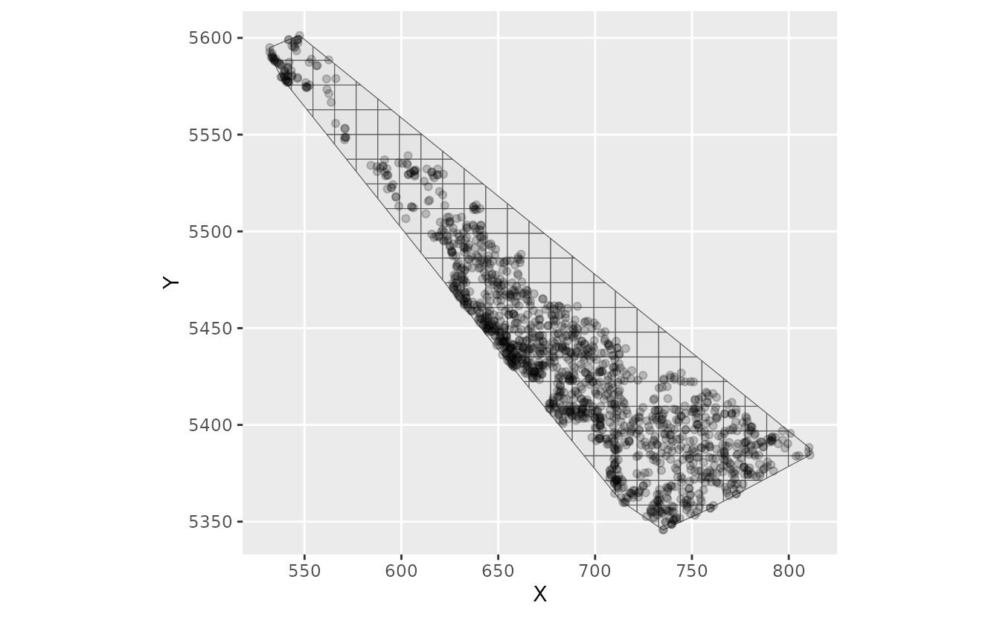
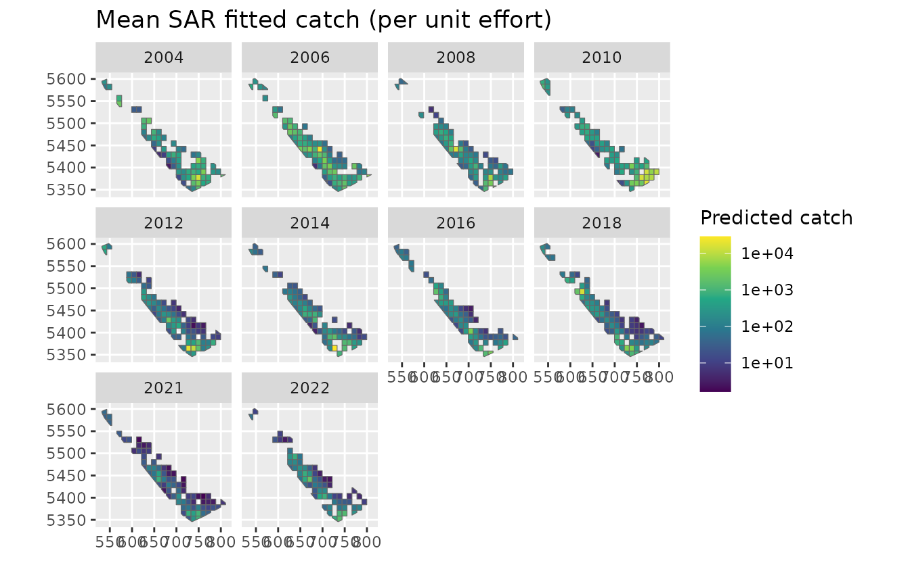
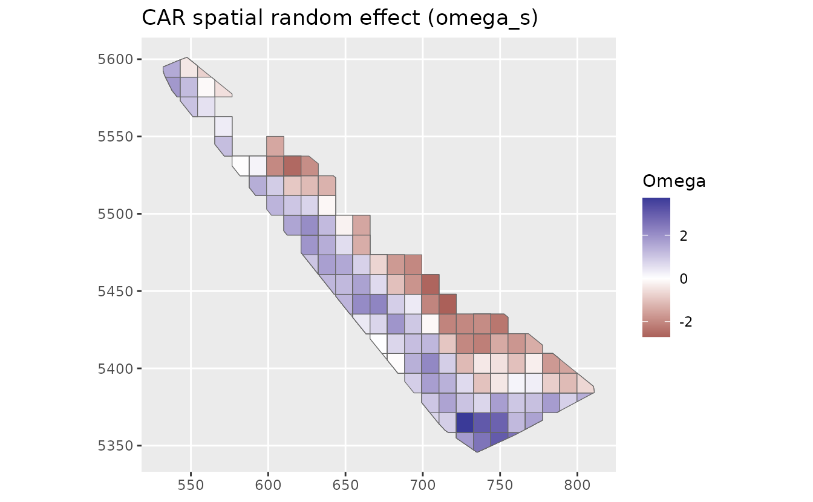
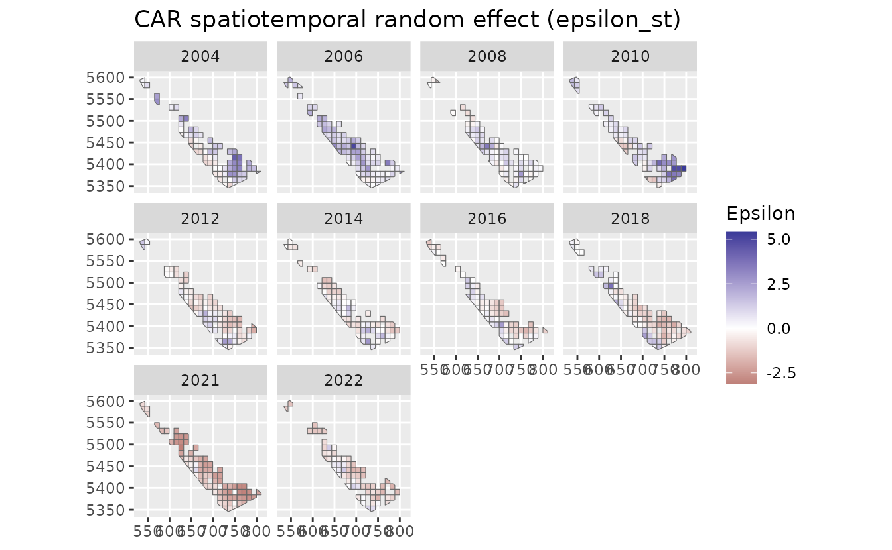
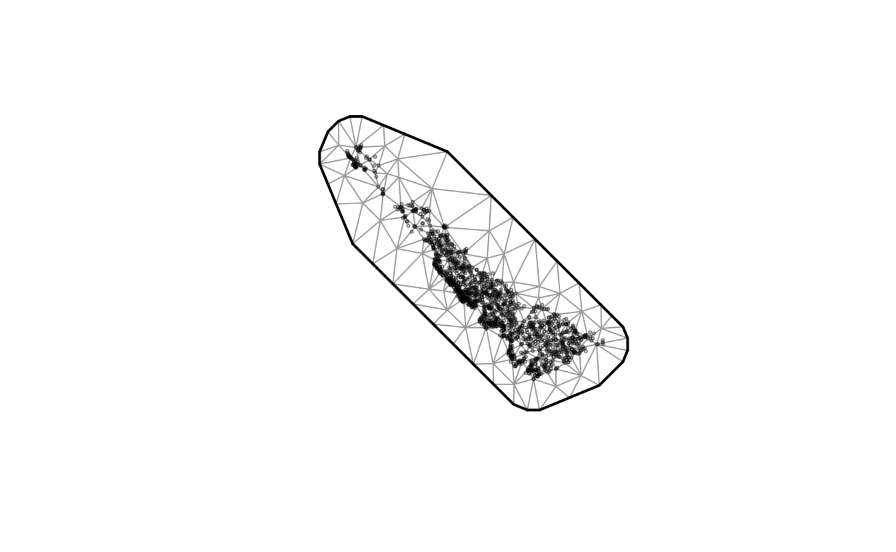
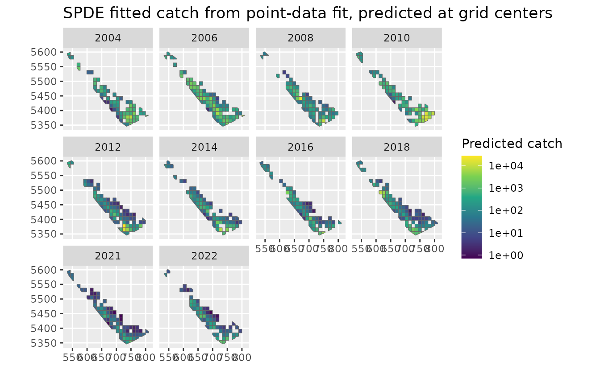
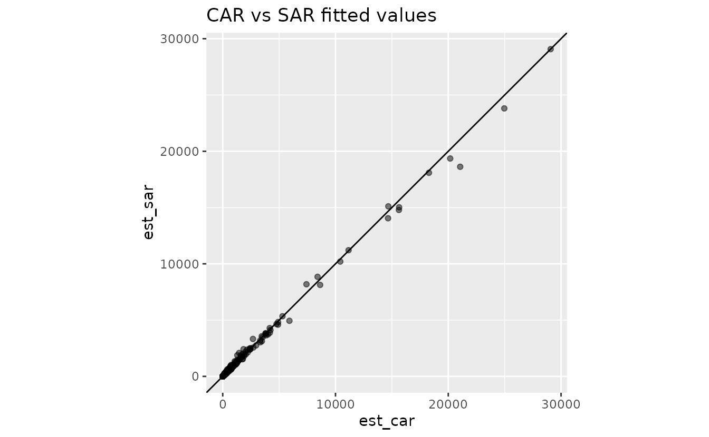
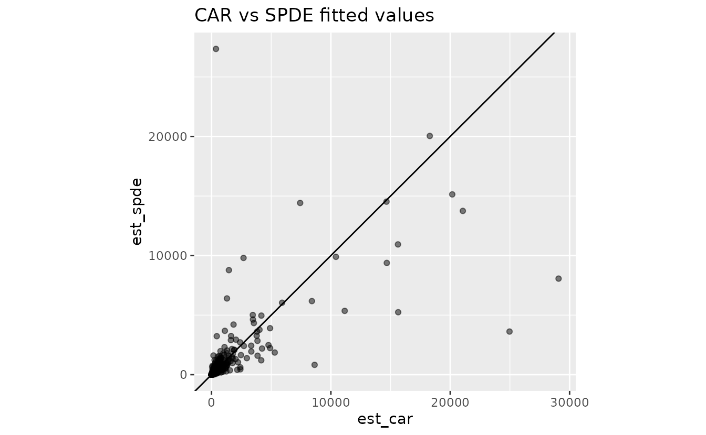

# Grid areal models in sdmTMB: CAR, SAR, and SPDE comparison

**If the code in this vignette has not been evaluated, a rendered
version is available on the [documentation
site](https://sdmTMB.github.io/sdmTMB/index.html) under ‘Articles’.**

``` r

library(dplyr)
library(ggplot2)
library(sdmTMB)
library(sf)
```

This vignette illustrates converting point-based observations into an
areal grid that can be fit with CAR or SAR models. It compares:

- CAR model on the areal grid
- SAR model on the areal grid
- SPDE model on point data, summarized back to the same grid for
  comparison

## Build an areal grid and assign observations

The original `dogfish` data are survey tow-level points. To fit a CAR or
SAR model, we first define polygon areal units (grid cells) and assign
each tow to a cell. We keep the tow-level observations for model fitting
so that the model sees the original catch, effort, and tow-specific
covariates.

``` r

# draw a boundary around our points
dogfish_boundary <- st_as_sf(dogfish, coords = c("X", "Y"), crs = NA) |> 
  st_union() |>
  st_convex_hull()

# pass our data and our spatial boundary to make an areal grid:
dogfish_grid_obj <- make_areal_grid(
  dogfish,
  xy_cols = c("X", "Y"),
  spatial_domain = dogfish_boundary,
  n = c(25L, 20L), # make a grid with 25 cells by 20 cells
  space_column = "cell_id" # optionally rename the output column
)

ggplot(dogfish_grid_obj$grid) + geom_sf() + 
  geom_point(data = dogfish_grid_obj$data, aes(X, Y), alpha = 0.2)
```



For very large datasets, one could aggregate observations to one row per
`cell_id` and `year`, for example by summing catch and effort and
averaging or summing covariates. That can reduce computation
substantial, but it changes the observation support and loses
within-cell tow-level variation in covariates, catches, zeros, and
effort. Instead, here we will fit the raw observation data:

``` r

areal_data <- dogfish_grid_obj$data |>
  mutate(log_depth = log(depth))

cell_centres <- dogfish_grid_obj$grid |>
  st_drop_geometry() |>
  select(cell_id, X_cell = X, Y_cell = Y)

areal_data_xy <- left_join(areal_data, cell_centres, by = "cell_id")
```

## Fit CAR and SAR areal models

We fit the same linear predictor and distribution in both models so the
only intended difference is the spatial structure. We’ll wrap our model
fits in [`system.time()`](https://rdrr.io/r/base/system.time.html) just
so we can see if these CAR/SAR models are faster than the SPDE (they
are).

``` r

system.time(
  fit_car <- sdmTMB(
    catch_weight ~ log_depth,
    data = areal_data,
    mesh = dogfish_grid_obj$domain,
    spatial_model = "car",
    time = "year",
    family = tweedie(link = "log"),
    spatial = "on",
    spatiotemporal = "iid",
    offset = log(areal_data$area_swept)
  )
)
#>    user  system elapsed 
#>   4.164   6.436   3.050
system.time(
  fit_sar <- sdmTMB(
    catch_weight ~ log_depth,
    data = areal_data,
    mesh = dogfish_grid_obj$domain,
    spatial_model = "sar",
    time = "year",
    family = tweedie(link = "log"),
    spatial = "on",
    spatiotemporal = "iid",
    offset = log(areal_data$area_swept)
  )
)
#>    user  system elapsed 
#>   4.222   6.240   3.121
```

``` r

fit_car
#> Spatiotemporal model fit by ML ['sdmTMB']
#> Formula: catch_weight ~ log_depth
#> Mesh: dogfish_grid_obj$domain (isotropic covariance)
#> Time column: character
#> Data: areal_data
#> Family: tweedie(link = 'log')
#>  
#> Conditional model:
#>             coef.est coef.se
#> (Intercept)    12.01    1.33
#> log_depth      -1.60    0.23
#> 
#> Dispersion parameter: 6.35
#> Tweedie p: 1.61
#> CAR spatial dependence: 0.99
#> Spatial CAR field scale: 1.90
#> Spatiotemporal IID CAR field scale: 1.92
#> ML criterion at convergence: 5871.792
#> 
#> See ?tidy.sdmTMB to extract these values as a data frame.
fit_sar
#> Spatiotemporal model fit by ML ['sdmTMB']
#> Formula: catch_weight ~ log_depth
#> Mesh: dogfish_grid_obj$domain (isotropic covariance)
#> Time column: character
#> Data: areal_data
#> Family: tweedie(link = 'log')
#>  
#> Conditional model:
#>             coef.est coef.se
#> (Intercept)    12.51    1.22
#> log_depth      -1.74    0.22
#> 
#> Dispersion parameter: 6.34
#> Tweedie p: 1.61
#> SAR spatial dependence: 0.88
#> Spatial SAR field scale: 0.85
#> Spatiotemporal IID SAR field scale: 0.86
#> ML criterion at convergence: 5865.272
#> 
#> See ?tidy.sdmTMB to extract these values as a data frame.
AIC(fit_car, fit_sar)
#>         df      AIC
#> fit_car  7 11757.58
#> fit_sar  7 11744.54
```

At this stage, check that both models converge and that fixed-effect
magnitudes are broadly comparable. Large differences can indicate
sensitivity to the areal dependence specification.

## Predict CAR/SAR on observed tows

Here we predict on cells that have observed tow rows (`areal_data`)
rather than expanding to all cell-year combinations, which we might
choose to do in other contexts. Alternatively, we could have created a
data frame of one cell per year first and predicted to that.

``` r

pred_car <- predict(
  fit_car,
  newdata = areal_data,
  type = "response",
  offset = rep(0, nrow(areal_data))
)

pred_sar <- predict(
  fit_sar,
  newdata = areal_data,
  type = "response",
  offset = rep(0, nrow(areal_data))
)

pred_areal <- areal_data |>
  mutate(
    est_car = pred_car$est,
    est_sar = pred_sar$est,
    omega_s_car = pred_car$omega_s,
    omega_s_sar = pred_sar$omega_s,
    epsilon_st_car = pred_car$epsilon_st,
    epsilon_st_sar = pred_sar$epsilon_st
  )

# condense to one prediction per cell for plotting
pred_cell_year <- pred_areal |>
  group_by(cell_id, year) |>
  summarise(
    est_car = mean(est_car),
    est_sar = mean(est_sar),
    omega_s_car = first(omega_s_car),
    omega_s_sar = first(omega_s_sar),
    epsilon_st_car = first(epsilon_st_car),
    epsilon_st_sar = first(epsilon_st_sar),
    .groups = "drop"
  )

pred_grid <- left_join(
  dogfish_grid_obj$grid,
  pred_cell_year,
  by = "cell_id"
) |> 
  filter(!is.na(year))
```

``` r

ggplot(pred_grid) +
  geom_sf(aes(fill = est_car), colour = "grey40") +
  facet_wrap(~year) +
  scale_fill_viridis_c(trans = "log10") +
  labs(fill = "Predicted catch", title = "Mean CAR fitted catch (per unit effort)")
```


``` r

ggplot(pred_grid) +
  geom_sf(aes(fill = est_sar), colour = "grey40") +
  facet_wrap(~year) +
  scale_fill_viridis_c(trans = "log10") +
  labs(fill = "Predicted catch", title = "Mean SAR fitted catch (per unit effort)")
```



``` r

ggplot(pred_grid) +
  geom_sf(aes(fill = omega_s_car), colour = "grey40") +
  scale_fill_gradient2() +
  labs(fill = "Omega", title = "CAR spatial random effect (omega_s)")
```



``` r

ggplot(pred_grid) +
  geom_sf(aes(fill = epsilon_st_car), colour = "grey40") +
  facet_wrap(~year) +
  scale_fill_gradient2() +
  labs(fill = "Epsilon", title = "CAR spatiotemporal random effect (epsilon_st)")
```



## Fit an SPDE model on the original point data

Next we fit a continuous-space geostatistical SPDE model to the original
tow locations.

``` r

spde_mesh <- make_mesh(dogfish, c("X", "Y"), cutoff = 8.5)
spde_mesh$mesh$n
#> [1] 171
dogfish_grid_obj$domain$n_s
#> [1] 172
plot(spde_mesh)
```



``` r


system.time(
fit_spde <- sdmTMB(
  catch_weight ~ log(depth),
  data = dogfish,
  mesh = spde_mesh,
  spatial_model = "spde",
  time = "year",
  family = tweedie(link = "log"),
  spatial = "on",
  spatiotemporal = "iid",
  offset = log(dogfish$area_swept)
)
)
#>    user  system elapsed 
#>   7.580  11.143   5.662
fit_spde
#> Spatiotemporal model fit by ML ['sdmTMB']
#> Formula: catch_weight ~ log(depth)
#> Mesh: spde_mesh (isotropic covariance)
#> Time column: character
#> Data: dogfish
#> Family: tweedie(link = 'log')
#>  
#> Conditional model:
#>             coef.est coef.se
#> (Intercept)    15.23    1.54
#> log(depth)     -2.37    0.29
#> 
#> Dispersion parameter: 5.84
#> Tweedie p: 1.59
#> Matérn range: 39.45
#> Spatial SD: 2.29
#> Spatiotemporal IID SD: 1.96
#> ML criterion at convergence: 5778.437
#> 
#> See ?tidy.sdmTMB to extract these values as a data frame.

AIC(fit_spde, fit_sar)
#>          df      AIC
#> fit_spde  7 11570.87
#> fit_sar   7 11744.54
```

That took approximately twice as long as the CAR/SAR models.

## Project SPDE predictions onto observed grid-cell locations

To align our predictions, we predict the SPDE model at grid-cell center
locations for the same observed tow rows used by the CAR/SAR fits. We
then summarize fitted values to `cell_id`-`year` rows for maps and
model-comparison plots.

``` r

spde_newdata <- areal_data_xy |>
  mutate(X = X_cell, Y = Y_cell)

pred_spde_grid <- predict(
  fit_spde,
  newdata = spde_newdata,
  type = "response",
  offset = rep(0, nrow(spde_newdata))
)

pred_spde_cell_year <- spde_newdata |>
  mutate(
    est_spde = pred_spde_grid$est
  ) |>
  group_by(cell_id, year) |>
  summarise(
    est_spde = mean(est_spde),
    .groups = "drop"
  )

pred_grid_compare <- left_join(
  pred_grid,
  pred_spde_cell_year,
  by = c("cell_id", "year")
)
```

``` r

ggplot(pred_grid_compare) +
  geom_sf(aes(fill = est_spde), colour = "grey40") +
  facet_wrap(~year) +
  scale_fill_viridis_c(trans = "log10", na.value = "grey90") +
  labs(fill = "Predicted catch", title = "SPDE fitted catch from point-data fit, predicted at grid centers")
```



## Compare fitted values

These scatter plots are a quick check of how well the predictions agree:

``` r

ggplot(st_drop_geometry(pred_grid_compare), aes(est_car, est_sar)) +
  geom_point(alpha = 0.5) +
  geom_abline(intercept = 0, slope = 1) +
  coord_fixed() +
  labs(title = "CAR vs SAR fitted values")
```



``` r

ggplot(st_drop_geometry(pred_grid_compare), aes(est_car, est_spde)) +
  geom_point(alpha = 0.5) +
  geom_abline(intercept = 0, slope = 1) +
  coord_fixed() +
  labs(title = "CAR vs SPDE fitted values")
```



For continuous data, a geostatistical SPDE model is a more natural
approach and it better fits the data here. However, sometimes with very
large datasets, there may be a computational advantage to using the
CAR/SAR models and an even bigger computational advantage to aggregating
to a grid and using a CAR or SAR model. That aggregation trades speed
for loss of tow-level information. Even without aggregation, the CAR
model followed by the SAR model were faster than the SPDE model
(approximately twice as fast in this case).
