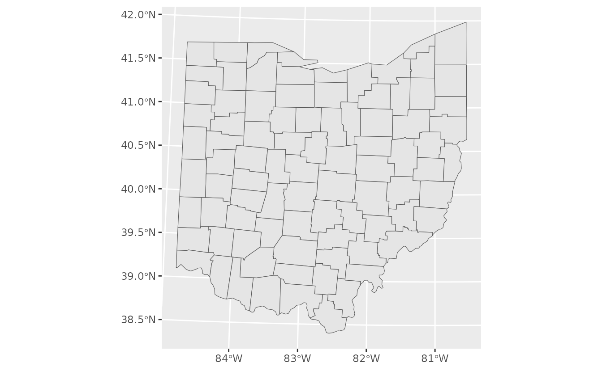
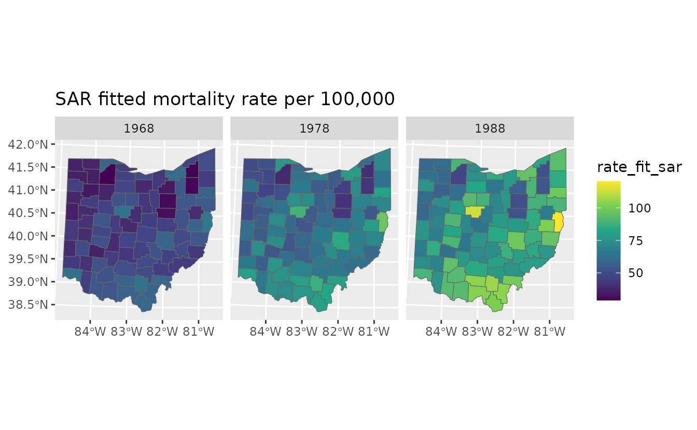
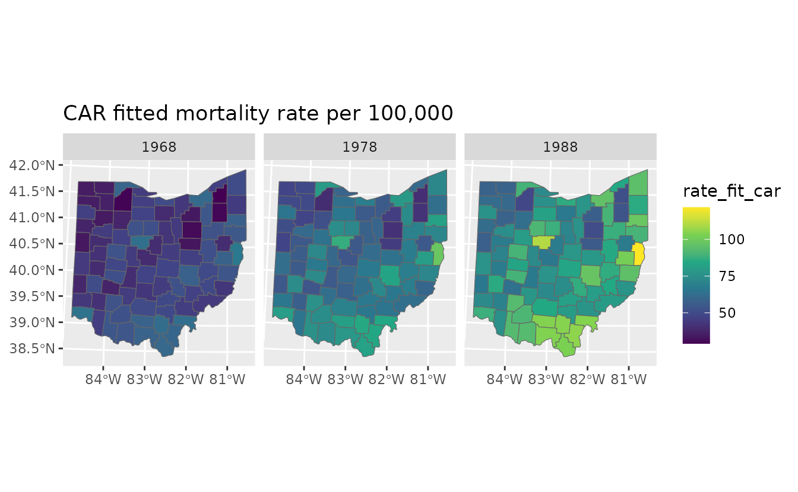
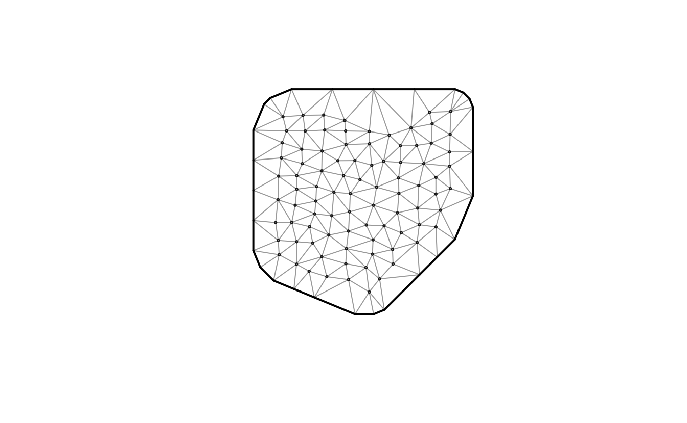
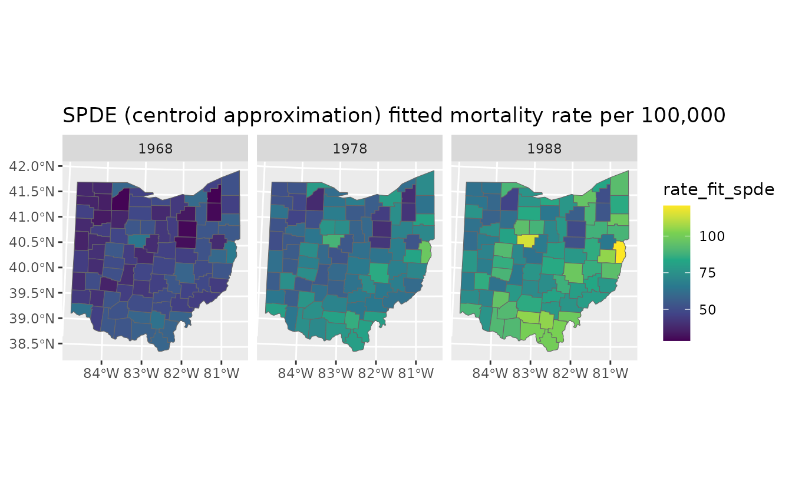
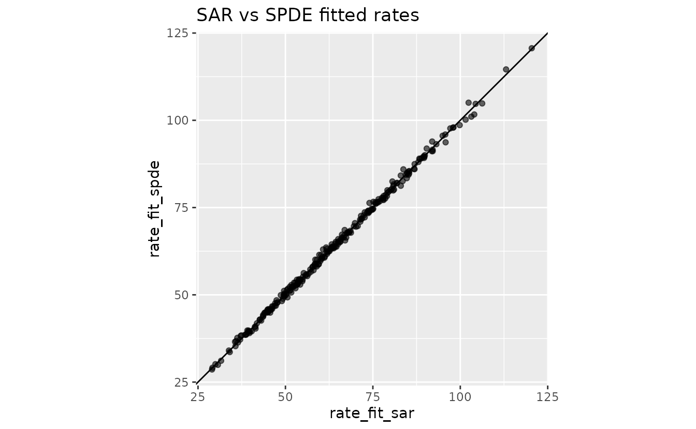
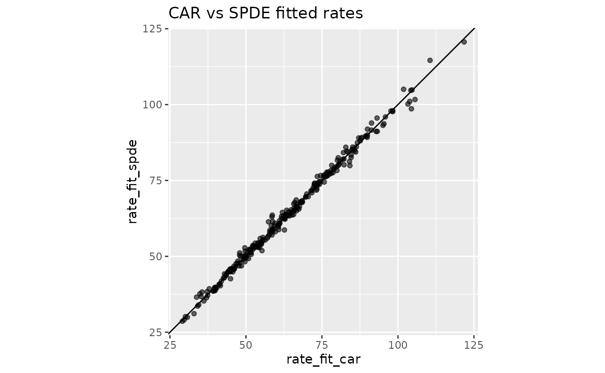
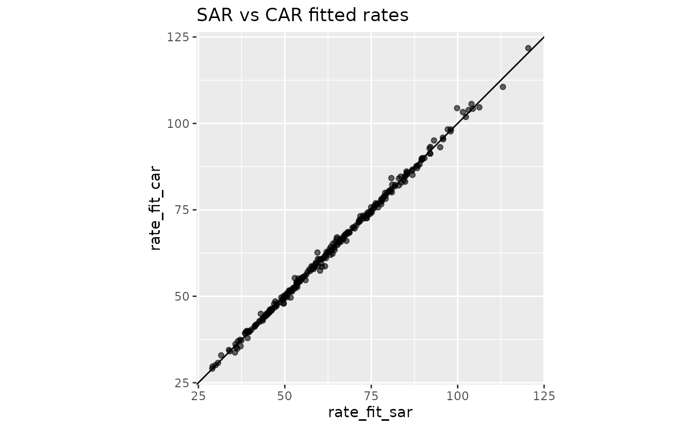

# Areal models in sdmTMB: SAR, CAR, and SPDE comparison

**If the code in this vignette has not been evaluated, a rendered
version is available on the [documentation
site](https://sdmTMB.github.io/sdmTMB/index.html) under ‘Articles’.**

``` r

library(dplyr)
library(ggplot2)
library(sdmTMB)
library(sf)
```

Areal (or lattice) data are observations measured or aggregated over
spatial regions or polygons, such as countries, census tracts, or
administrative boundaries.

This vignette demonstrates three ways to model spatial structure in
areal data using the built-in Ohio lung cancer dataset:

- SAR (`spatial_model = "sar"`) on polygons
- CAR (`spatial_model = "car"`) on polygons
- SPDE (`spatial_model = "spde"`) on polygon centroids as a
  geostatistical point-based version

The areal response is counts (`cases`) with population offset
(`log(pop)`), so fitted values are interpreted as expected counts or
rates.

## Build an areal domain from polygons

For SAR and CAR models, we pass an areal domain (adjacency + IDs) to
`mesh` via
[`make_areal_domain()`](https://sdmTMB.github.io/sdmTMB/reference/make_areal_domain.md).
We need to supply an `igraph` or `sf/sfc` object. In this example, we
have an `sf` object with a column `county` that identifies polygons:

``` r

head(ohio_sf, n = 3)
#> Simple feature collection with 3 features and 1 field
#> Geometry type: POLYGON
#> Dimension:     XY
#> Bounding box:  xmin: 218384 ymin: 4576930 xmax: 499922 ymax: 4622820
#> Projected CRS: WGS 84 / UTM zone 17N
#>   county                       geometry
#> 1  Lucas POLYGON ((270074 4622050, 2...
#> 2 Fulton POLYGON ((220512 4622820, 2...
#> 3 Geauga POLYGON ((499922 4617790, 4...
ggplot(ohio_sf) + geom_sf()
```



``` r

domain <- make_areal_domain(
  ohio_sf,
  id_column = "county"
)
```

We also have a data frame with the observations:

``` r

dat <- ohio_df
head(dat, n = 3)
#>   county year cases    pop  pct_male
#> 1  Lucas 1968   147 231377 0.4764055
#> 2 Fulton 1968     4  15571 0.5154639
#> 3 Geauga 1968     4  30887 0.4876033
```

The `county` column is what links the spatial domain to the observation
data in this case because it matches the column name in the `sf` object.

## Fit SAR and CAR areal models

Both models use the same fixed effects and random-effects structure. The
difference is the spatial process (`sar` vs `car`). We will be fitting a
spatiotemporal version here to demonstrate that it can be done. Of
course, you could simply be fitting a spatial model by dropping the
`time` argument. Likewise, we include an
[`offset`](https://stats.stackexchange.com/a/13192) because it makes
sense with these data (so we are effectively modelling cases per
individual), but it doesn’t necessarily make sense for your data.

``` r

fit_sar <- sdmTMB(
  cases ~ 0 + as.factor(year) + pct_male,
  data = dat,
  mesh = domain,
  spatial_model = "sar",
  time = "year",
  family = poisson(link = "log"),
  spatial = "on",
  spatiotemporal = "iid",
  offset = log(dat$pop)
)

fit_car <- sdmTMB(
  cases ~ 0 + as.factor(year) + pct_male,
  data = dat,
  mesh = domain,
  spatial_model = "car",
  time = "year",
  family = poisson(link = "log"),
  spatial = "on",
  spatiotemporal = "iid",
  offset = log(dat$pop)
)
```

``` r

sanity(fit_sar)
#> ✔ Non-linear minimizer suggests successful convergence
#> ✔ Hessian matrix is positive definite
#> ✔ No extreme or very small eigenvalues detected
#> ✔ No gradients with respect to fixed effects are >= 0.001
#> ✔ No fixed-effect standard errors are NA
#> ✔ No standard errors look unreasonably large
#> ✔ No sigma parameters are < 0.01
#> ✔ No sigma parameters are > 100
sanity(fit_car)
#> ✔ Non-linear minimizer suggests successful convergence
#> ✔ Hessian matrix is positive definite
#> ✔ No extreme or very small eigenvalues detected
#> ✔ No gradients with respect to fixed effects are >= 0.001
#> ✔ No fixed-effect standard errors are NA
#> ✔ No standard errors look unreasonably large
#> ✔ No sigma parameters are < 0.01
#> ✔ No sigma parameters are > 100
fit_sar
#> Spatiotemporal model fit by ML ['sdmTMB']
#> Formula: cases ~ 0 + as.factor(year) + pct_male
#> Mesh: domain (isotropic covariance)
#> Time column: character
#> Data: dat
#> Family: poisson(link = 'log')
#>  
#> Conditional model:
#>                     coef.est coef.se
#> as.factor(year)1968    -7.73    0.18
#> as.factor(year)1978    -7.41    0.18
#> as.factor(year)1988    -7.20    0.18
#> pct_male                0.08    0.36
#> 
#> SAR spatial dependence: 0.31
#> Spatial SAR field scale: 0.21
#> Spatiotemporal IID SAR field scale: 0.07
#> ML criterion at convergence: 825.435
#> 
#> See ?tidy.sdmTMB to extract these values as a data frame.
fit_car
#> Spatiotemporal model fit by ML ['sdmTMB']
#> Formula: cases ~ 0 + as.factor(year) + pct_male
#> Mesh: domain (isotropic covariance)
#> Time column: character
#> Data: dat
#> Family: poisson(link = 'log')
#>  
#> Conditional model:
#>                     coef.est coef.se
#> as.factor(year)1968    -7.72    0.18
#> as.factor(year)1978    -7.40    0.18
#> as.factor(year)1988    -7.19    0.18
#> pct_male                0.06    0.35
#> 
#> CAR spatial dependence: 0.60
#> Spatial CAR field scale: 0.47
#> Spatiotemporal IID CAR field scale: 0.15
#> ML criterion at convergence: 825.199
#> 
#> See ?tidy.sdmTMB to extract these values as a data frame.
```

You can inspect random-effect parameters and compare model fit
summaries:

``` r

tidy(fit_sar, "ran_pars")
#> # A tibble: 3 × 5
#>   term    estimate std.error conf.low conf.high
#>   <chr>      <dbl>     <dbl>    <dbl>     <dbl>
#> 1 sigma_O   0.213     0.0244   0.170      0.267
#> 2 sigma_E   0.0704    0.0207   0.0395     0.125
#> 3 rho_sar   0.313     0.175   -0.0576     0.607
tidy(fit_car, "ran_pars")
#> # A tibble: 3 × 5
#>   term      estimate std.error conf.low conf.high
#>   <chr>        <dbl>     <dbl>    <dbl>     <dbl>
#> 1 sigma_O      0.465    0.0554   0.369      0.588
#> 2 sigma_E      0.145    0.0425   0.0818     0.258
#> 3 alpha_car    0.597    0.264    0.147      0.927
AIC(fit_sar, fit_car)
#>         df      AIC
#> fit_sar  7 1664.871
#> fit_car  7 1664.399
```

## Predict fitted rates for SAR and CAR

We predict fitted counts at observed county-year combinations and
convert to rates per 100,000.

``` r

pred_sar <- predict(fit_sar, newdata = dat, type = "response", offset = log(dat$pop))
pred_car <- predict(fit_car, newdata = dat, type = "response", offset = log(dat$pop))

pred_dat <- data.frame(
  county = dat$county,
  year = dat$year,
  pop = dat$pop,
  cases = dat$cases,
  rate_obs = 1e5 * dat$cases / dat$pop,
  rate_fit_sar = 1e5 * pred_sar$est / dat$pop,
  rate_fit_car = 1e5 * pred_car$est / dat$pop,
  omega_s_sar = pred_sar$omega_s,
  omega_s_car = pred_car$omega_s,
  epsilon_st_sar = pred_sar$epsilon_st,
  epsilon_st_car = pred_car$epsilon_st
)

pred_map <- left_join(ohio_sf, pred_dat, by = "county")
```

``` r

ggplot(pred_map) +
  geom_sf(aes(fill = rate_fit_sar), colour = "grey40") +
  facet_wrap(~year) +
  scale_fill_viridis_c() +
  labs(title = "SAR fitted mortality rate per 100,000")
```



``` r

ggplot(pred_map) +
  geom_sf(aes(fill = rate_fit_car), colour = "grey40") +
  facet_wrap(~year) +
  scale_fill_viridis_c() +
  labs(title = "CAR fitted mortality rate per 100,000")
```



## SPDE approximation using county centroids

The SPDE approach is a continuous-space geostatistical model and does
not directly use areal polygons. A common approximation is to collapse
each polygon to a centroid and fit a point-based model. This may be
reasonable when polygons are relatively small and similar in size and
the latent field is smooth within polygons.

``` r

ohio_centroids <- suppressWarnings(st_centroid(ohio_sf))
ohio_xy <- st_coordinates(ohio_centroids)

ohio_spde_dat <- left_join(
  ohio_df,
  data.frame(
    county = ohio_sf$county,
    X = ohio_xy[, "X"] / 1000,
    Y = ohio_xy[, "Y"] / 1000
  ),
  by = "county"
)

ohio_spde_mesh <- make_mesh(ohio_spde_dat, c("X", "Y"), cutoff = 20)
plot(ohio_spde_mesh)
```



``` r

fit_spde <- sdmTMB(
  cases ~ 0 + as.factor(year) + pct_male,
  data = ohio_spde_dat,
  mesh = ohio_spde_mesh,
  spatial_model = "spde",
  family = poisson(link = "log"),
  time = "year",
  spatial = "on",
  spatiotemporal = "iid",
  offset = log(ohio_spde_dat$pop)
)

fit_spde
#> Spatiotemporal model fit by ML ['sdmTMB']
#> Formula: cases ~ 0 + as.factor(year) + pct_male
#> Mesh: ohio_spde_mesh (isotropic covariance)
#> Time column: character
#> Data: ohio_spde_dat
#> Family: poisson(link = 'log')
#>  
#> Conditional model:
#>                     coef.est coef.se
#> as.factor(year)1968    -7.72    0.18
#> as.factor(year)1978    -7.40    0.18
#> as.factor(year)1988    -7.19    0.18
#> pct_male                0.09    0.36
#> 
#> Matérn range: 32.46
#> Spatial SD: 0.27
#> Spatiotemporal IID SD: 0.09
#> ML criterion at convergence: 824.723
#> 
#> See ?tidy.sdmTMB to extract these values as a data frame.

AIC(fit_spde, fit_car, fit_sar)
#>          df      AIC
#> fit_spde  7 1663.446
#> fit_car   7 1664.399
#> fit_sar   7 1664.871
```

``` r

pred_spde <- predict(
  fit_spde,
  newdata = ohio_spde_dat,
  type = "response",
  offset = log(ohio_spde_dat$pop)
)

pred_spde_dat <- data.frame(
  county = ohio_spde_dat$county,
  year = ohio_spde_dat$year,
  rate_fit_spde = 1e5 * pred_spde$est / ohio_spde_dat$pop
)

pred_map_spde <- left_join(ohio_sf, pred_spde_dat, by = "county")
```

``` r

ggplot(pred_map_spde) +
  geom_sf(aes(fill = rate_fit_spde), colour = "grey40") +
  facet_wrap(~year) +
  scale_fill_viridis_c() +
  labs(title = "SPDE (centroid approximation) fitted mortality rate per 100,000")
```



## Compare fitted rates across models

``` r

combined <- pred_map_spde
combined$rate_fit_sar <- pred_map$rate_fit_sar
combined$rate_fit_car <- pred_map$rate_fit_car

ggplot(combined, aes(rate_fit_sar, rate_fit_spde)) +
  geom_point(alpha = 0.6) +
  coord_fixed() +
  geom_abline(intercept = 0, slope = 1) +
  labs(title = "SAR vs SPDE fitted rates")
```



``` r

ggplot(combined, aes(rate_fit_car, rate_fit_spde)) +
  geom_point(alpha = 0.6) +
  coord_fixed() +
  geom_abline(intercept = 0, slope = 1) +
  labs(title = "CAR vs SPDE fitted rates")
```



``` r

ggplot(combined, aes(rate_fit_sar, rate_fit_car)) +
  geom_point(alpha = 0.6) +
  coord_fixed() +
  geom_abline(intercept = 0, slope = 1) +
  labs(title = "SAR vs CAR fitted rates")
```



For areal outcomes, SAR/CAR are usually the most straightforward models
to fit because they encode adjacency among polygons explicitly. The SPDE
method, on the other hand, assumes an underlying continuous spatial
process. In this case, we find similar support for all 3 models with a
slightly higher log likelihood for the geostatistical SPDE model.
