# Introduction to modelling with sdmTMB

**If the code in this vignette has not been evaluated, a rendered
version is available on the [documentation
site](https://sdmTMB.github.io/sdmTMB/index.html) under ‘Articles’.**

``` r

library(ggplot2)
library(dplyr)
library(sdmTMB)
```

## Why spatial models?

Observations collected close together in space tend to be more similar
than observations far apart. Nearby sites share habitat, environmental
conditions, and other factors we often haven’t measured. A standard GLM
assumes every observation is independent, so it treats 10 nearby samples
as 10 independent pieces of information when they may carry much less.
The result is standard errors that are too small and conclusions that
are more confident than the data support.

sdmTMB deals with this by adding *spatial random fields* to a GLM or
GLMM. A random field is a smooth, estimated surface that captures
spatial patterns your covariates don’t explain. In this article, we
will:

1.  look at the data,
2.  fit a non-spatial model as a baseline,
3.  add a spatial random field and see what changes,
4.  add spatiotemporal random fields,
5.  switch to modelling biomass density,
6.  check the model,
7.  predict and map the results, and
8.  plot covariate effects.

## The data

We will use built-in data for Pacific cod from a fisheries-independent
trawl survey. Each row is one survey tow (sampling event):

- `density` is biomass density in kg/km² (catch divided by the area
  swept by the trawl).
- `present` is 1 if any Pacific cod were caught and 0 otherwise.
- `X` and `Y` are coordinates in UTM zone 9, in km. You can add UTM
  columns to your own data with
  [`add_utm_columns()`](https://sdmTMB.github.io/sdmTMB/reference/add_utm_columns.md).
- `depth` is depth in meters.
- `depth_scaled` is log(depth), centered at its mean and divided by its
  standard deviation. Working on the log scale reflects that a 10 m
  change matters more in shallow water than in deep water. Scaling keeps
  coefficients a reasonable size, and a 1-unit change in `depth_scaled`
  is a 1-SD change in log depth.

Before fitting anything, it helps to look at the data:

``` r

ggplot(pcod, aes(X, Y, col = density)) +
  geom_point() +
  coord_fixed() +
  scale_colour_viridis_c(trans = "sqrt") +
  labs(colour = "Density", title = "Observed survey tows")
```

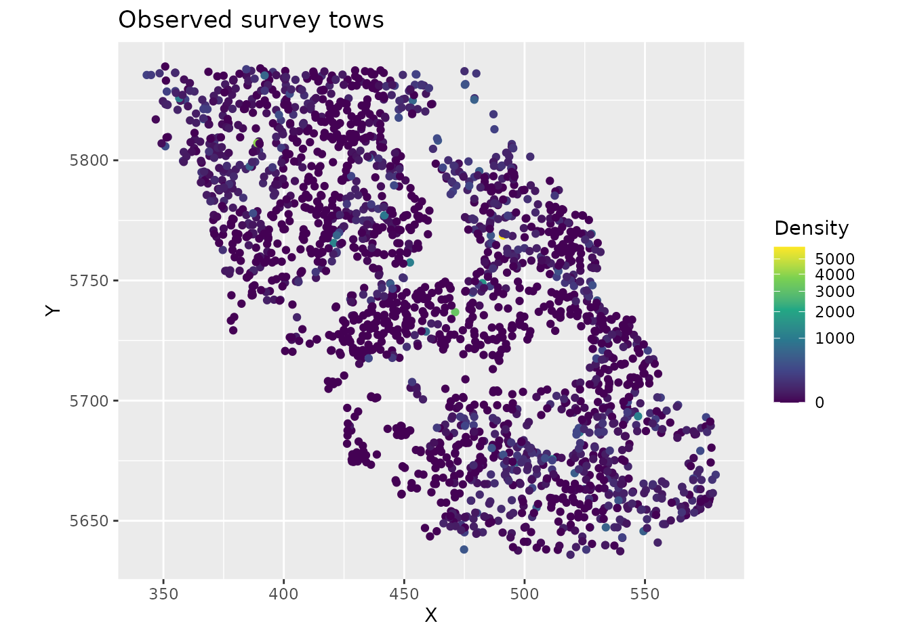

``` r

glimpse(pcod)
#> Rows: 2,143
#> Columns: 12
#> $ year          <int> 2003, 2003, 2003, 2003, 2003, 2003, 2003, 2003, 2003, 20…
#> $ X             <dbl> 446.4752, 446.4594, 448.5987, 436.9157, 420.6101, 417.71…
#> $ Y             <dbl> 5793.426, 5800.136, 5801.687, 5802.305, 5771.055, 5772.2…
#> $ depth         <dbl> 201, 212, 220, 197, 256, 293, 410, 387, 285, 270, 381, 1…
#> $ density       <dbl> 113.138476, 41.704922, 0.000000, 15.706138, 0.000000, 0.…
#> $ present       <dbl> 1, 1, 0, 1, 0, 0, 0, 0, 0, 1, 0, 0, 0, 0, 0, 0, 0, 0, 0,…
#> $ lat           <dbl> 52.28858, 52.34890, 52.36305, 52.36738, 52.08437, 52.094…
#> $ lon           <dbl> -129.7847, -129.7860, -129.7549, -129.9265, -130.1586, -…
#> $ depth_mean    <dbl> 5.155194, 5.155194, 5.155194, 5.155194, 5.155194, 5.1551…
#> $ depth_sd      <dbl> 0.4448783, 0.4448783, 0.4448783, 0.4448783, 0.4448783, 0…
#> $ depth_scaled  <dbl> 0.3329252, 0.4526914, 0.5359529, 0.2877417, 0.8766077, 1…
#> $ depth_scaled2 <dbl> 0.11083919, 0.20492947, 0.28724555, 0.08279527, 0.768440…
```

Notice that high and low densities cluster in space. This clustering is
what spatial random fields will capture.

## A non-spatial baseline

We’ll start with a logistic regression of whether Pacific cod were
caught (`present`) as a function of depth. We include depth and depth
squared (`I(depth_scaled^2)`) so that the probability of catching cod
can peak at intermediate depths. With `spatial = "off"`,
[`sdmTMB()`](https://sdmTMB.github.io/sdmTMB/reference/sdmTMB.md) fits a
standard GLM:

``` r

m <- sdmTMB(
  present ~ depth_scaled + I(depth_scaled^2),
  data = pcod,
  family = binomial(link = "logit"),
  spatial = "off"
)
m
#> Model fit by ML ['sdmTMB']
#> Formula: present ~ depth_scaled + I(depth_scaled^2)
#> Mesh:  (isotropic covariance)
#> Data: pcod
#> Family: binomial(link = 'logit')
#>  
#> Conditional model:
#>                   coef.est coef.se
#> (Intercept)           0.57    0.06
#> depth_scaled         -1.04    0.07
#> I(depth_scaled^2)    -0.99    0.06
#> 
#> ML criterion at convergence: 1193.035
#> 
#> See ?tidy.sdmTMB to extract these values as a data frame.
```

For comparison, here’s the same model with
[`glm()`](https://rdrr.io/r/stats/glm.html):

``` r

m0 <- glm(
  present ~ depth_scaled + I(depth_scaled^2),
  data = pcod,
  family = binomial(link = "logit")
)
summary(m0)
#> 
#> Call:
#> glm(formula = present ~ depth_scaled + I(depth_scaled^2), family = binomial(link = "logit"), 
#>     data = pcod)
#> 
#> Coefficients:
#>                   Estimate Std. Error z value Pr(>|z|)    
#> (Intercept)        0.56599    0.05979   9.467   <2e-16 ***
#> depth_scaled      -1.03590    0.07266 -14.258   <2e-16 ***
#> I(depth_scaled^2) -0.99259    0.06066 -16.363   <2e-16 ***
#> ---
#> Signif. codes:  0 '***' 0.001 '**' 0.01 '*' 0.05 '.' 0.1 ' ' 1
#> 
#> (Dispersion parameter for binomial family taken to be 1)
#> 
#>     Null deviance: 2958.4  on 2142  degrees of freedom
#> Residual deviance: 2386.1  on 2140  degrees of freedom
#> AIC: 2392.1
#> 
#> Number of Fisher Scoring iterations: 5
```

The parameter estimates and standard errors are the same. The negative
quadratic term means the probability of catching cod rises and then
falls with depth. Because we used a logit link, the coefficients are on
the log-odds scale.

## Adding a spatial random field

### The mesh

To include a spatial random field, sdmTMB needs a *mesh*: a network of
triangles covering the study area. The random field is estimated at the
mesh vertices (corners of the triangles) and interpolated between them.

``` r

mesh <- make_mesh(pcod, c("X", "Y"), cutoff = 10)
plot(mesh)
```

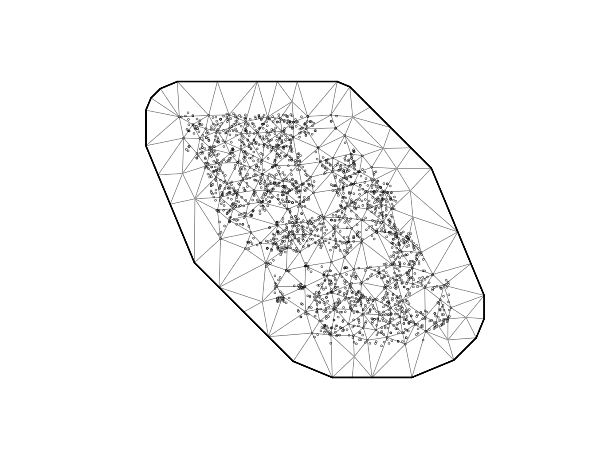

The circles are observations and the triangle corners are the mesh
vertices. `cutoff` is the minimum distance between vertices, in the
units of `X` and `Y` (here, km). Smaller values give a finer mesh that
can capture finer spatial patterns but is slower to fit. A good approach
is to start with a relatively coarse mesh and then check whether a finer
mesh changes your conclusions. See
[`?make_mesh`](https://sdmTMB.github.io/sdmTMB/reference/make_mesh.md)
for other ways to build a mesh.

### Fitting the model

Now we fit the same model with `spatial = "on"` and our `mesh`:

``` r

m1 <- sdmTMB(
  present ~ depth_scaled + I(depth_scaled^2),
  data = pcod,
  mesh = mesh,
  family = binomial(link = "logit"),
  spatial = "on"
)
```

It’s a good habit to run
[`sanity()`](https://sdmTMB.github.io/sdmTMB/reference/sanity.md) after
fitting any model. It checks for common convergence and estimation
problems:

``` r

sanity(m1)
#> ✔ Non-linear minimizer suggests successful convergence
#> ✔ Hessian matrix is positive definite
#> ✔ No extreme or very small eigenvalues detected
#> ✔ No gradients with respect to fixed effects are >= 0.001
#> ✔ No fixed-effect standard errors are NA
#> ✔ No standard errors look unreasonably large
#> ✔ No sigma parameters are < 0.01
#> ✔ No sigma parameters are > 100
#> ✔ Range parameter doesn't look unreasonably large
```

``` r

m1
#> Spatial model fit by ML ['sdmTMB']
#> Formula: present ~ depth_scaled + I(depth_scaled^2)
#> Mesh: mesh (isotropic covariance)
#> Data: pcod
#> Family: binomial(link = 'logit')
#>  
#> Conditional model:
#>                   coef.est coef.se
#> (Intercept)           1.14    0.44
#> depth_scaled         -2.17    0.21
#> I(depth_scaled^2)    -1.59    0.13
#> 
#> Matérn range: 43.54
#> Spatial SD: 1.65
#> ML criterion at convergence: 1042.157
#> 
#> See ?tidy.sdmTMB to extract these values as a data frame.
```

Two new parameters appear in the output:

- `Matérn range`: the distance at which two locations are effectively
  independent (about 13% correlated). Here, locations more than about 40
  km apart have little spatial correlation.
- `Spatial SD` (`sigma_O`, for “omega”): how much the spatial random
  field varies. Larger values mean more spatial variation that depth
  doesn’t explain. Here, it is on the logit scale.

### What changed?

Let’s compare the depth coefficients with and without the spatial field:

``` r

coefs <- bind_rows(
  mutate(tidy(m), model = "Non-spatial"),
  mutate(tidy(m1), model = "Spatial")
)
ggplot(coefs, aes(estimate, term, colour = model)) +
  geom_pointrange(aes(xmin = conf.low, xmax = conf.high),
    position = position_dodge(width = 0.4)) +
  geom_vline(xintercept = 0, lty = 2) +
  labs(x = "Estimate (log odds)", y = NULL, colour = NULL)
```

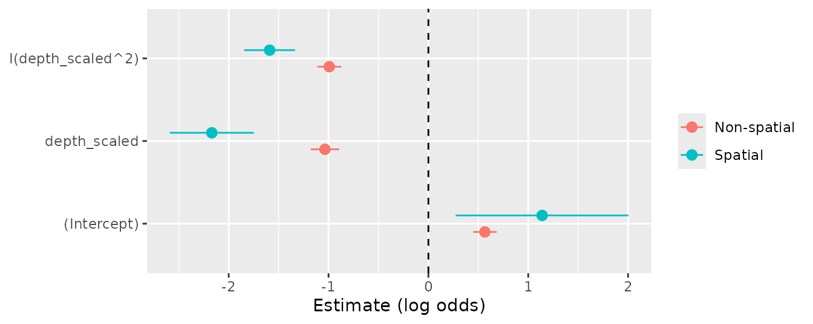

The confidence intervals are much wider with the spatial random field.
The non-spatial model treated nearby tows as independent and was
overconfident. The estimates themselves also changed. Here, the depth
effect became stronger (a more peaked curve), but estimates can shift in
either direction once spatial correlation is accounted for.

We can also compare the models with AIC (lower is better):

``` r

AIC(m, m1)
#>    df      AIC
#> m   3 2392.070
#> m1  5 2094.314
```

The spatial model is strongly favoured.

> **Under the hood:** The random field is a Gaussian random field with a
> Matérn covariance function. sdmTMB uses the SPDE approach (Lindgren et
> al. 2011) to approximate it with a Gaussian Markov random field on the
> mesh vertices. This is what makes the models fast to fit. See the
> [model
> description](https://sdmTMB.github.io/sdmTMB/articles/model-description.html)
> for the equations.

## Adding spatiotemporal random fields

The spatial random field is constant through time. It captures
*persistent* spatial patterns, such as areas that always have high
density. To also capture patterns that change from year to year, we add
*spatiotemporal* random fields. This needs a `time` argument naming the
column with the time step and a choice of how the fields are related
through time:

- `"iid"`: each year’s field is independent;
- `"ar1"`: each year’s field is correlated with the previous year’s;
- `"rw"`: each year’s field is the previous year’s field plus a random
  change (a random walk).

We’ll use `"iid"`, which is a simple starting point. The `"ar1"` and
`"rw"` options assume evenly spaced time steps, so with this survey
(which was not run every year) we would need to fill in the missing
years with the `extra_time` argument.

``` r

m2 <- sdmTMB(
  present ~ depth_scaled + I(depth_scaled^2),
  data = pcod,
  mesh = mesh,
  family = binomial(link = "logit"),
  spatial = "on",
  time = "year",
  spatiotemporal = "iid"
)
sanity(m2)
#> ✔ Non-linear minimizer suggests successful convergence
#> ✔ Hessian matrix is positive definite
#> ✔ No extreme or very small eigenvalues detected
#> ✔ No gradients with respect to fixed effects are >= 0.001
#> ✔ No fixed-effect standard errors are NA
#> ✔ No standard errors look unreasonably large
#> ✔ No sigma parameters are < 0.01
#> ✔ No sigma parameters are > 100
#> ✔ Range parameter doesn't look unreasonably large
m2
#> Spatiotemporal model fit by ML ['sdmTMB']
#> Formula: present ~ depth_scaled + I(depth_scaled^2)
#> Mesh: mesh (isotropic covariance)
#> Time column: year
#> Data: pcod
#> Family: binomial(link = 'logit')
#>  
#> Conditional model:
#>                   coef.est coef.se
#> (Intercept)           1.37    0.58
#> depth_scaled         -2.47    0.25
#> I(depth_scaled^2)    -1.83    0.15
#> 
#> Matérn range: 49.96
#> Spatial SD: 1.91
#> Spatiotemporal IID SD: 0.95
#> ML criterion at convergence: 1014.753
#> 
#> See ?tidy.sdmTMB to extract these values as a data frame.
```

The new parameter is `Spatiotemporal IID SD` (`sigma_E`, for “epsilon”):
how much the spatial pattern varies from year to year beyond the
persistent spatial field.

``` r

AIC(m1, m2)
#>    df      AIC
#> m1  5 2094.314
#> m2  6 2041.506
```

## Modelling biomass density

So far we’ve modelled presence or absence. Often we’re more interested
in biomass density, which is continuous but has many exact zeros (tows
that caught nothing). The Tweedie distribution handles this kind of
data. We keep the same covariates and random fields and change only the
response and family:

``` r

m3 <- sdmTMB(
  density ~ depth_scaled + I(depth_scaled^2),
  data = pcod,
  mesh = mesh,
  family = tweedie(link = "log"),
  spatial = "on",
  time = "year",
  spatiotemporal = "iid"
)
sanity(m3)
#> ✔ Non-linear minimizer suggests successful convergence
#> ✔ Hessian matrix is positive definite
#> ✔ No extreme or very small eigenvalues detected
#> ✔ No gradients with respect to fixed effects are >= 0.001
#> ✔ No fixed-effect standard errors are NA
#> ✔ No standard errors look unreasonably large
#> ✔ No sigma parameters are < 0.01
#> ✔ No sigma parameters are > 100
#> ✔ Range parameter doesn't look unreasonably large
m3
#> Spatiotemporal model fit by ML ['sdmTMB']
#> Formula: density ~ depth_scaled + I(depth_scaled^2)
#> Mesh: mesh (isotropic covariance)
#> Time column: year
#> Data: pcod
#> Family: tweedie(link = 'log')
#>  
#> Conditional model:
#>                   coef.est coef.se
#> (Intercept)           3.29    0.21
#> depth_scaled         -1.91    0.15
#> I(depth_scaled^2)    -1.43    0.09
#> 
#> Dispersion parameter: 11.03
#> Tweedie p: 1.50
#> Matérn range: 19.75
#> Spatial SD: 1.40
#> Spatiotemporal IID SD: 1.55
#> ML criterion at convergence: 6277.624
#> 
#> See ?tidy.sdmTMB to extract these values as a data frame.
```

We can get the estimates and confidence intervals as data frames with
[`tidy()`](https://generics.r-lib.org/reference/tidy.html). With a log
link, exponentiating a coefficient gives the multiplicative change in
density for a 1-unit change in the covariate:

``` r

tidy(m3)
#> # A tibble: 3 × 5
#>   term              estimate std.error conf.low conf.high
#>   <chr>                <dbl>     <dbl>    <dbl>     <dbl>
#> 1 (Intercept)           3.29    0.210      2.88      3.70
#> 2 depth_scaled         -1.91    0.151     -2.21     -1.62
#> 3 I(depth_scaled^2)    -1.43    0.0888    -1.61     -1.26
```

And for the random field and observation parameters:

``` r

tidy(m3, "ran_pars")
#> # A tibble: 5 × 5
#>   term      estimate std.error conf.low conf.high
#>   <chr>        <dbl>     <dbl>    <dbl>     <dbl>
#> 1 range        19.8     3.03      14.6      26.7 
#> 2 phi          11.0     0.377     10.3      11.8 
#> 3 sigma_O       1.40    0.162      1.12      1.76
#> 4 sigma_E       1.55    0.129      1.32      1.83
#> 5 tweedie_p     1.50    0.0119     1.48      1.52
```

We’ve seen `range`, `sigma_O`, and `sigma_E` already. The Tweedie
distribution adds two parameters:

- `phi`: the dispersion parameter, which controls how variable
  observations are around the mean.
- `tweedie_p`: the power parameter, between 1 and 2. Values closer to 1
  behave more like a Poisson distribution and values closer to 2 behave
  more like a gamma distribution.

By default, the spatial and spatiotemporal fields share the same range.
Set `share_range = FALSE` to estimate them separately. If we had used
AR1 spatiotemporal fields, we would also see `rho`, the correlation
between years (between -1 and 1).

## Checking the model

[`sanity()`](https://sdmTMB.github.io/sdmTMB/reference/sanity.md) checks
that the model converged, but not whether it fits the data well. For
that, we look at residuals. Randomized quantile residuals should be
approximately normally distributed with mean 0 and standard deviation 1
if the model is consistent with the data:

``` r

set.seed(1)
pcod$resids <- residuals(m3, type = "mle-mvn") # randomized quantile residuals
qqnorm(pcod$resids)
abline(0, 1)
```

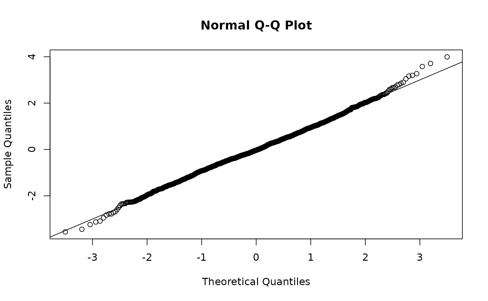

``` r

ggplot(pcod, aes(X, Y, col = resids)) +
  scale_colour_gradient2() +
  geom_point() +
  facet_wrap(~year) +
  coord_fixed()
```

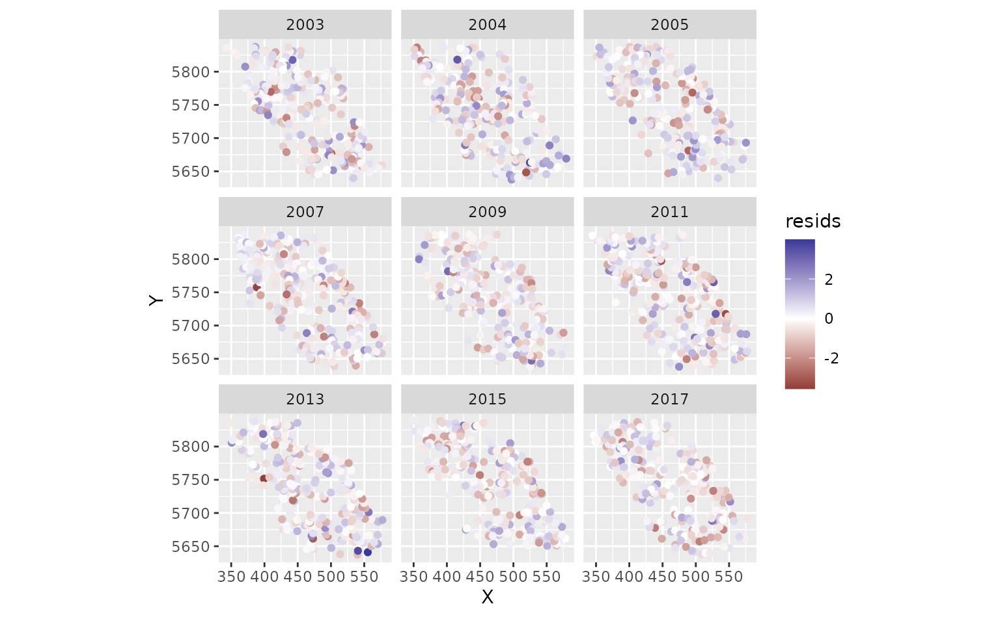

Look for an approximately straight line in the QQ plot and no large
patches of positive or negative residuals in the maps. Strong spatial
patterns suggest missing covariates, a misspecified model, or a mesh
that is too coarse.

We can also use simulation-based residuals with the DHARMa package:

``` r

set.seed(19283)
s <- simulate(m3, nsim = 300, type = "mle-mvn")
dharma_residuals(s, m3)
```

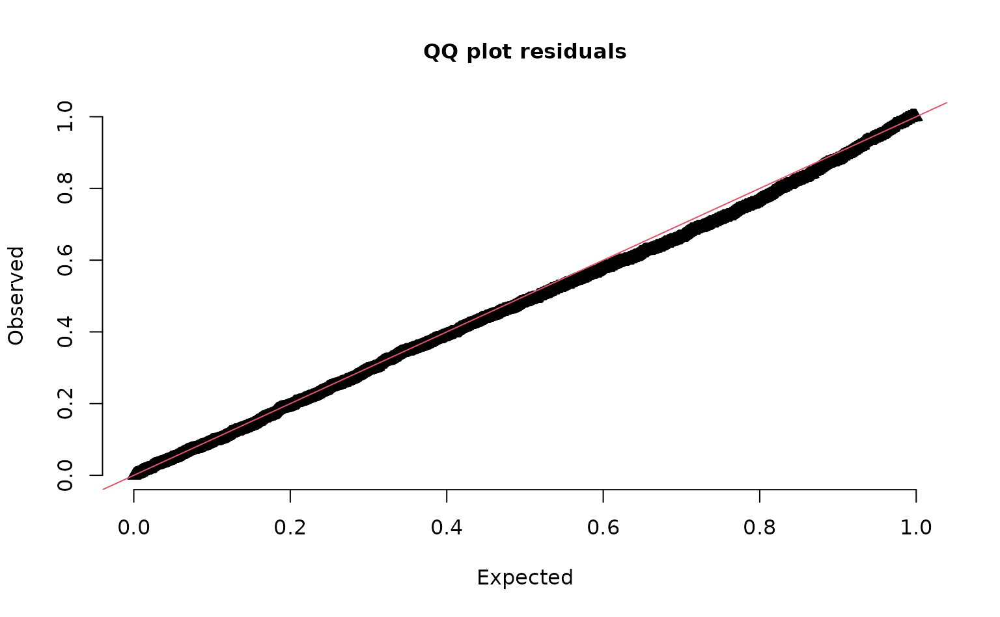

See `?residuals.sdmTMB()` and the [residual checking
article](https://sdmtmb.github.io/sdmTMB/articles/residual-checking.html).

## Predicting and mapping

To make maps, we predict on a grid covering the whole survey area. The
package includes a grid for this survey, `qcs_grid`, with 2 x 2 km
cells. The grid needs every covariate used in the model. See [this
discussion](https://github.com/sdmTMB/sdmTMB/discussions/151) for
suggestions on making your own grid.

``` r

glimpse(qcs_grid)
#> Rows: 7,314
#> Columns: 5
#> $ X             <dbl> 456, 458, 460, 462, 464, 466, 468, 470, 472, 474, 476, 4…
#> $ Y             <dbl> 5636, 5636, 5636, 5636, 5636, 5636, 5636, 5636, 5636, 56…
#> $ depth         <dbl> 347.08345, 223.33479, 203.74085, 183.29868, 182.99983, 1…
#> $ depth_scaled  <dbl> 1.56081222, 0.56976988, 0.36336929, 0.12570465, 0.122036…
#> $ depth_scaled2 <dbl> 2.436134794, 0.324637712, 0.132037240, 0.015801659, 0.01…
```

Our model has spatiotemporal fields, so we need a copy of the grid for
each year:

``` r

grid_yrs <- replicate_df(qcs_grid, "year", unique(pcod$year))
```

Now we predict on the new data:

``` r

predictions <- predict(m3, newdata = grid_yrs)
```

Let’s make a small function to help make maps.

``` r

plot_map <- function(dat, column) {
  ggplot(dat, aes(X, Y, fill = {{ column }})) +
    geom_raster() +
    coord_fixed()
}
```

The `{{ }}` syntax is a “[tidy-eval
helper](https://ggplot2.tidyverse.org/reference/tidyeval.html)” that
lets us pass an unquoted column name to ggplot.

### The parts of a prediction

The prediction is the sum of several parts, all on the link scale (here,
log):

    est = est_non_rf + omega_s + epsilon_st

- `est_non_rf`: the part from the fixed effects (here, depth);
- `omega_s`: the spatial random field (persistent spatial patterns);
- `epsilon_st`: the spatiotemporal random fields (year-specific
  patterns);
- `est_rf`: the two random field parts combined
  (`omega_s + epsilon_st`);
- `est`: the full prediction, which is usually what you want for maps.

We can check that the parts add up:

``` r

all.equal(
  predictions$est,
  predictions$est_non_rf + predictions$omega_s + predictions$epsilon_st
)
#> [1] TRUE
```

First, the full predictions. We use
[`exp()`](https://rdrr.io/r/base/Log.html) to convert from the log scale
to biomass density:

``` r

plot_map(predictions, exp(est)) +
  scale_fill_viridis_c(
    trans = "sqrt",
    # trim extreme high values to make spatial variation more visible:
    na.value = "yellow", limits = c(0, quantile(exp(predictions$est), 0.995))
  ) +
  facet_wrap(~year) +
  ggtitle("Prediction (fixed effects + all random effects)",
    subtitle = paste("maximum estimated biomass density =", round(max(exp(predictions$est))))
  )
```

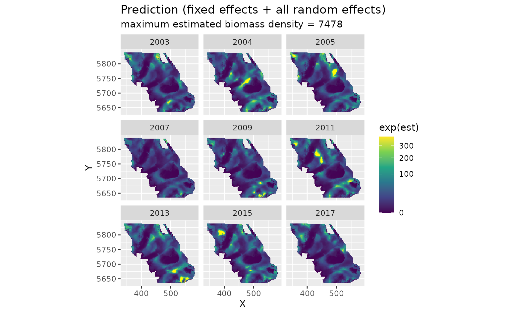

The fixed effects only (depth). This is the same every year:

``` r

plot_map(predictions, exp(est_non_rf)) +
  scale_fill_viridis_c(trans = "sqrt") +
  ggtitle("Prediction (fixed effects only)")
```

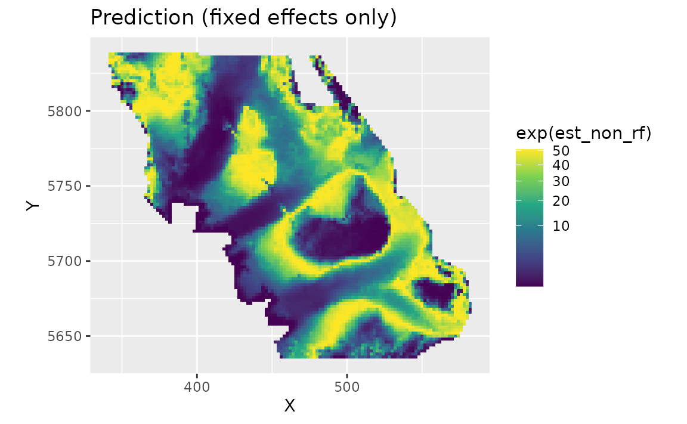

The spatial random field. These are persistent deviations from the depth
effect: areas that are consistently higher (red) or lower (blue) than
depth alone predicts. They represent spatially structured factors, such
as habitat, that the model doesn’t include:

``` r

plot_map(predictions, omega_s) +
  scale_fill_gradient2() +
  ggtitle("Spatial random effects only")
```

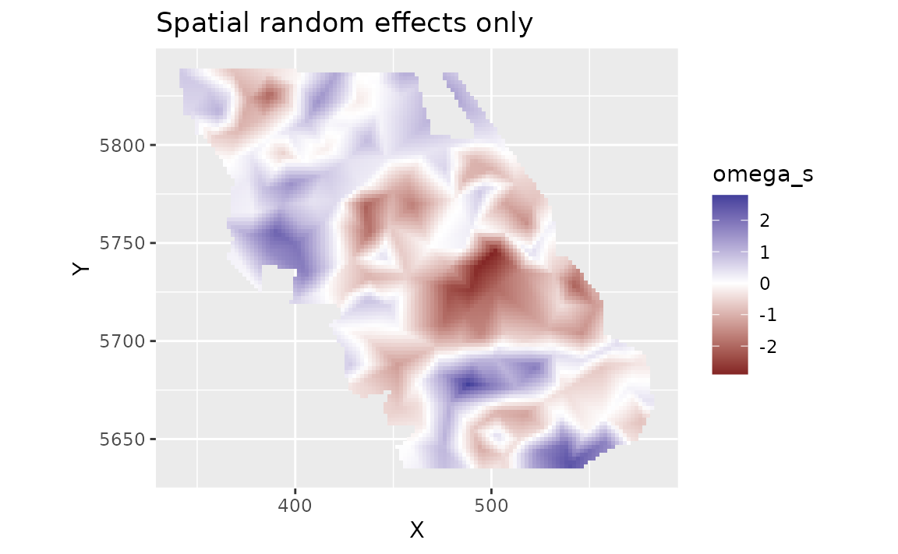

The spatiotemporal random fields. These are deviations that change from
year to year, beyond the depth effect and the persistent spatial field:

``` r

plot_map(predictions, epsilon_st) +
  scale_fill_gradient2() +
  facet_wrap(~year) +
  ggtitle("Spatiotemporal random effects only")
```

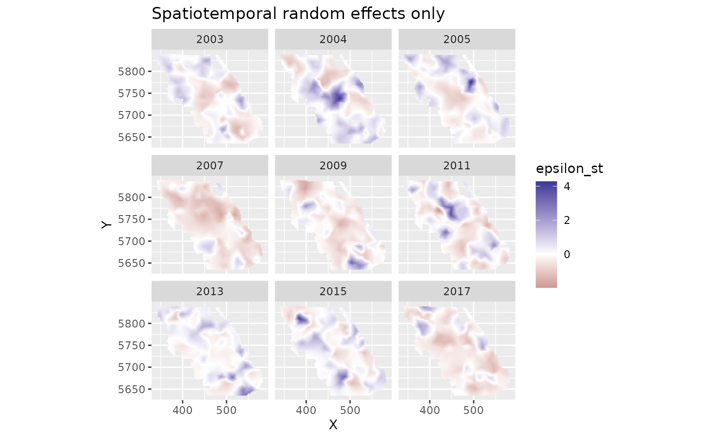

### Uncertainty

To get uncertainty on the predictions, we can set `nsim` in
[`predict()`](https://rdrr.io/r/stats/predict.html). This draws many
sets of values for the parameters and random effects, consistent with
their estimated uncertainty and correlations, and makes a prediction for
each draw. (Technically, the draws come from a multivariate normal
distribution defined by the estimated values and the *joint precision
matrix*, the inverse of the covariance matrix, of all fixed and random
effects.) Here we take 100 draws and summarize them for each grid cell
with [`apply()`](https://rdrr.io/r/base/apply.html):

``` r

set.seed(1)
sim <- predict(m3, newdata = grid_yrs, nsim = 100)
sim_last <- sim[grid_yrs$year == max(grid_yrs$year), ] # just plot last year
pred_last <- predictions[predictions$year == max(grid_yrs$year), ]
pred_last$lwr <- apply(exp(sim_last), 1, quantile, probs = 0.025)
pred_last$upr <- apply(exp(sim_last), 1, quantile, probs = 0.975)
pred_last$sd <- apply(exp(sim_last), 1, sd)
pred_last$cv <- apply(exp(sim_last), 1, function(x) sd(x) / mean(x))
```

The coefficient of variation (CV; SD divided by the mean) shows where
the predictions are most uncertain relative to their size:

``` r

plot_map(pred_last, cv) +
  scale_fill_viridis_c()
```

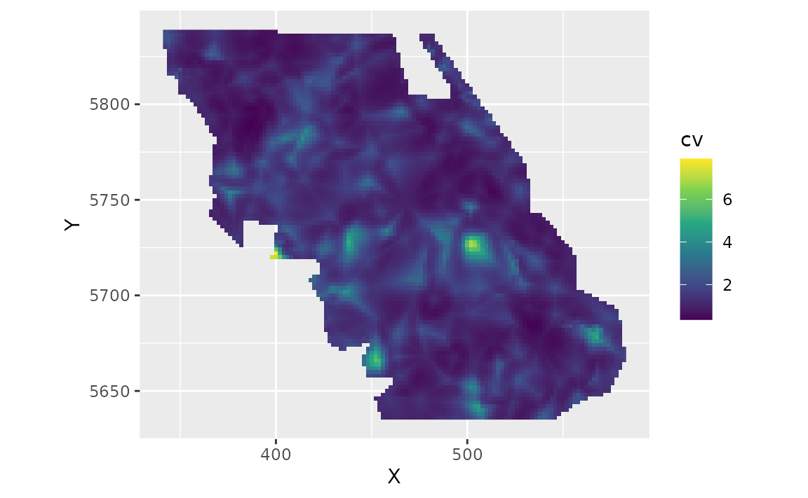

## Plotting covariate effects

To see the effect of depth, we predict across a range of depths while
ignoring the random fields (`re_form = NA`). We make the depths in
meters and convert them to `depth_scaled` the same way the data were
prepared:

``` r

nd <- data.frame(depth = seq(min(pcod$depth), max(pcod$depth), length.out = 100))
nd$depth_scaled <- (log(nd$depth) - pcod$depth_mean[1]) / pcod$depth_sd[1]
nd$year <- 2015L # the year doesn't matter with re_form = NA here, but is required

p <- predict(m3, newdata = nd, se_fit = TRUE, re_form = NA)

ggplot(p, aes(depth, exp(est),
  ymin = exp(est - 1.96 * est_se),
  ymax = exp(est + 1.96 * est_se)
)) +
  geom_line() +
  geom_ribbon(alpha = 0.4) +
  coord_cartesian(expand = FALSE) +
  labs(x = "Depth (m)", y = "Biomass density (kg/km2)")
```

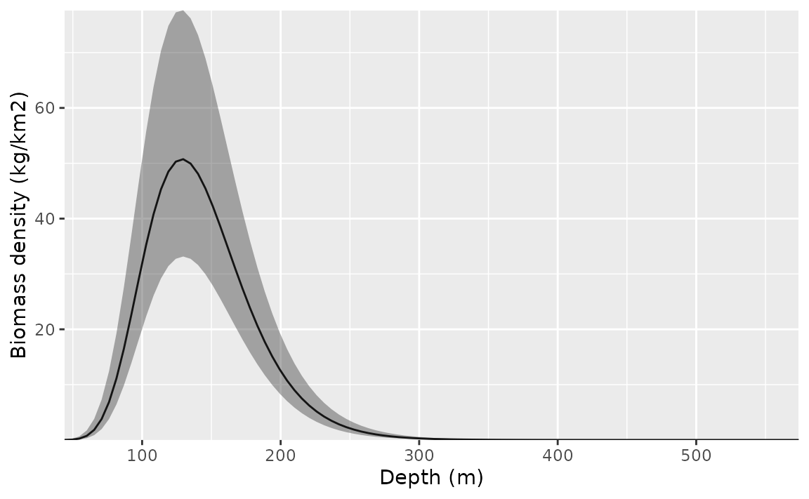

The [ggeffects](https://sdmTMB.github.io/sdmTMB/articles/ggeffects.html)
and [visreg](https://sdmTMB.github.io/sdmTMB/articles/visreg.html)
packages can make these plots for you. For example:

``` r

ggeffects::ggpredict(m3, "depth_scaled [all]") |> plot()
```

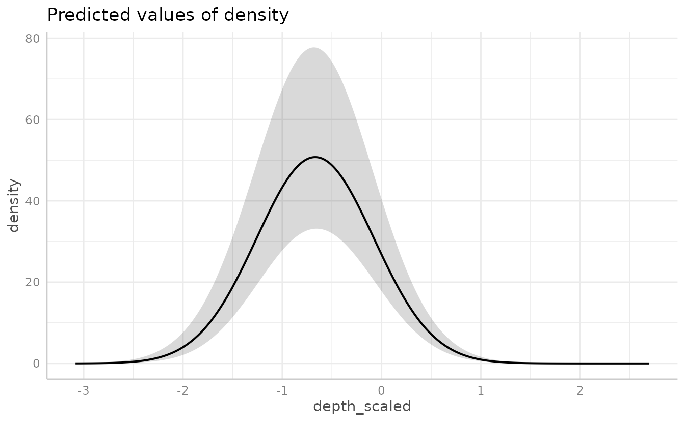

## Recap and next steps

The steps we followed apply to most sdmTMB analyses:

1.  Look at the data and put coordinates in a projection with distances
    in meaningful units (e.g., UTMs in km).
2.  Make a mesh with
    [`make_mesh()`](https://sdmTMB.github.io/sdmTMB/reference/make_mesh.md).
3.  Fit models with
    [`sdmTMB()`](https://sdmTMB.github.io/sdmTMB/reference/sdmTMB.md),
    building up from simpler to more complex.
4.  Run
    [`sanity()`](https://sdmTMB.github.io/sdmTMB/reference/sanity.md) on
    each model.
5.  Check residuals.
6.  Interpret parameters with
    [`tidy()`](https://generics.r-lib.org/reference/tidy.html) and
    compare models (e.g., with
    [`AIC()`](https://rdrr.io/r/stats/AIC.html) or
    [`sdmTMB_cv()`](https://sdmTMB.github.io/sdmTMB/reference/sdmTMB_cv.md)).
7.  Predict on a grid with
    [`predict()`](https://rdrr.io/r/stats/predict.html) to make maps,
    and use `nsim` for uncertainty.

Where to go next:

- [Index
  standardization](https://sdmTMB.github.io/sdmTMB/articles/index-standardization.html):
  calculate total abundance or biomass over time from predictions.
- [Residual
  checking](https://sdmTMB.github.io/sdmTMB/articles/residual-checking.html):
  more on model checking.
- [Cross-validation](https://sdmTMB.github.io/sdmTMB/articles/cross-validation.html):
  compare models by how well they predict new data.
- [Delta
  models](https://sdmTMB.github.io/sdmTMB/articles/delta-models.html):
  model presence and positive density separately.
- [Spatial trend
  models](https://sdmTMB.github.io/sdmTMB/articles/spatial-trend-models.html):
  spatially varying coefficients.
- [Forecasting](https://sdmTMB.github.io/sdmTMB/articles/forecasting.html):
  predict into future years.

### Time-varying effects

Covariate effects can also change through time. Here, we let the
intercept and depth effects follow an AR1 process (each year’s values
correlated with the previous year’s) with `time_varying_type = "ar1"`.
With `"ar1"`, the coefficients in the main formula are the average
values, and the time-varying process estimates each year’s deviation
from them. We use `extra_time` to include every year between the first
and last survey so the time steps are evenly spaced. To keep the example
simple and fast, we leave out the spatiotemporal fields. See
[`?sdmTMB`](https://sdmTMB.github.io/sdmTMB/reference/sdmTMB.md) for the
other options for `time_varying_type`.

``` r

m4 <- sdmTMB(
  density ~ depth_scaled + I(depth_scaled^2),
  data = pcod,
  time_varying = ~ 1 + depth_scaled + I(depth_scaled^2),
  time_varying_type = "ar1",
  extra_time = 2003:2017,
  mesh = mesh,
  family = tweedie(link = "log"),
  spatial = "on",
  time = "year",
  spatiotemporal = "off"
)
sanity(m4)
#> ✔ Non-linear minimizer suggests successful convergence
#> ✔ Hessian matrix is positive definite
#> ✔ No extreme or very small eigenvalues detected
#> ✔ No gradients with respect to fixed effects are >= 0.001
#> ✔ No fixed-effect standard errors are NA
#> ✔ No standard errors look unreasonably large
#> ✔ No sigma parameters are < 0.01
#> ✔ No sigma parameters are > 100
#> ✔ Range parameter doesn't look unreasonably large
m4
#> Spatial model fit by ML ['sdmTMB']
#> Formula: density ~ depth_scaled + I(depth_scaled^2)
#> Mesh: mesh (isotropic covariance)
#> Time column: year
#> Data: pcod
#> Family: tweedie(link = 'log')
#>  
#> Conditional model:
#>                   coef.est coef.se
#> (Intercept)           3.84    0.28
#> depth_scaled         -1.91    0.16
#> I(depth_scaled^2)    -1.72    0.18
#> 
#> Time-varying parameters:
#>                        coef.est coef.se
#> (Intercept)-2003           0.00    0.25
#> (Intercept)-2004           0.62    0.24
#> (Intercept)-2005           0.51    0.24
#> (Intercept)-2006          -0.08    0.49
#> (Intercept)-2007          -0.76    0.26
#> (Intercept)-2008          -0.46    0.63
#> (Intercept)-2009          -0.74    0.25
#> (Intercept)-2010          -0.09    0.49
#> (Intercept)-2011           0.44    0.24
#> (Intercept)-2012           0.16    0.51
#> (Intercept)-2013           0.08    0.24
#> (Intercept)-2014           0.13    0.50
#> (Intercept)-2015           0.35    0.24
#> (Intercept)-2016           0.05    0.49
#> (Intercept)-2017          -0.18    0.25
#> depth_scaled-2003          0.00    0.08
#> depth_scaled-2004          0.01    0.09
#> depth_scaled-2005         -0.02    0.10
#> depth_scaled-2006          0.00    0.10
#> depth_scaled-2007         -0.03    0.13
#> depth_scaled-2008          0.00    0.09
#> depth_scaled-2009          0.03    0.13
#> depth_scaled-2010          0.00    0.10
#> depth_scaled-2011          0.01    0.09
#> depth_scaled-2012          0.00    0.09
#> depth_scaled-2013         -0.01    0.08
#> depth_scaled-2014          0.00    0.10
#> depth_scaled-2015          0.06    0.23
#> depth_scaled-2016          0.00    0.09
#> depth_scaled-2017         -0.04    0.19
#> I(depth_scaled^2)-2003    -0.05    0.22
#> I(depth_scaled^2)-2004    -0.04    0.19
#> I(depth_scaled^2)-2005    -0.11    0.22
#> I(depth_scaled^2)-2006     0.00    0.42
#> I(depth_scaled^2)-2007    -0.02    0.24
#> I(depth_scaled^2)-2008     0.01    0.50
#> I(depth_scaled^2)-2009     0.69    0.19
#> I(depth_scaled^2)-2010     0.00    0.42
#> I(depth_scaled^2)-2011    -0.50    0.23
#> I(depth_scaled^2)-2012     0.00    0.42
#> I(depth_scaled^2)-2013     0.56    0.17
#> I(depth_scaled^2)-2014     0.00    0.46
#> I(depth_scaled^2)-2015    -0.06    0.23
#> I(depth_scaled^2)-2016     0.00    0.46
#> I(depth_scaled^2)-2017    -0.45    0.25
#> rho-(Intercept)            0.34    0.39
#> rho-depth_scaled           0.00    1.19
#> rho-I(depth_scaled^2)      0.01    0.40
#> 
#> Dispersion parameter: 12.37
#> Tweedie p: 1.58
#> Matérn range: 15.41
#> Spatial SD: 1.75
#> ML criterion at convergence: 6361.987
#> 
#> See ?tidy.sdmTMB to extract these values as a data frame.
```

To plot the depth effect for each year, we predict for every combination
of depth and year:

``` r

nd <- expand.grid(
  depth = seq(50, 400, length.out = 50),
  year = unique(pcod$year)
)
nd$depth_scaled <- (log(nd$depth) - pcod$depth_mean[1]) / pcod$depth_sd[1]

p <- predict(m4, newdata = nd, se_fit = TRUE, re_form = NA)

ggplot(p, aes(depth, exp(est),
  ymin = exp(est - 1.96 * est_se),
  ymax = exp(est + 1.96 * est_se),
  group = as.factor(year)
)) +
  geom_line(aes(colour = year), lwd = 1) +
  geom_ribbon(aes(fill = year), alpha = 0.1) +
  scale_colour_viridis_c() +
  scale_fill_viridis_c() +
  coord_cartesian(expand = FALSE) +
  labs(x = "Depth (m)", y = "Biomass density (kg/km2)")
```

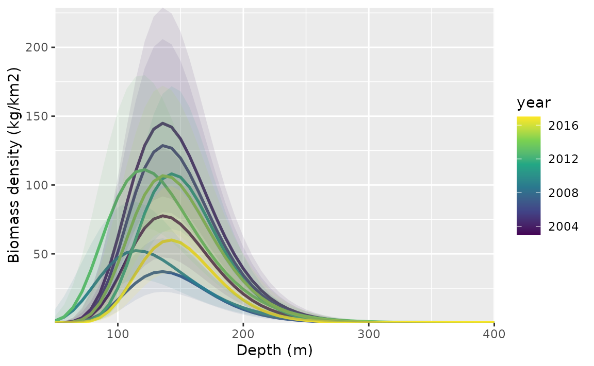

## References

Lindgren, F., Rue, H., and Lindström, J. 2011. An explicit link between
Gaussian fields and Gaussian Markov random fields: the stochastic
partial differential equation approach. Journal of the Royal Statistical
Society: Series B 73(4): 423–498.
