# Estimating covariate diffusion with sdmTMB

**If the code in this vignette has not been evaluated, a rendered
version is available on the [documentation
site](https://sdmTMB.github.io/sdmTMB/index.html) under ‘Articles’.**

``` r

library(ggplot2)
library(sdmTMB)
theme_set(theme_light())
```

This vignette demonstrates covariate-diffusion models using simulated
data. These models could alternatively be described as “distributed lag”
models.

When might you want to fit these models? Sometimes, the spatial or
temporal scale at which covariates influence the response is unclear.

For example, fish move. Therefore, if we measure temperature at the
location where a fish was sampled, it may be unclear whether the model
should use the temperature at the sampling site or a smoothed version of
the temperature surface that accounts for fish movement and integration
over a broader spatial range.

One option is to fit models using covariates with different levels of
smoothing and compare them. Alternatively, we can estimate the
appropriate degree of smoothing simultaneously with the parameters of
the main model. This is what the covariate-diffusion functionality does.

Users are encouraged to read and cite Lindmark *et al.* (2025) for
spatial models and Thorson *et al.* (2026) for extensions to temporal
and spatiotemporal settings, including the introduction of the MSD and
RMSD terms.

We begin with a simple spatial-diffusion example and then fit an example
that combines `space()` and
[`time()`](https://rdrr.io/r/stats/time.html) terms.

### Simple spatial diffusion example

We will start by simulating data with a fine-scale predictor (`x1`) and
a spatially diffused effect:

``` r

set.seed(1)
n_sites <- 220
site <- data.frame(X = runif(n_sites), Y = runif(n_sites))
dat <- transform(
  site,
  x1 = as.numeric(scale(
    sin(6 * pi * X) + cos(6 * pi * Y) + rnorm(n_sites, sd = 1)
  ))
)
mesh <- make_mesh(dat, c("X", "Y"), cutoff = 0.05)

sim_space <- simulate_new(
  formula = ~ 1,
  data = dat,
  mesh = mesh,
  family = gaussian(),
  spatial = "off",
  spatiotemporal = "off",
  range = 0.2,
  sigma_O = 0,
  phi = 0.1,
  B = c(0, 0.8),
  covariate_diffusion = ~ space(x1),
  diffusion_kappaS = 1.5,
  seed = 1
)

dat$observed <- sim_space$observed
dat$x1_truth <- sim_space$diffusion_truth_space_x1
head(dat)
#>           X         Y          x1    observed     x1_truth
#> 1 0.2655087 0.2624741 -1.80218040 -0.05509372  0.009439577
#> 2 0.3721239 0.1654539 -0.21021214  0.01510442 -0.004074891
#> 3 0.5728534 0.3221681 -0.43693836 -0.07591271  0.009562691
#> 4 0.9082078 0.5101252 -1.69168657  0.13020238 -0.036657119
#> 5 0.2016819 0.9239685 -1.18474680  0.06744091  0.043112665
#> 6 0.8983897 0.5109597 -0.05084862 -0.10927063 -0.034029739
```

Fit the matching covariate-diffusion model:

``` r

fit <- sdmTMB(
  observed ~ 1,
  mesh = mesh,
  covariate_diffusion = ~ space(x1), #<
  spatial = "off",
  data = dat
)

fit
#> Model fit by ML ['sdmTMB']
#> Formula: observed ~ 1
#> Mesh: mesh (isotropic covariance)
#> Data: dat
#> Covariate diffusion: space(x1)
#> Family: gaussian(link = 'identity')
#>  
#> Conditional model:
#>                   coef.est coef.se
#> (Intercept)           0.01    0.01
#> cov_diff_space_x1     0.23    0.15
#> 
#> Dispersion parameter: 0.09
#> Covariate diffusion RMSD: RMSD[x1]=0.46
#> ML criterion at convergence: -207.521
#> 
#> See ?tidy.sdmTMB to extract these values as a data frame.
tidy(fit)
#> # A tibble: 2 × 5
#>   term              estimate std.error  conf.low conf.high
#>   <chr>                <dbl>     <dbl>     <dbl>     <dbl>
#> 1 (Intercept)         0.0138   0.00675  0.000551    0.0270
#> 2 cov_diff_space_x1   0.226    0.149   -0.0658      0.517
tidy(fit, effects = "ran_pars")
#> # A tibble: 4 × 5
#>   term                estimate std.error conf.low conf.high
#>   <chr>                  <dbl>     <dbl>    <dbl>     <dbl>
#> 1 phi                   0.0942   0.00449  0.0858      0.103
#> 2 kappaS_cov_diff[x1]   4.30     2.23    -0.0661      8.67 
#> 3 MSD[x1]               0.216    0.224   -0.223       0.655
#> 4 RMSD[x1]              0.465    0.241   -0.00714     0.937
```

Here `kappaS_cov_diff[x1]` is the estimated spatial diffusion scale
parameter for `x1` (larger values imply less smoothing).

The output also reports `MSD[x1]` and `RMSD[x1]`, the implied mean
squared displacement (`4 / kappaS_cov_diff[x1]^2`) and root mean squared
displacement (`2 / kappaS_cov_diff[x1]`). `RMSD[x1]` is a typical
diffusion distance (a blur radius) in coordinate units. Users applying
this spatial diffusion method should cite Lindmark *et al.* (2025).
Users using these MSD and RMSD metrics should consult and cite Thorson
*et al.* (2026).

Compare true and estimated diffused covariates:

``` r

pred <- predict(fit)
pred$X <- dat$X
pred$Y <- dat$Y

cor(pred$diffusion_cov_space_x1, pred$x1_truth)
#> [1] 0.9215819

g1 <- ggplot(pred, aes(X, Y, colour = x1)) +
  geom_point(size = 0.7) +
  scale_colour_gradient2() +
  coord_equal() +
  ggtitle("Fine-scale observed predictor (x1)")

g2 <- ggplot(pred, aes(X, Y, colour = x1_truth)) +
  geom_point(size = 0.7) +
  scale_colour_gradient2() +
  coord_equal() +
  ggtitle("True diffused covariate (from simulation)")

g3 <- ggplot(pred, aes(X, Y, colour = diffusion_cov_space_x1)) +
  geom_point(size = 0.7) +
  scale_colour_gradient2() +
  coord_equal() +
  ggtitle("Estimated diffused covariate")

print(g1)
```

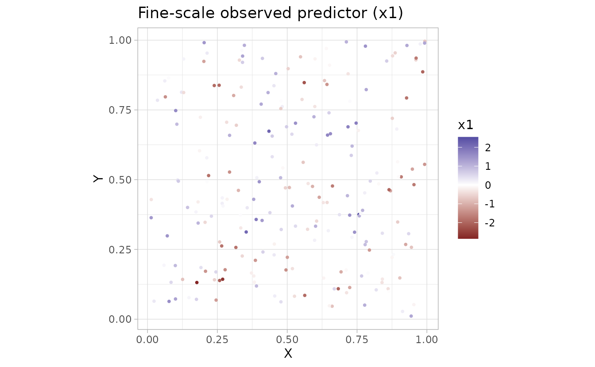

``` r

print(g2)
```

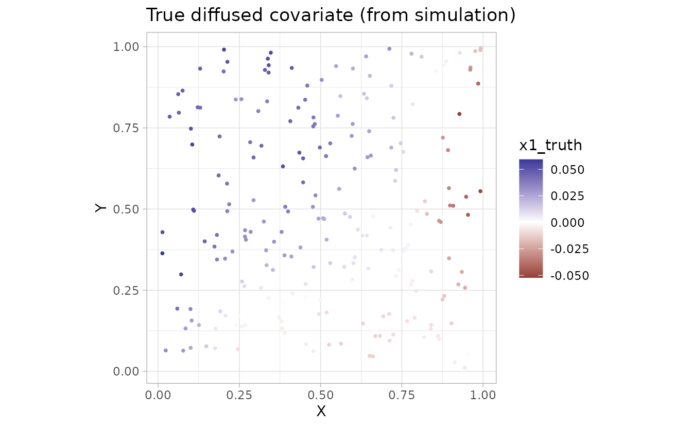

``` r

print(g3)
```

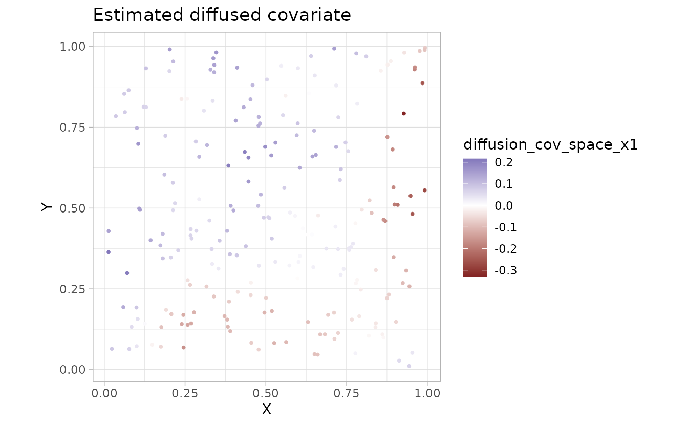

We can visualize the diffusion operator and the original and smoothed
covariate on the mesh:

``` r

plot_diffusion_kernel(fit, component = "space")
```

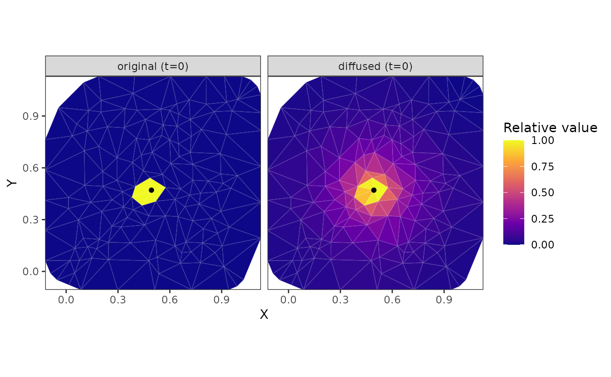

``` r

plot_diffused_covariate(fit, component = "space")
```

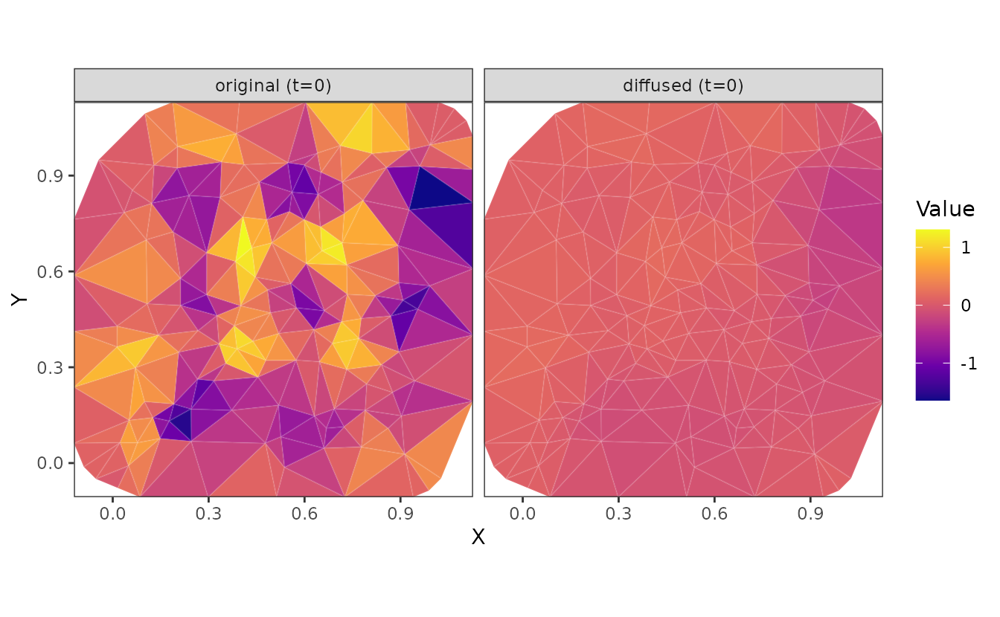

### Space-time example with additive terms

Next we will simulate and fit a model containing spatial and temporal
components: `~ space(x1) + time(x1)`.

``` r

set.seed(1)
n_t <- 16
n_sites <- 300
site_st <- data.frame(X = runif(n_sites), Y = runif(n_sites))
dat_st <- data.frame(
  X = rep(site_st$X, times = n_t),
  Y = rep(site_st$Y, times = n_t),
  year = rep(seq_len(n_t), each = n_sites)
)
dat_st$x1 <- as.numeric(scale(
  sin(2 * pi * (dat_st$X + dat_st$year / 8)) +
    cos(2 * pi * (dat_st$Y - dat_st$year / 10)) +
    0.6 * sin(4 * pi * dat_st$X) * cos(dat_st$year / 3) +
    rnorm(nrow(dat_st), sd = 0.15)
))
mesh_st <- make_mesh(dat_st, c("X", "Y"), cutoff = 0.07)

sim_st <- simulate_new(
  formula = ~ 1,
  data = dat_st,
  mesh = mesh_st,
  time = "year",
  family = gaussian(),
  spatial = "on",
  spatiotemporal = "off",
  range = 0.3,
  sigma_O = 0.2,
  phi = 0.1,
  B = c(0, 0.7, 0.6),
  covariate_diffusion = ~ space(x1) + time(x1),
  diffusion_kappaS = 4.4,
  diffusion_rhoT = 0.3,
  seed = 123
)

dat_st$observed <- sim_st$observed
```

``` r

fit_st <- sdmTMB(
  observed ~ 1,
  mesh = mesh_st,
  time = "year",
  covariate_diffusion = ~ space(x1) + time(x1), #<
  spatial = "on",
  spatiotemporal = "off",
  data = dat_st
)

sanity(fit_st)
#> ✔ Non-linear minimizer suggests successful convergence
#> ✔ Hessian matrix is positive definite
#> ✔ No extreme or very small eigenvalues detected
#> ✔ No gradients with respect to fixed effects are >= 0.001
#> ✔ No fixed-effect standard errors are NA
#> ✔ No standard errors look unreasonably large
#> ✔ No sigma parameters are < 0.01
#> ✔ No sigma parameters are > 100
#> ✔ Range parameter doesn't look unreasonably large
fit_st
#> Spatial model fit by ML ['sdmTMB']
#> Formula: observed ~ 1
#> Mesh: mesh_st (isotropic covariance)
#> Time column: character
#> Data: dat_st
#> Covariate diffusion: space(x1) + time(x1)
#> Family: gaussian(link = 'identity')
#>  
#> Conditional model:
#>                   coef.est coef.se
#> (Intercept)           0.01    0.05
#> cov_diff_space_x1     0.69    0.01
#> cov_diff_time_x1      0.61    0.01
#> 
#> Dispersion parameter: 0.10
#> Covariate diffusion temporal persistence: rhoT[x1]=0.30
#> Matérn range: 0.28
#> Spatial SD: 0.17
#> Covariate diffusion RMSD: RMSD[x1]=0.38
#> ML criterion at convergence: -4055.260
#> 
#> See ?tidy.sdmTMB to extract these values as a data frame.

tidy(fit_st, effects = "ran_pars")
#> # A tibble: 8 × 5
#>   term                estimate std.error conf.low conf.high
#>   <chr>                  <dbl>     <dbl>    <dbl>     <dbl>
#> 1 range                 0.279    0.0504    0.196      0.398
#> 2 phi                   0.0997   0.00103   0.0977     0.102
#> 3 sigma_O               0.173    0.0175    0.142      0.211
#> 4 kappaS_cov_diff[x1]   4.35     0.103     4.15       4.55 
#> 5 kappaT_cov_diff[x1]   0.431    0.0100    0.411      0.450
#> 6 rhoT[x1]              0.301    0.00490   0.291      0.311
#> 7 MSD[x1]               0.148    0.00771   0.133      0.163
#> 8 RMSD[x1]              0.384    0.0100    0.365      0.404
```

In the random-effect parameters, `kappaS_cov_diff[x1]` controls spatial
smoothing and `kappaT_cov_diff[x1]` controls temporal diffusion. Users
applying the time diffusion extension should read and cite Thorson *et
al.* (2026).

### Plot diffusion kernels

We can separately visualize the spatial diffusion, time diffusion, or
their combined effects as either the diffusion kernel or the smoothed
covariate field represented on the mesh:

``` r

plot_diffusion_kernel(fit_st, component = "space")
```

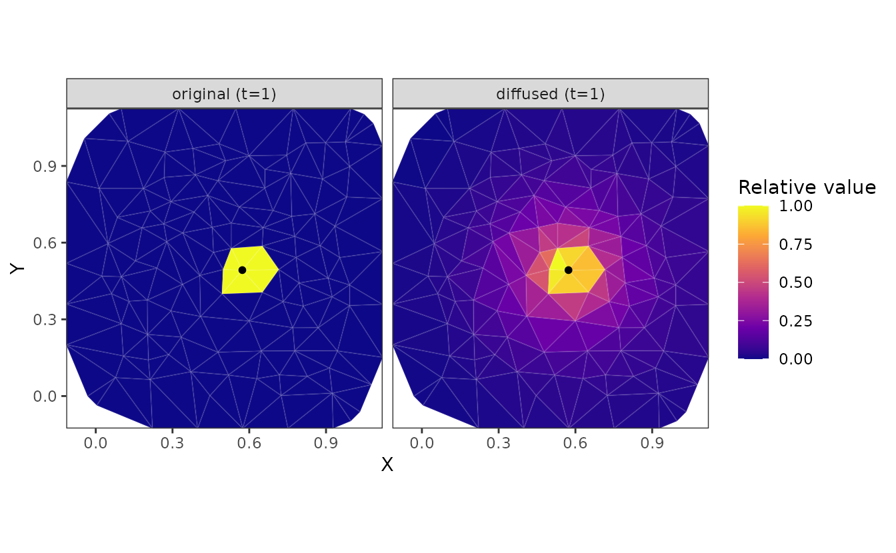

``` r

plot_diffusion_kernel(fit_st, component = "time", common_scale = TRUE)
```

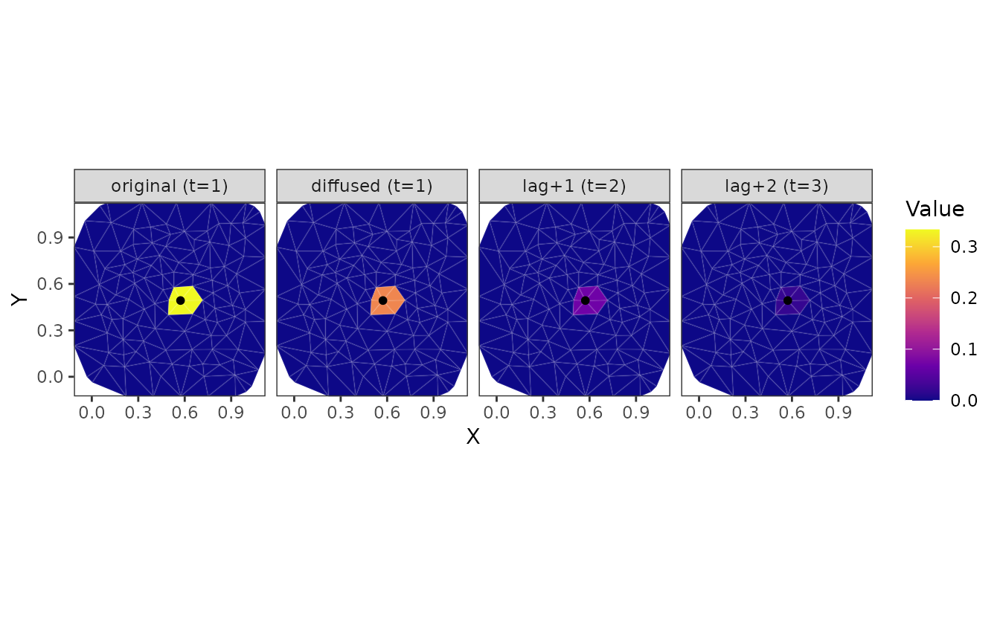

``` r

plot_diffusion_kernel(fit_st, component = "combined")
```

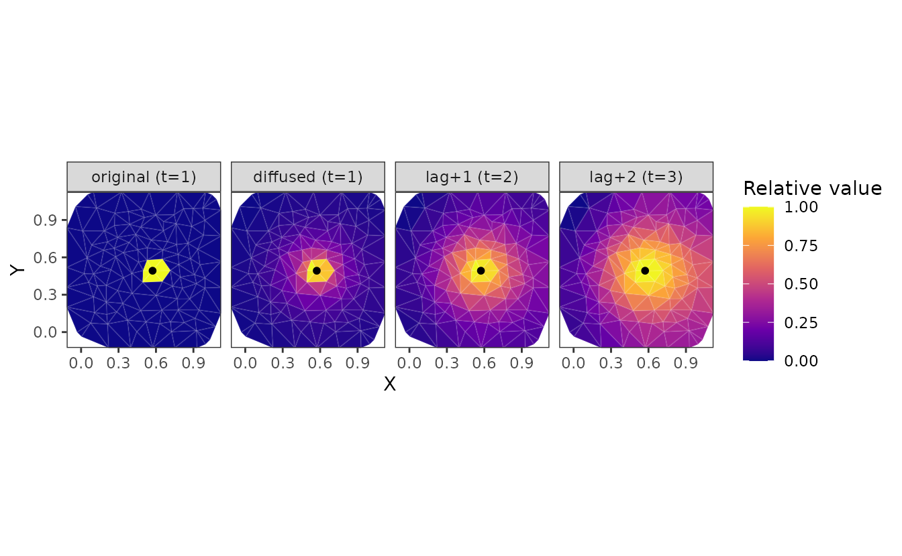

``` r

plot_diffusion_kernel(fit_st, component = "combined", common_scale = TRUE)
```

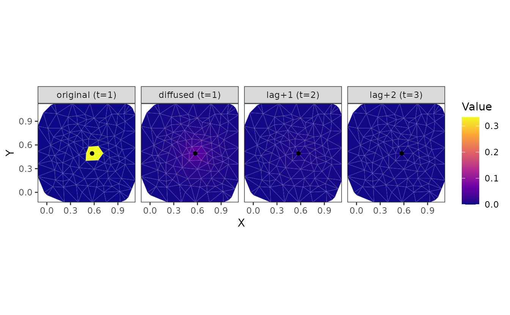

``` r

plot_diffused_covariate(fit_st, component = "space")
```


``` r

plot_diffused_covariate(fit_st, component = "time")
```

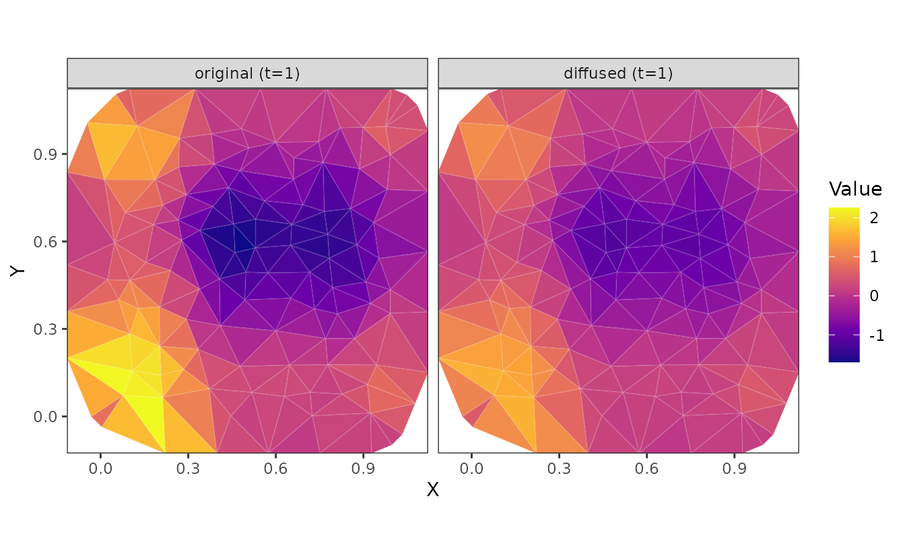

``` r

plot_diffused_covariate(fit_st, component = "combined")
```

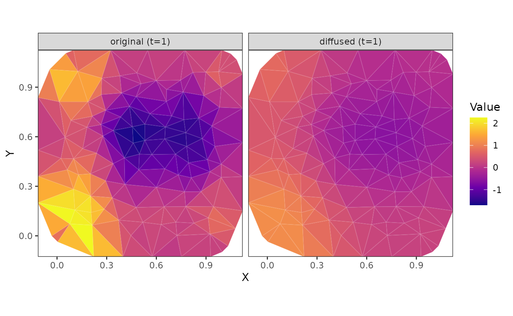

We could also have plotted the spatially diffused covariate at the
original locations from the predictions.

``` r

pred <- predict(fit_st)

ggplot(pred, aes(X, Y, colour = x1)) + geom_point() +
  scale_colour_gradient2()
```

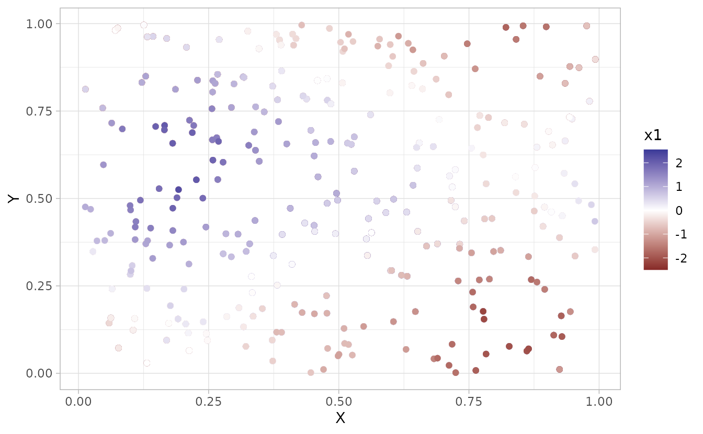

``` r


ggplot(pred, aes(X, Y, colour = diffusion_cov_space_x1)) + geom_point() +
  scale_colour_gradient2()
```

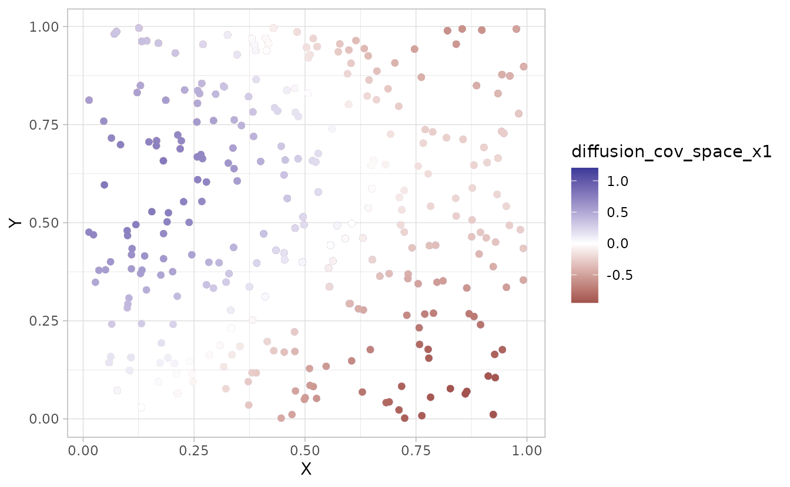

## References

Lindmark, M., Anderson, S.C. & Thorson, J.T. (2025). [Estimating
scale-dependent covariate responses using two-dimensional diffusion
derived from the stochastic partial differential equation
method](https://doi.org/10.1111/2041-210X.70177). *Methods in Ecology
and Evolution*, **17**, 207–218.

Thorson, J., Anderson, S. & Lindmark, M. (2026). [Temperature carryover
effect revealed for marine fishes using spatio-temporal distributed lag
models](https://doi.org/10.32942/X2W95P).
