# Estimating non-local covariate effects with sdmTMB: spatial diffusion and time lags

**If the code in this vignette has not been evaluated, a rendered
version is available on the [documentation
site](https://sdmTMB.github.io/sdmTMB/index.html) under ‘Articles’.**

``` r

library(ggplot2)
library(sdmTMB)
theme_set(theme_light())
```

This vignette demonstrates non-local-covariate models using simulated
data. These models could alternatively be described as “distributed lag”
models or, in the case of spatial diffusion, “covariate diffusion”
models.

When might you want to fit these models? Sometimes, the spatial or
temporal scale at which covariates influence the response is unclear.

For example, fish move. Therefore, if we measure temperature at the
location where a fish was sampled, it may be unclear whether the model
should use the temperature at the sampling site or a smoothed version of
the temperature surface that accounts for fish movement and integration
over a broader spatial range.

One option is to fit models using covariates with different levels of
smoothing and compare them. Alternatively, we can estimate the
appropriate degree of smoothing simultaneously while we fit the model.
This is what the covariate-diffusion functionality does.

Users are encouraged to read and cite Lindmark *et al.* (2025) for
spatial models and Thorson *et al.* (2026) for extensions to temporal
and spatiotemporal settings, including the introduction of the MSD and
RMSD terms.

We begin with a simple spatial-diffusion example and then fit an example
that combines `diffusion()` and `time_lag()` terms.

### Simple spatial diffusion example

We will start by simulating data with a fine-scale predictor (`x1`) and
a spatially diffused effect:

``` r

set.seed(1)
n_sites <- 220
site <- data.frame(X = runif(n_sites), Y = runif(n_sites))
dat <- site
mesh <- make_mesh(dat, c("X", "Y"), cutoff = 0.05)
nonlocal_space <- data.frame(
  X = mesh$mesh$loc[, 1],
  Y = mesh$mesh$loc[, 2]
)
nonlocal_space$x1 <- as.numeric(scale(
  sin(6 * pi * nonlocal_space$X) +
    cos(6 * pi * nonlocal_space$Y) +
    rnorm(nrow(nonlocal_space), sd = 1)
))
dat$x1 <- as.numeric(mesh$A_st %*% nonlocal_space$x1)

sim_space <- simulate_new(
  formula = ~ 1,
  data = dat,
  mesh = mesh,
  family = gaussian(),
  spatial = "off",
  spatiotemporal = "off",
  range = 0.2,
  sigma_O = 0,
  phi = 0.1,
  B = c(0, 0.8),
  nonlocal_formula = ~ diffusion(x1),
  nonlocal_data = nonlocal_space,
  lags_kappaS = 1.5,
  seed = 1
)

dat$observed <- sim_space$observed
dat$x1_truth <- sim_space$nl_truth_diffusion_x1
head(dat)
#>           X         Y         x1     observed    x1_truth
#> 1 0.2655087 0.2624741 -1.7055029 -0.073116797 -0.01308927
#> 2 0.3721239 0.1654539 -0.2216659  0.007108232 -0.01407013
#> 3 0.5728534 0.3221681 -0.4329922 -0.109571512 -0.03251081
#> 4 0.9082078 0.5101252 -1.6025141  0.119772355 -0.04969466
#> 5 0.2016819 0.9239685 -1.1300073  0.005831051 -0.03389966
#> 6 0.8983897 0.5109597 -1.4796643 -0.120935190 -0.04861044
```

Fit the matching covariate-diffusion model:

``` r

fit <- sdmTMB(
  observed ~ 1,
  mesh = mesh,
  nonlocal_formula = ~ diffusion(x1), #<
  nonlocal_data = nonlocal_space,
  spatial = "off",
  data = dat
)

fit
#> Model fit by ML ['sdmTMB']
#> Formula: observed ~ 1
#> Mesh: mesh (isotropic covariance)
#> Data: dat
#> Nonlocal formula: diffusion(x1)
#> Family: gaussian(link = 'identity')
#>  
#> Conditional model:
#>                 coef.est coef.se
#> (Intercept)        -0.01    0.01
#> nl_diffusion_x1     0.22    0.27
#> 
#> Dispersion parameter: 0.09
#> Nonlocal RMSD: RMSD[x1]=0.53
#> ML criterion at convergence: -206.752
#> 
#> See ?tidy.sdmTMB to extract these values as a data frame.
tidy(fit)
#> # A tibble: 2 × 5
#>   term            estimate std.error conf.low conf.high
#>   <chr>              <dbl>     <dbl>    <dbl>     <dbl>
#> 1 (Intercept)     -0.00792   0.00913  -0.0258   0.00997
#> 2 nl_diffusion_x1  0.221     0.275    -0.317    0.760
tidy(fit, effects = "ran_pars")
#> # A tibble: 4 × 5
#>   term          estimate std.error conf.low conf.high
#>   <chr>            <dbl>     <dbl>    <dbl>     <dbl>
#> 1 phi             0.0945   0.00451   0.0861     0.104
#> 2 kappaS_nl[x1]   3.77     3.31     -2.71      10.3  
#> 3 MSD[x1]         0.281    0.493    -0.684      1.25 
#> 4 RMSD[x1]        0.530    0.465    -0.381      1.44
```

Here `kappaS_nl[x1]` is the estimated spatial diffusion scale parameter
for `x1` (larger values imply less smoothing).

The output also reports `MSD[x1]` and `RMSD[x1]`, the implied mean
squared displacement (`4 / kappaS_nl[x1]^2`) and root mean squared
displacement (`2 / kappaS_nl[x1]`). `RMSD[x1]` is a typical diffusion
distance (a blur radius) in coordinate units. Users applying this
spatial diffusion method should cite Lindmark *et al.* (2025). Users
using these MSD and RMSD metrics should consult and cite Thorson *et
al.* (2026).

Compare true and estimated diffused covariates:

``` r

pred <- predict(fit)
pred$X <- dat$X
pred$Y <- dat$Y

cor(pred$nl_diffusion_x1, pred$x1_truth)
#> [1] 0.9599908

g1 <- ggplot(pred, aes(X, Y, colour = x1)) +
  geom_point(size = 0.7) +
  scale_colour_gradient2() +
  coord_equal() +
  ggtitle("Fine-scale observed predictor (x1)")

g2 <- ggplot(pred, aes(X, Y, colour = x1_truth)) +
  geom_point(size = 0.7) +
  scale_colour_gradient2() +
  coord_equal() +
  ggtitle("True diffused covariate (from simulation)")

g3 <- ggplot(pred, aes(X, Y, colour = nl_diffusion_x1)) +
  geom_point(size = 0.7) +
  scale_colour_gradient2() +
  coord_equal() +
  ggtitle("Estimated diffused covariate")

print(g1)
```

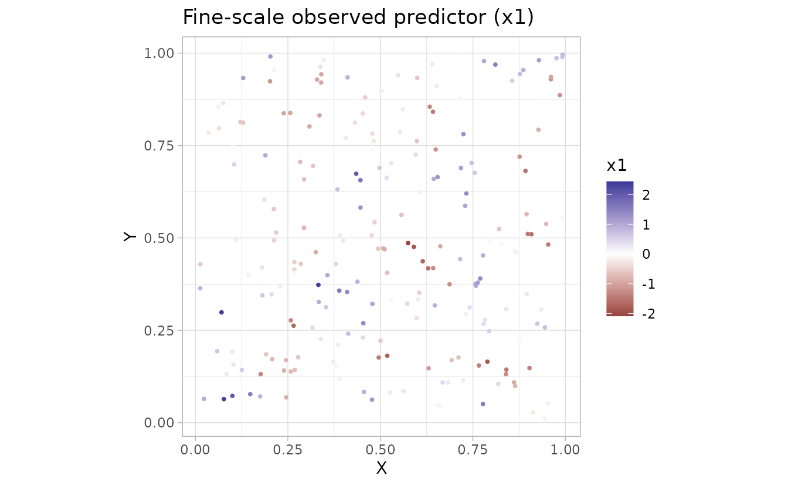

``` r

print(g2)
```

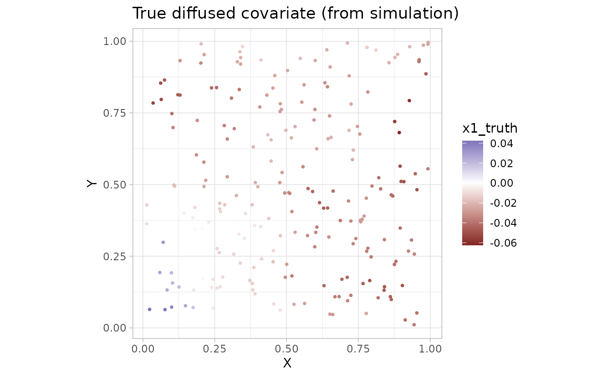

``` r

print(g3)
```

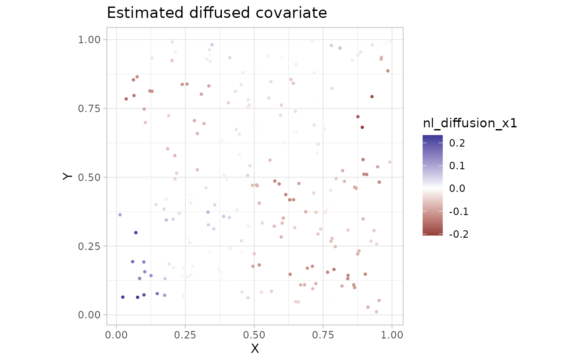

We can visualize the diffusion operator and the original and smoothed
covariate on the mesh:

``` r

plot_nonlocal_kernel(fit, component = "diffusion")
```

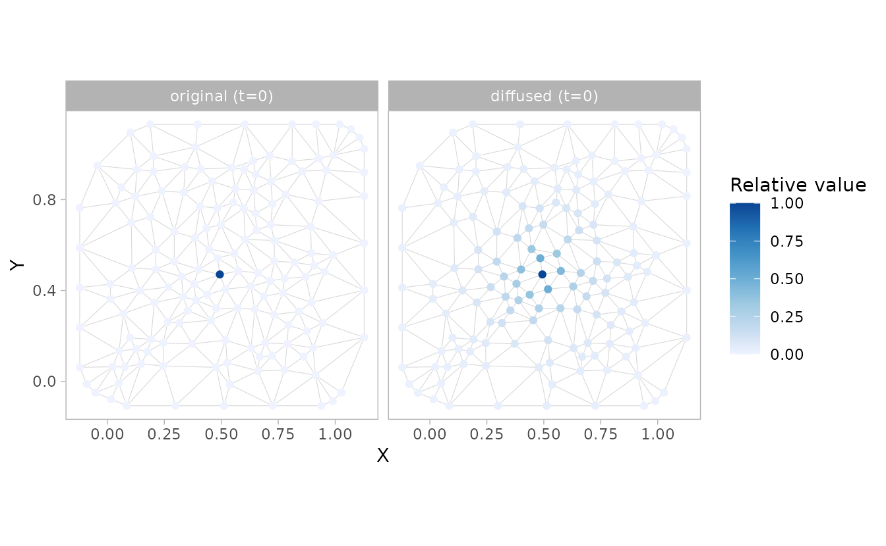

``` r

plot_nonlocal_covariate(fit, component = "diffusion")
```

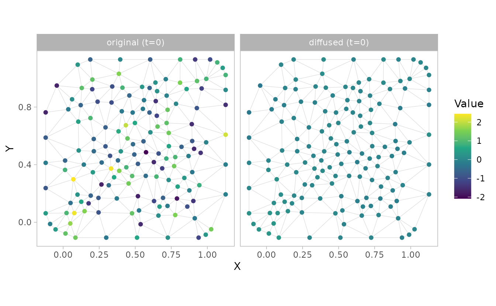

### Space-time example with additive terms

Next we will simulate and fit a model containing spatial and temporal
components: `~ diffusion(x1) + time_lag(x1)`.

``` r

set.seed(1)
n_t <- 16
n_sites <- 300
site_st <- data.frame(X = runif(n_sites), Y = runif(n_sites))
dat_st <- data.frame(
  X = rep(site_st$X, times = n_t),
  Y = rep(site_st$Y, times = n_t),
  year = rep(seq_len(n_t), each = n_sites)
)
mesh_st <- make_mesh(dat_st, c("X", "Y"), cutoff = 0.07)
nonlocal_st <- expand.grid(
  vertex = seq_len(nrow(mesh_st$mesh$loc)),
  year = seq_len(n_t)
)
nonlocal_st$X <- mesh_st$mesh$loc[nonlocal_st$vertex, 1]
nonlocal_st$Y <- mesh_st$mesh$loc[nonlocal_st$vertex, 2]
nonlocal_st$x1 <- as.numeric(scale(
  sin(2 * pi * (nonlocal_st$X + nonlocal_st$year / 8)) +
    cos(2 * pi * (nonlocal_st$Y - nonlocal_st$year / 10)) +
    0.6 * sin(4 * pi * nonlocal_st$X) * cos(nonlocal_st$year / 3) +
    rnorm(nrow(nonlocal_st), sd = 0.15)
))
nonlocal_st$vertex <- NULL
dat_st$x1 <- NA_real_
for (tt in seq_len(n_t)) {
  rows <- dat_st$year == tt
  vertex_values <- nonlocal_st$x1[nonlocal_st$year == tt]
  dat_st$x1[rows] <- as.numeric(mesh_st$A_st[rows, ] %*% vertex_values)
}

sim_st <- simulate_new(
  formula = ~ 1,
  data = dat_st,
  mesh = mesh_st,
  time = "year",
  family = gaussian(),
  spatial = "on",
  spatiotemporal = "off",
  range = 0.3,
  sigma_O = 0.2,
  phi = 0.1,
  B = c(0, 0.7, 0.6),
  nonlocal_formula = ~ diffusion(x1) + time_lag(x1),
  nonlocal_data = nonlocal_st,
  lags_kappaS = 4.4,
  lags_rhoT = 0.3,
  seed = 123
)

dat_st$observed <- sim_st$observed
```

``` r

fit_st <- sdmTMB(
  observed ~ 1,
  mesh = mesh_st,
  time = "year",
  nonlocal_formula = ~ diffusion(x1) + time_lag(x1), #<
  nonlocal_data = nonlocal_st,
  spatial = "on",
  spatiotemporal = "off",
  data = dat_st
)

sanity(fit_st)
#> ✔ Non-linear minimizer suggests successful convergence
#> ✔ Hessian matrix is positive definite
#> ✔ No extreme or very small eigenvalues detected
#> ✔ No gradients with respect to fixed effects are >= 0.001
#> ✔ No fixed-effect standard errors are NA
#> ✔ No standard errors look unreasonably large
#> ✔ No sigma parameters are < 0.01
#> ✔ No sigma parameters are > 100
#> ✔ Range parameter doesn't look unreasonably large
fit_st
#> Spatial model fit by ML ['sdmTMB']
#> Formula: observed ~ 1
#> Mesh: mesh_st (isotropic covariance)
#> Time column: character
#> Data: dat_st
#> Nonlocal formula: diffusion(x1) + time_lag(x1)
#> Family: gaussian(link = 'identity')
#>  
#> Conditional model:
#>                 coef.est coef.se
#> (Intercept)         0.01    0.05
#> nl_diffusion_x1     0.70    0.01
#> nl_time_lag_x1      0.60    0.01
#> 
#> Dispersion parameter: 0.10
#> Nonlocal temporal persistence: rhoT[x1]=0.30
#> Matérn range: 0.28
#> Spatial SD: 0.17
#> Nonlocal RMSD: RMSD[x1]=0.38
#> ML criterion at convergence: -4055.067
#> 
#> See ?tidy.sdmTMB to extract these values as a data frame.

tidy(fit_st, effects = "ran_pars")
#> # A tibble: 8 × 5
#>   term          estimate std.error conf.low conf.high
#>   <chr>            <dbl>     <dbl>    <dbl>     <dbl>
#> 1 range           0.280    0.0504    0.196      0.398
#> 2 phi             0.0997   0.00103   0.0978     0.102
#> 3 sigma_O         0.173    0.0175    0.142      0.211
#> 4 kappaS_nl[x1]   4.40     0.0891    4.22       4.57 
#> 5 kappaT_nl[x1]   0.437    0.0110    0.415      0.459
#> 6 rhoT[x1]        0.304    0.00535   0.294      0.315
#> 7 MSD[x1]         0.144    0.00667   0.131      0.157
#> 8 RMSD[x1]        0.379    0.00879   0.362      0.397
```

In the random-effect parameters, `kappaS_nl[x1]` controls spatial
diffusion and `kappaT_nl[x1]` controls temporal lags. Users applying the
time-lag functionality should read and cite Thorson *et al.* (2026).

### Supplying a separate covariate grid

By default, the covariate field used for diffusion is built from `data`
alone. If the covariate is available on a finer or more complete grid
than the observation locations, we can supply it via `nonlocal_data`.
This also lets us define the covariate at a forecast (`extra_time`)
slice without padding `data` with extra rows.

``` r

extra_yr <- n_t + 1
grid_st <- expand.grid(
  vertex = seq_len(nrow(mesh_st$mesh$loc)),
  year = seq_len(extra_yr)
)
grid_st$X <- mesh_st$mesh$loc[grid_st$vertex, 1]
grid_st$Y <- mesh_st$mesh$loc[grid_st$vertex, 2]
grid_st$x1 <- as.numeric(scale(
  sin(2 * pi * (grid_st$X + grid_st$year / 8)) +
    cos(2 * pi * (grid_st$Y - grid_st$year / 10)) +
    0.6 * sin(4 * pi * grid_st$X) * cos(grid_st$year / 3)
))
grid_st$vertex <- NULL

fit_st_grid <- sdmTMB(
  observed ~ 1,
  mesh = mesh_st,
  time = "year",
  nonlocal_formula = ~ diffusion(x1) + time_lag(x1), #<
  nonlocal_data = grid_st, #<
  extra_time = extra_yr, #<
  spatial = "on",
  spatiotemporal = "off",
  data = dat_st
)
sanity(fit_st_grid)
#> ✔ Non-linear minimizer suggests successful convergence
#> ✔ Hessian matrix is positive definite
#> ✔ No extreme or very small eigenvalues detected
#> ✔ No gradients with respect to fixed effects are >= 0.001
#> ✔ No fixed-effect standard errors are NA
#> ✔ No standard errors look unreasonably large
#> ✔ No sigma parameters are < 0.01
#> ✔ No sigma parameters are > 100
#> ✔ Range parameter doesn't look unreasonably large
```

We will plot the spatially diffused covariate on the non-local data grid
locations:

``` r

pred_grid <- predict(fit_st_grid, newdata = grid_st)

ggplot(pred_grid, aes(X, Y, fill = nl_diffusion_x1)) +
  geom_point(shape = 21) +
  facet_wrap(~year) +
  scale_fill_gradient2()
```

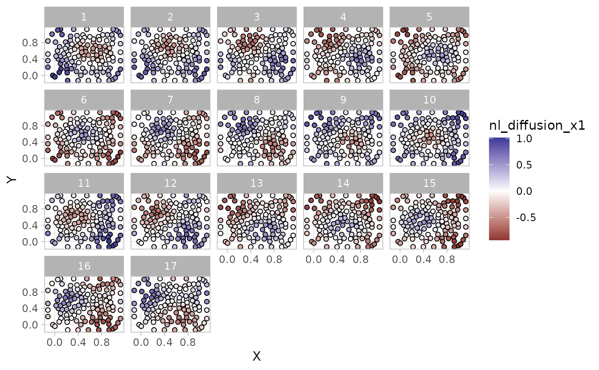

### Plot diffusion kernels

We can separately visualize the spatial diffusion, time diffusion, or
their combined effects as either the diffusion kernel or the smoothed
covariate field. By default, the diffusion kernel is shown at the mesh
vertices:

``` r

plot_nonlocal_kernel(fit_st, component = "diffusion")
```

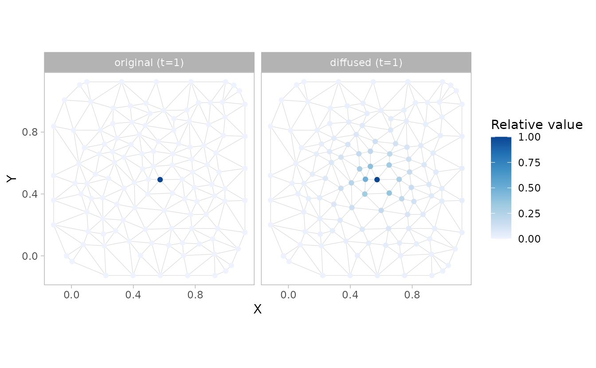

``` r

plot_nonlocal_kernel(fit_st, component = "time_lag", common_scale = TRUE)
```


``` r

plot_nonlocal_kernel(fit_st, component = "combined")
```

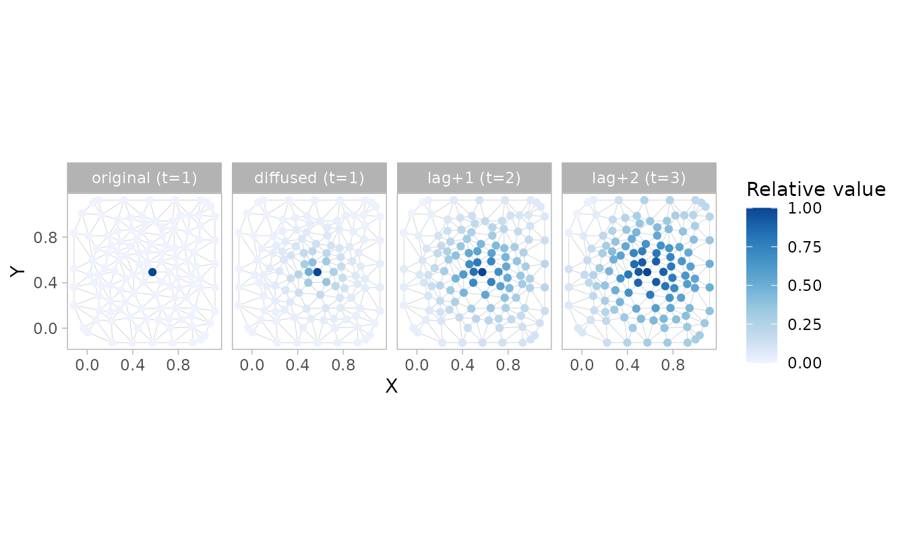

``` r

plot_nonlocal_kernel(fit_st, component = "combined", common_scale = TRUE)
```

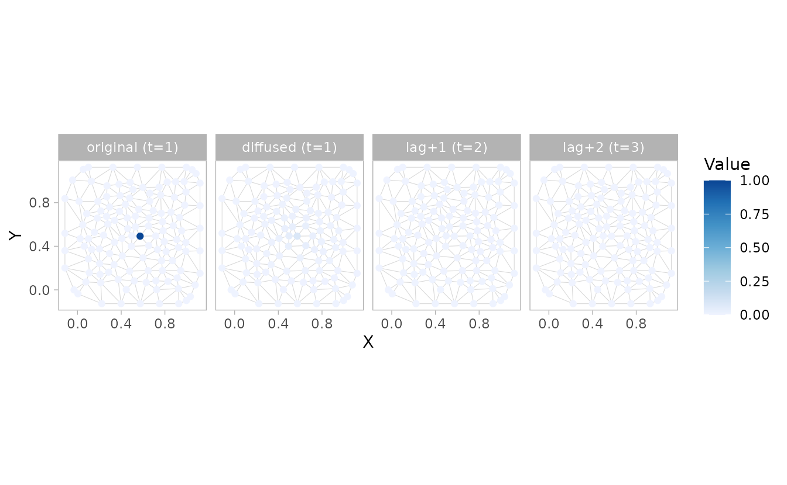

In the last case, the colour scale makes it hard to see the variation.
We could add our own ggplot colour scale transformation:

``` r

plot_nonlocal_kernel(fit_st, component = "combined", common_scale = TRUE) +
  scale_colour_distiller(trans = "log10", palette = "Blues", direction = 1)
#> Scale for colour is already present.
#> Adding another scale for colour, which will replace the existing scale.
#> Warning in scale_colour_distiller(trans = "log10", palette = "Blues", direction
#> = 1): log-10 transformation introduced infinite values.
```

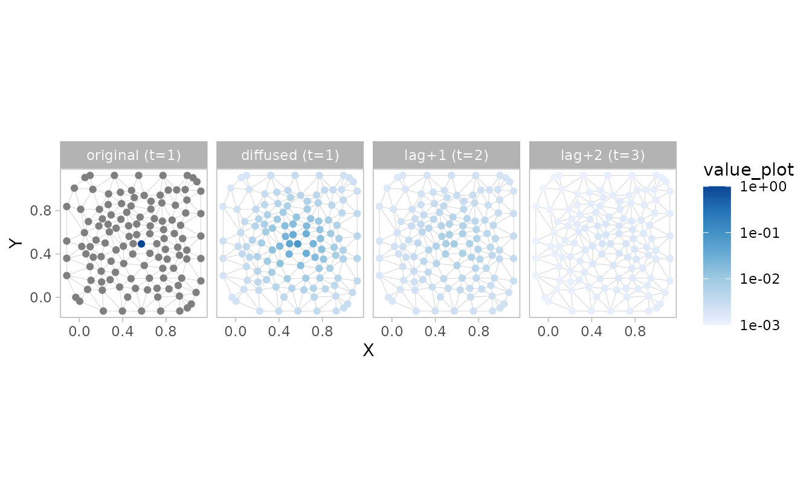

All the knots except one in the “original” panel were zero, so they
become -Inf when log transformed, but now we can see the space and time
nonlocal effects.

``` r

plot_nonlocal_covariate(fit_st, component = "diffusion")
```

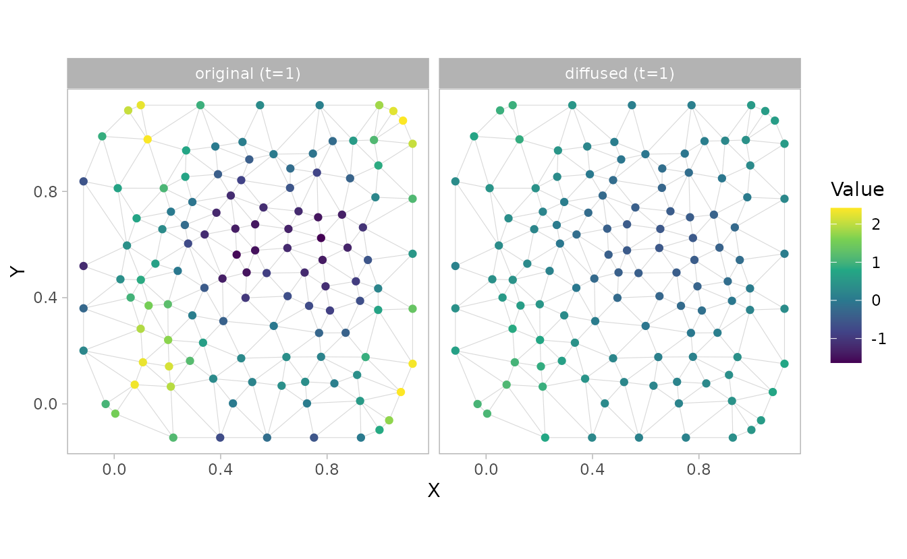

``` r

plot_nonlocal_covariate(fit_st, component = "time_lag", n_steps = 2)
```

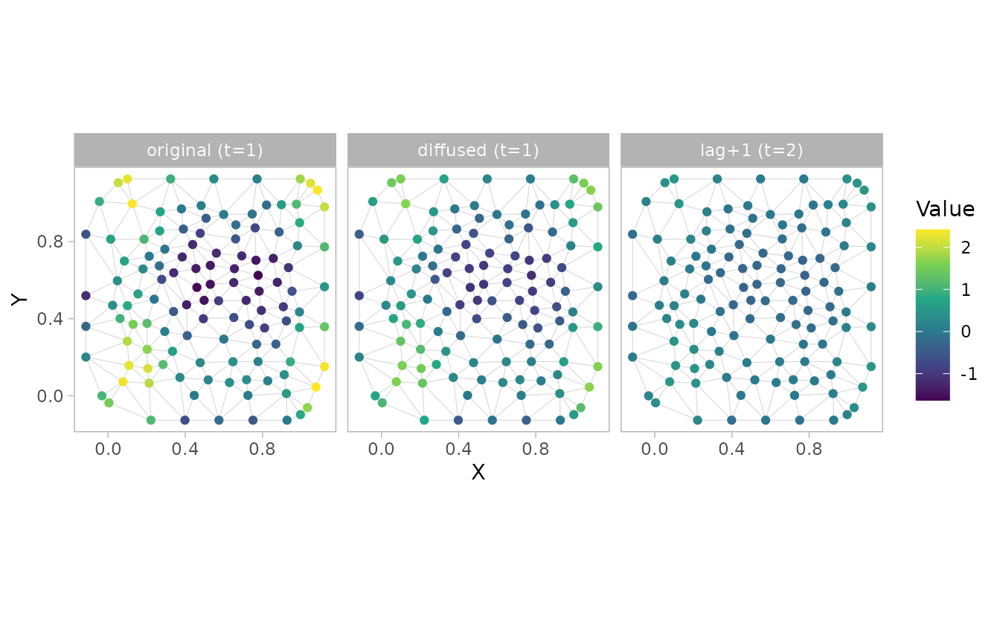

``` r

plot_nonlocal_covariate(fit_st, component = "combined", n_steps = 2)
```

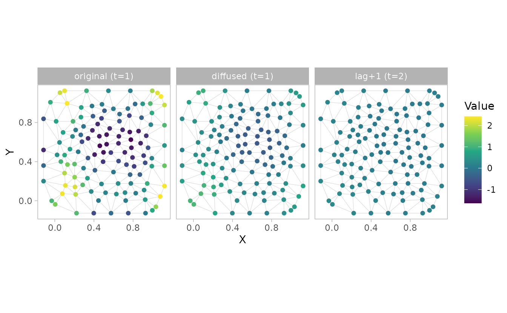

We could also have plotted the spatially diffused covariate at the
original locations from the predictions.

``` r

pred <- predict(fit_st)

ggplot(pred, aes(X, Y, colour = x1)) + geom_point() +
  scale_colour_gradient2()
```

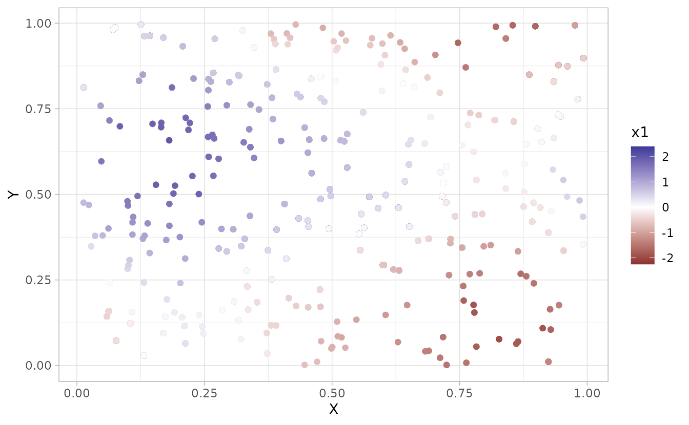

``` r


ggplot(pred, aes(X, Y, colour = nl_diffusion_x1)) + geom_point() +
  scale_colour_gradient2()
```

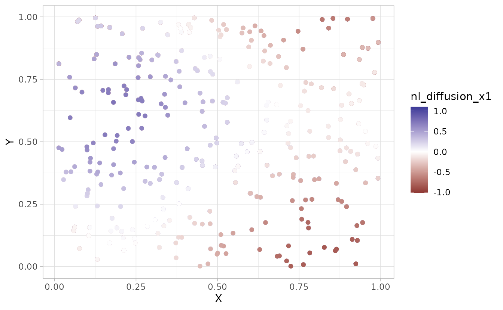

### `predict()` vs. the non-local plotting functions

These two paths answer different questions, so pick based on what you
need:

- Use [`predict()`](https://rdrr.io/r/stats/predict.html) and the `nl_*`
  columns for the modeled effect. Columns such as `nl_diffusion_x1` and
  `nl_time_lag_x1` are the transformed covariate values that enter the
  linear predictor at your data or `newdata` locations. For `time_lag()`
  these accumulate the response across all prior time slices, and for
  `diffusion()` they give the smoothed field integrated over space. This
  is what you want for reporting, mapping the estimated effect,
  correlating against a known truth, or any downstream calculation. One
  column is returned per fitted `nonlocal_formula` term.

- Use
  [`plot_nonlocal_kernel()`](https://sdmTMB.github.io/sdmTMB/reference/nonlocal_formula_plots.md)
  and
  [`plot_nonlocal_covariate()`](https://sdmTMB.github.io/sdmTMB/reference/nonlocal_formula_plots.md)
  for diagnostics. These visualize how the estimated operator behaves.
  [`plot_nonlocal_kernel()`](https://sdmTMB.github.io/sdmTMB/reference/nonlocal_formula_plots.md)
  shows the impulse response (how a point input spreads in space and/or
  decays through time) and cannot be reconstructed from the `nl_*`
  columns.
  [`plot_nonlocal_covariate()`](https://sdmTMB.github.io/sdmTMB/reference/nonlocal_formula_plots.md)
  isolates a single input time slice and shows how it propagates forward
  over `n_steps`; it also offers `component = "combined"` (the joint
  space-and-time response), which is not returned as a
  [`predict()`](https://rdrr.io/r/stats/predict.html) column. Both plot
  on the mesh vertices by default, or at supplied `newdata` coordinates
  as points or a raster.

For the pure spatial `diffusion()` case at a single time slice,
[`plot_nonlocal_covariate()`](https://sdmTMB.github.io/sdmTMB/reference/nonlocal_formula_plots.md)
and mapping `nl_diffusion_x1` from
[`predict()`](https://rdrr.io/r/stats/predict.html) show the same field,
so either is fine. The plotting functions become most useful for
temporal (`time_lag()`) and `combined` terms, and whenever you want to
inspect the operator on the mesh itself.

## References

Lindmark, M., Anderson, S.C. & Thorson, J.T. (2025). [Estimating
scale-dependent covariate responses using two-dimensional diffusion
derived from the stochastic partial differential equation
method](https://doi.org/10.1111/2041-210X.70177). *Methods in Ecology
and Evolution*, **17**, 207–218.

Thorson, J., Anderson, S. & Lindmark, M. (2026). [Temperature carryover
effect revealed for marine fishes using spatio-temporal distributed lag
models](https://doi.org/10.32942/X2W95P).
