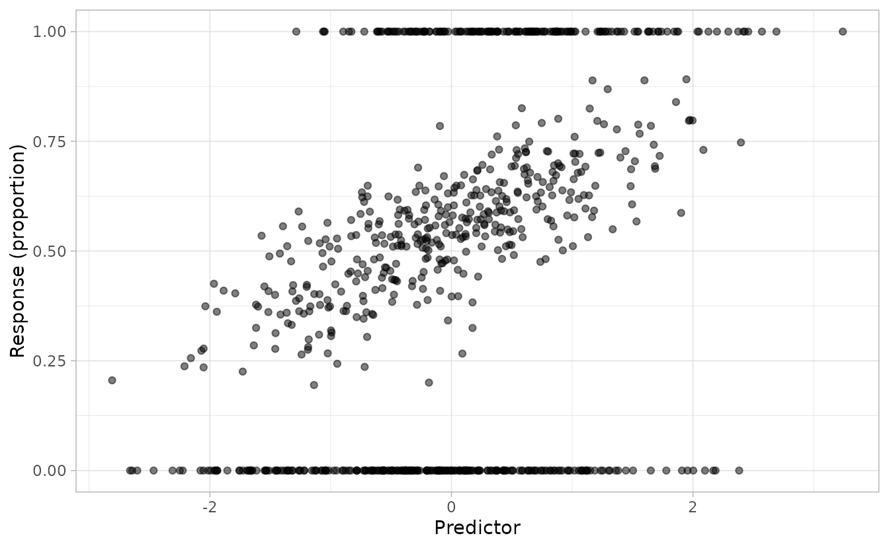
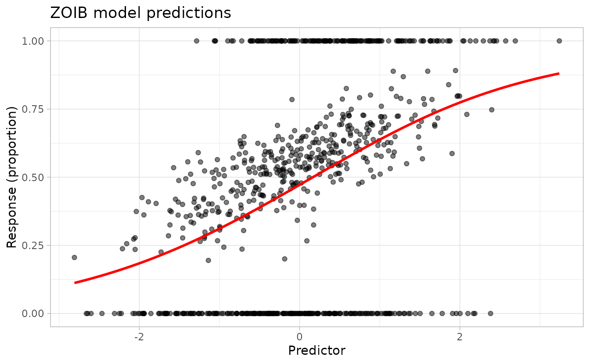
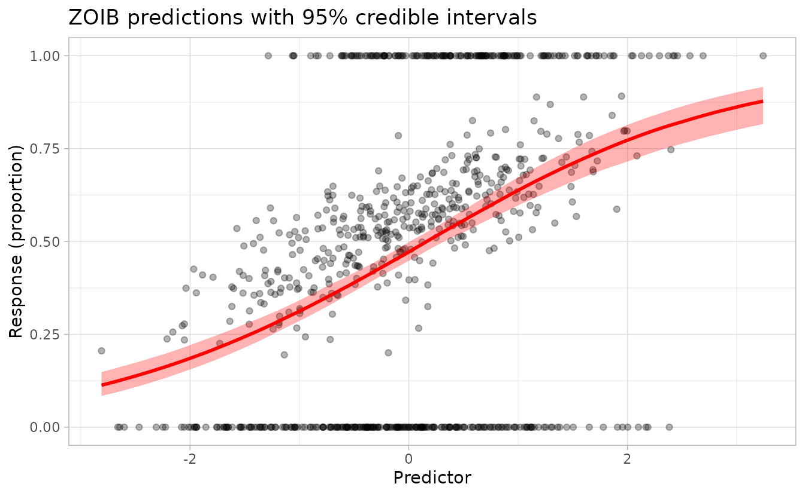
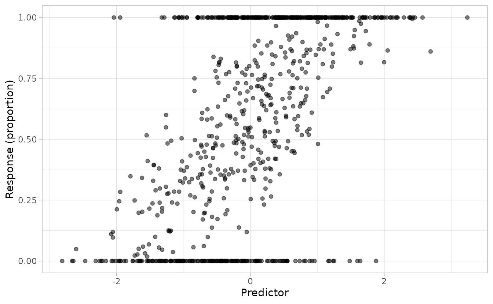
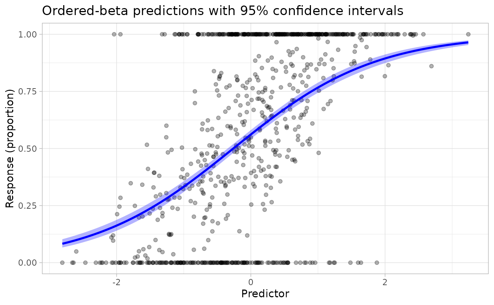

# Models for bounded proportional data in sdmTMB: ZOIB and ordered beta

**If the code in this vignette has not been evaluated, a rendered
version is available on the [documentation
site](https://sdmTMB.github.io/sdmTMB/index.html) under ‘Articles’.**

``` r

library(sdmTMB)
library(ggplot2)
theme_set(theme_light())
```

## Introduction

Proportional data bounded between 0 and 1—such as habitat suitability
indices, cover fractions, or proportional abundances—often include more
zeros and/or ones than a standard beta distribution would predict. Two
complementary approaches are available in sdmTMB for such data:

1.  **Three-model ZOIB**: fit three separate models (a zero component, a
    one component, and a continuous beta component) and combine their
    predictions. This approach allows different predictors and even
    different spatial structures for each component, at the cost of more
    parameters and manual combination of predictions.

2.  **Ordered-beta**
    ([`ordbeta()`](https://sdmTMB.github.io/sdmTMB/reference/families.md)
    family): a single model with one linear predictor shared across all
    three outcomes, plus two estimated cutpoints that govern boundary
    inflation. This is more parsimonious when the same covariates drive
    the probability of zeros, ones, and the continuous proportion.

This vignette demonstrates both approaches on simulated data.

## The three-model ZOIB approach

### Simulating ZOIB data

Let’s simulate data from a ZOIB process to illustrate how to fit these
models in sdmTMB.

First, we’ll set up the parameters for our simulation:

``` r

set.seed(123)
N <- 800
x <- rnorm(N)

# Coefficients for the zero component (logit scale)
b_0 <- c(-1, -0.4)

# Coefficients for the one component (logit scale)
b_1 <- c(-1, 0.6)

# Coefficients for the proportion component (logit scale for mean)
b_prop <- c(0.2, 0.5)

# Precision parameter for beta distribution
phi <- 30
```

Now we’ll simulate the three components:

``` r

# Zero component: probability of observing a zero
p <- plogis(cbind(rep(1, N), x) %*% b_0)
y_p <- rbinom(N, 1, p)

# One component: probability of observing a one (given not zero)
q <- plogis(cbind(rep(1, N), x) %*% b_1)
y_q <- rbinom(N, 1, q)

# Proportion component: beta-distributed values between 0 and 1
mu <- plogis(cbind(rep(1, N), x) %*% b_prop)
a <- phi * mu
b <- phi * (1 - mu)
y_r <- rbeta(N, a, b)
```

Finally, we combine the components to create the ZOIB response:

``` r

y <- numeric(length = N)
y[y_p == 1] <- 0
y[y_p != 1 & y_q == 1] <- 1
y[y_p != 1 & y_q != 1] <- y_r[y_p != 1 & y_q != 1]

dat <- data.frame(x, y)
ggplot(dat, aes(x, y)) +
  geom_point(alpha = 0.5) +
  labs(x = "Predictor", y = "Response (proportion)")
```



The plot shows the characteristic ZOIB pattern: data concentrated at 0
and 1, with continuous values between.

### Fitting the ZOIB model components

To fit a ZOIB model with sdmTMB, we fit three separate models and
combine their predictions.

First, we prepare the data for each component:

``` r

# Zero component: 1 if zero, 0 otherwise
dat$y_zero <- ifelse(dat$y == 0, 1, 0)

# One component: 1 if one, 0 if between 0 and 1, NA if zero
dat$y_one <- ifelse(dat$y == 1, 1, ifelse(dat$y < 1 & dat$y != 0, 0, NA))

# Proportion component: the value itself, but only for values between 0 and 1
dat$y_proportion <- ifelse(dat$y < 1 & dat$y > 0, dat$y, NA)
```

Now we fit the three models. In this example, we turn off spatial
effects with `spatial = "off"`, but in practice you could include
spatial and spatiotemporal random fields in any or all of the
components:

``` r

# Model 1: Zero component
fit_zero <- sdmTMB(
  y_zero ~ x,
  data = dat,
  family = binomial(link = "logit"),
  spatial = "off"
)

# Model 2: One component (excluding zeros)
fit_one <- sdmTMB(
  y_one ~ x,
  data = subset(dat, !is.na(y_one)),
  family = binomial(link = "logit"),
  spatial = "off"
)

# Model 3: Proportion component (values between 0 and 1)
fit_proportion <- sdmTMB(
  y_proportion ~ x,
  data = subset(dat, !is.na(y_proportion)),
  family = Beta(link = "logit"),
  spatial = "off"
)
```

Let’s check how well we recovered the simulation parameters:

``` r

# Zero component coefficients
coef(fit_zero)
#> (Intercept)           x 
#>  -0.8702097  -0.4254690
b_0
#> [1] -1.0 -0.4

# One component coefficients
coef(fit_one)
#> (Intercept)           x 
#>  -1.0390158   0.7738772
b_1
#> [1] -1.0  0.6

# Proportion component coefficients
coef(fit_proportion)
#> (Intercept)           x 
#>   0.2114247   0.4901013
b_prop
#> [1] 0.2 0.5

# Precision parameter
tidy(fit_proportion, "ran_pars")
#> # A tibble: 1 × 5
#>   term  estimate std.error conf.low conf.high
#>   <chr>    <dbl>     <dbl>    <dbl>     <dbl>
#> 1 phi       29.6      2.09     25.8      34.0
phi
#> [1] 30
```

The estimated coefficients should be close to the true values used in
the simulation.

### Making predictions

To make predictions from a ZOIB model, we need to:

1.  Generate predictions from each component
2.  Combine them using the ZOIB formula

First, create a new data frame for prediction:

``` r

nd <- data.frame(x = seq(min(x), max(x), length.out = 100))
```

#### Point predictions

Generate point predictions from each component and combine:

``` r

# Get predictions on the response scale (probabilities/proportions)
p0 <- plogis(predict(fit_zero, newdata = nd)$est)
p1 <- plogis(predict(fit_one, newdata = nd)$est)
pp <- plogis(predict(fit_proportion, newdata = nd)$est)

# Combine using ZOIB formula: E[Y] = (1 - p0) * (p1 + (1 - p1) * pp)
nd$est <- (1 - p0) * (p1 + (1 - p1) * pp)
```

Plot the predictions:

``` r

ggplot(dat, aes(x, y)) +
  geom_point(alpha = 0.5) +
  geom_line(aes(x, est), data = nd, colour = "red", linewidth = 1) +
  labs(
    x = "Predictor", y = "Response (proportion)",
    title = "ZOIB model predictions"
  )
```



#### Predictions with uncertainty

To incorporate parameter uncertainty, we use can use simulation-based
inference. The [`predict()`](https://rdrr.io/r/stats/predict.html)
function with `nsim` will draw from the joint precision matrix of the
fixed effects and random effects:

``` r

# Generate simulation draws from each model
p0 <- plogis(predict(fit_zero, newdata = nd, nsim = 500))
p1 <- plogis(predict(fit_one, newdata = nd, nsim = 500))
pp <- plogis(predict(fit_proportion, newdata = nd, nsim = 500))

# Combine the simulations
combined <- (1 - p0) * (p1 + (1 - p1) * pp)

# Calculate median and credible intervals
nd$est2 <- apply(combined, 1, median)
nd$lwr <- apply(combined, 1, quantile, probs = 0.025)
nd$upr <- apply(combined, 1, quantile, probs = 0.975)
```

Plot with uncertainty bands:

``` r

ggplot() +
  geom_point(data = dat, aes(x = x, y = y), alpha = 0.3) +
  geom_ribbon(
    data = nd, aes(x = x, ymin = lwr, ymax = upr),
    fill = "red", alpha = 0.3
  ) +
  geom_line(
    data = nd, aes(x = x, y = est2),
    colour = "red", linewidth = 1
  ) +
  labs(
    x = "Predictor", y = "Response (proportion)",
    title = "ZOIB predictions with 95% credible intervals"
  )
```



The red line shows the median prediction and the shaded region shows the
95% credible interval accounting for parameter uncertainty.

### Comparison with the zoib package

For reference, we can compare our approach to the dedicated ZOIB
implementation in the `zoib` package, which uses Bayesian methods:

``` r

library(zoib)
m <- zoib(y ~ x | 1 | x | x,
  data = dat,
  zero.inflation = TRUE,
  one.inflation = TRUE,
  joint = FALSE,
  n.iter = 600,
  n.thin = 1,
  n.burn = 100
)
```

``` r

# Extract parameter estimates
sample1 <- m$coeff
summary(sample1, quantiles = 0.5)

# Compare with our estimates
coef(fit_proportion)
coef(fit_zero)
coef(fit_one)
```

``` r

# Generate predictions
pred <- pred.zoib(m, xnew = nd)
nd2 <- data.frame(x = nd$x, zoib = pred$summary[, "mean"])

# Compare predictions
ggplot(dat, aes(x, y)) +
  geom_point(alpha = 0.3) +
  geom_line(aes(x, est), data = nd, colour = "red", linewidth = 1) +
  geom_line(aes(x, zoib), data = nd2, colour = "blue", linewidth = 1, linetype = 2) +
  labs(
    x = "Predictor", y = "Response (proportion)",
    title = "Comparison: sdmTMB (red) vs zoib package (blue)"
  )
```

## The ordered-beta approach

The ordered-beta regression model (Kubinec 2023) is a single-model
alternative that is built directly into sdmTMB as the
[`ordbeta()`](https://sdmTMB.github.io/sdmTMB/reference/families.md)
family. It uses one linear predictor shared across all three outcome
types (zero, continuous, one), plus two estimated cutpoint parameters
(ψ₀ and ψ₁) that govern how much probability mass falls at the
boundaries. A precision parameter φ controls the spread of the
continuous beta component, just as in a standard beta regression.

Because covariate effects are shared across the three outcomes, the
model is more parsimonious than the three-model ZOIB approach. It is a
natural first choice when you have no strong reason to believe the
processes driving zeros vs. ones vs. the continuous proportion differ in
their relationship to the predictors.

### Simulating ordered-beta data

We reuse the same predictor `x` from the ZOIB simulation above so the
data sets are directly comparable. The true parameters are a single
intercept and slope for the mean (logit scale), plus φ and two
cutpoints:

``` r

set.seed(42)
eta_ord <- 0.3 + 0.8 * x
mu_ord <- plogis(eta_ord)
phi_ord <- 6
psi <- c(-1.2, 1.0)

p0_ord <- plogis(psi[1] - eta_ord) # Pr(y == 0)
p1_ord <- plogis(eta_ord - psi[2]) # Pr(y == 1)
u_ord <- runif(N)
y_ord <- numeric(N)
zero_ <- u_ord < p0_ord
one_ <- u_ord > 1 - p1_ord
mid_ <- !zero_ & !one_
y_ord[zero_] <- 0
y_ord[one_] <- 1
y_ord[mid_] <- rbeta(
  sum(mid_), mu_ord[mid_] * phi_ord,
  (1 - mu_ord[mid_]) * phi_ord
)

dat_ord <- data.frame(x = x, y = y_ord)
ggplot(dat_ord, aes(x, y)) +
  geom_point(alpha = 0.5) +
  labs(x = "Predictor", y = "Response (proportion)")
```



### Fitting the ordered-beta model

A single
[`sdmTMB()`](https://sdmTMB.github.io/sdmTMB/reference/sdmTMB.md) call
with `family = ordbeta()` replaces the three separate models:

``` r

fit_ord <- sdmTMB(y ~ x, data = dat_ord, family = ordbeta(), spatial = "off")
```

### Checking parameter recovery

``` r

# Fixed effects: intercept ≈ 0.3, x slope ≈ 0.8
tidy(fit_ord)
#> # A tibble: 2 × 5
#>   term        estimate std.error conf.low conf.high
#>   <chr>          <dbl>     <dbl>    <dbl>     <dbl>
#> 1 (Intercept)    0.247    0.0401    0.168     0.325
#> 2 x              0.943    0.0428    0.860     1.03

# Precision and boundary cutpoints (on [0, 1] scale)
tidy(fit_ord, "ran_pars")
#> # A tibble: 3 × 5
#>   term                   estimate std.error conf.low conf.high
#>   <chr>                     <dbl>     <dbl>    <dbl>     <dbl>
#> 1 phi                       6.99      0.499     6.08      8.04
#> 2 ordbeta_cutpoint_lower    0.217    NA        NA        NA   
#> 3 ordbeta_cutpoint_upper    0.724    NA        NA        NA
```

### Predictions with uncertainty

For a fixed-effects model, `se_fit = TRUE` provides delta-method
standard errors on the linear predictor. Transforming through
[`plogis()`](https://rdrr.io/r/stats/Logistic.html) gives approximate
confidence intervals on the beta-distribution mean µ:

``` r

nd_ord <- data.frame(x = seq(min(x), max(x), length.out = 100))
p_ord <- predict(fit_ord, newdata = nd_ord, se_fit = TRUE, re_form = NA)

nd_ord$est <- plogis(p_ord$est)
nd_ord$lwr <- plogis(p_ord$est - 1.96 * p_ord$est_se)
nd_ord$upr <- plogis(p_ord$est + 1.96 * p_ord$est_se)
```

``` r

ggplot() +
  geom_point(data = dat_ord, aes(x = x, y = y), alpha = 0.3) +
  geom_ribbon(
    data = nd_ord, aes(x = x, ymin = lwr, ymax = upr),
    fill = "blue", alpha = 0.3
  ) +
  geom_line(
    data = nd_ord, aes(x = x, y = est),
    colour = "blue", linewidth = 1
  ) +
  labs(
    x = "Predictor", y = "Response (proportion)",
    title = "Ordered-beta predictions with 95% confidence intervals"
  )
```



The curve shows µ (the mean of the continuous beta component) with
delta-method confidence intervals. The full expected value E\[Y\] also
accounts for boundary probability mass, but µ is the main quantity of
interest for a marginal effects plot.

## Choosing between approaches

| Feature | Three-model ZOIB | Ordered beta ([`ordbeta()`](https://sdmTMB.github.io/sdmTMB/reference/families.md)) |
|----|----|----|
| Models to fit | 3 | 1 |
| Parameters for *k* covariates | ~3*k* + 3 intercepts | *k* + intercept + φ + 2 cutpoints |
| Zero/one inflation effects | Can differ from proportion | Shared with proportion mean |
| Spatial fields | Separate per component | Single shared field |
| Built-in sdmTMB family | No | Yes |
| Predictions | Manual combination | Automatic |

**Use ordered beta** when you have no strong reason to believe the
covariates affect the zero/one inflation differently from the continuous
proportion—it is simpler and requires fitting only one model.

**Use the three-model ZOIB** when the processes driving zeros, ones, and
the continuous proportion are plausibly governed by different
predictors, or when you need separate spatial or spatiotemporal
structures for each component.

## References

Kubinec, R. (2023). [Ordered beta regression: A parsimonious,
well-fitting model for continuous data with lower and upper
bounds](https://doi.org/10.1017/pan.2022.20). *Political Analysis*,
**31**, 519–536.
